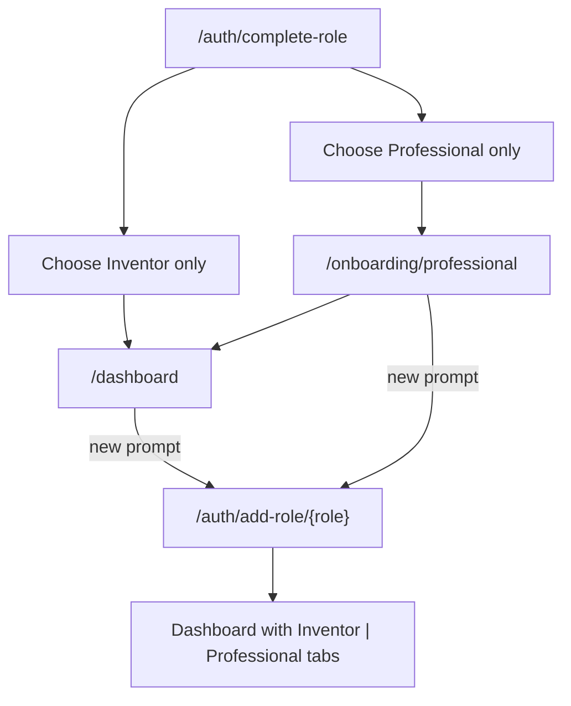

# Add opposite role after single-role onboarding

## Current state

The **backend already works**: [`addVenRole`](app/auth/complete-role/actions.ts) appends a missing role to Clerk `venRoles` and redirects appropriately (professional → onboarding if incomplete, else dashboard tab).

The **only UI entry point** today is easy to miss — avatar menu links in [`components/ven-user-button.tsx`](components/ven-user-button.tsx):

```97:109:components/ven-user-button.tsx
            {showAddInventor ? (
              <UserButton.Link
                href="/auth/add-role/inventor"
                label="Add inventor profile"
              />
            ) : null}
            {showAddProfessional ? (
              <UserButton.Link
                href="/auth/add-role/professional"
                label="Add professional profile"
              />
            ) : null}
```

[`/auth/complete-role`](app/auth/complete-role/page.tsx) already offers **Both inventor and professional**, but users who pick a single role are redirected away with no in-flow prompt to add the other role later (copy only mentions “account menu”).



## Approach

Add a small reusable prompt component and render it wherever a signed-in user has **exactly one** role. Reuse existing routes — no new server actions or metadata changes.

### 1. New component: `AddOppositeRolePrompt`

Create [`components/dashboard/add-opposite-role-prompt.tsx`](components/dashboard/add-opposite-role-prompt.tsx) (server component is fine — props only):

| Prop | When shown |
|------|------------|
| `missingRole: "inventor" \| "professional"` | Parent passes based on `hasInventor` / `hasProfessional` |

**Copy (role-specific):**

- Inventor-only → missing professional:
  - Title/body: e.g. “Also want to join teams as a skilled professional?”
  - CTA link: `/auth/add-role/professional` — “Add professional profile”
- Professional-only → missing inventor:
  - Body: e.g. “Have an invention to share? You can add an inventor profile to create and manage projects.”
  - CTA link: `/auth/add-role/inventor` — “Add inventor profile”

**Visual style:** Match existing dashboard secondary cards (e.g. the amber incomplete-onboarding block in [`app/dashboard/page.tsx`](app/dashboard/page.tsx) lines 109–118), but use neutral slate styling so it reads as optional, not urgent. Use `Link` (not a form) — same pattern as the onboarding CTA already on the dashboard.

### 2. Dashboard — primary surface

Update [`app/dashboard/page.tsx`](app/dashboard/page.tsx):

- Compute `showAddOppositeRole = (hasInventor !== hasProfessional)` (exactly one role).
- Render `<AddOppositeRolePrompt missingRole={...} />` below the active role panel and above “Back to home”.
- Pass `missingRole="professional"` when `hasInventor && !hasProfessional`, else `"inventor"`.

This covers users who chose a single role at `/auth/complete-role` **and** users who signed up via `/auth/signup/inventor` or `/auth/signup/professional` (cookie append path).

### 3. Professional onboarding — in-flow prompt

Update [`app/onboarding/professional/page.tsx`](app/onboarding/professional/page.tsx):

- After the onboarding form card, render the prompt **only when** `!hasInventorRole(meta)` (professional-only users).
- Skip for dual-role users who chose “Both” at complete-role — they already have inventor.

This gives professional-only signups a visible “add inventor” option **before** they finish skills onboarding, without blocking the required flow.

### 4. Copy tweaks on role-selection pages (light touch)

Update helper text so it points to the new prompts, not only the avatar menu:

- [`app/auth/complete-role/page.tsx`](app/auth/complete-role/page.tsx) — e.g. “You can add the other role anytime from your dashboard.”
- [`app/auth/signup/page.tsx`](app/auth/signup/page.tsx) — same wording for consistency.

Keep the **Both** button as-is; no flow change to complete-role forms.

### 5. Docs

Add one bullet to [`manual/sign-up-procedures.md`](manual/sign-up-procedures.md) dual-role section: single-role users also see an **Add … profile** card on the dashboard (and on professional onboarding for inventor add).

## Out of scope

- Dedicated `/dashboard/account/roles` page (optional in original dual-role plan; avatar menu links remain as secondary entry).
- Inventor-specific onboarding page (deferred per [`lib/onboarding-deferred.ts`](lib/onboarding-deferred.ts)).
- Changing `addVenRole` redirect logic (already correct).

## Test plan

- **Inventor-only** (existing or new via `/auth/signup/inventor`): dashboard shows “Add professional profile” → click → `/onboarding/professional` → complete → dashboard shows Inventor \| Professional tabs.
- **Professional-only**: onboarding page shows “Add inventor profile” (optional click); after finishing onboarding, dashboard shows same prompt until inventor is added.
- **Dual-role from start** (“Both” at complete-role): no prompt on dashboard or onboarding.
- **Avatar menu** links still work and disappear once both roles are present.
