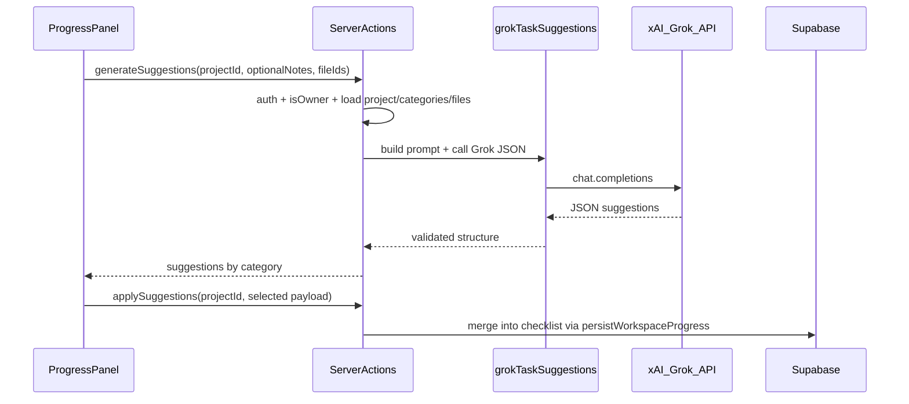

# AI assistance for workspace task creation (Grok)

## Context

- **Tasks** in the product are the **Progress checklist**: per [`ProfessionalJobCategory`](lib/professional-onboarding.ts), a tree of **major** groups and **minor** leaf tasks ([`WorkspaceProgressChecklist`](lib/workspace-progress-checklist.ts)). Standard rows use `std:` ids; user-added rows use `cust:` via [`addCustomMajor`](lib/workspace-progress-checklist.ts) / [`addCustomMinor`](lib/workspace-progress-checklist.ts).
- **Persistence** is already centralized: [`persistWorkspaceProgress`](lib/workspace-progress-sync.ts) and server actions in [`app/idea-arena/[projectId]/workspace/actions.ts`](app/idea-arena/[projectId]/workspace/actions.ts).
- **Project description** is already loaded on the workspace page as [`ArenaProject.description`](lib/projects-arena.ts) (`getProjectByIdForArena`); [`getWorkspaceProjectMeta`](lib/workspace.ts) does not include it today—no need to change meta if we pass description from the page into the shell.
- **Files** live in the private workspace bucket; MIME allowlist already includes `text/plain` (and CSV). PDFs/DOCX are allowed for upload but **text extraction is out of scope for v1** unless you add a parser later.
- **No AI dependency yet** in [`package.json`](package.json). xAI exposes an **OpenAI-compatible** API at `https://api.x.ai/v1` (Bearer `XAI_API_KEY`); use the official **`openai` npm package** with `baseURL` + `apiKey` so swapping models or providers stays easy.

## Product / security decisions

- **Who can use it**: Only the **project owner** (`userId === meta.clerk_user_id`), matching “inventor setting up their tasks” for their own project. Reuse [`getWorkspaceAccessFlags`](lib/workspace-access.ts) (`isOwner`) in server actions; do not expose the button to members.
- **What the model may change**: **Append only**—suggestions become **new `cust:` majors/minors**. Do not rewrite or delete `std:` template tasks in v1 (avoids accidental data loss and keeps arena completion logic stable).
- **Transparency**: Short UI note that **selected plain-text file content and project text are sent to xAI**; no guarantee of legal/engineering advice (one line disclaimer in the modal).
- **Context limits**: Cap total prompt size (e.g. description + notes + file excerpts ≤ ~24–32k chars) with deterministic truncation; include **file name** and **truncation notice** in the prompt.

## Architecture

## Implementation steps

1. **Dependencies and env**
   - Add `openai` to dependencies.
   - Document env vars (e.g. `.env.local`): `XAI_API_KEY`, optional `XAI_BASE_URL` default `https://api.x.ai/v1`, optional `XAI_GROK_MODEL` default **`grok-4.20-reasoning`** (or the exact model id you use in the xAI console).

2. **Server-only Grok helper** (new file e.g. [`lib/grok-task-suggestions.ts`](lib/grok-task-suggestions.ts))
   - Build a system + user prompt that includes: project title, description, `required_job_categories`, optional inventor “extra notes”, **summaries of existing custom tasks** (titles only) to reduce duplicates, and **excerpts** from chosen workspace files (server-side: resolve file rows with [`getWorkspaceFileById`](lib/workspace.ts), signed URL or storage download with service client, only if `content_type` is `text/plain` or `text/csv`; skip others with a clear skip reason in UI).
   - Request **JSON-only** output with a strict shape, e.g. `{ "categories": { "<ProfessionalJobCategory>": [ { "majorTitle": string, "minors": string[] } ] } }` only for categories that exist on the project.
   - Validate with TypeScript + runtime guards; clamp string lengths and array sizes (e.g. max N majors per category, M minors each).

3. **Server actions** (extend [`app/idea-arena/[projectId]/workspace/actions.ts`](app/idea-arena/[projectId]/workspace/actions.ts))
   - `actionGenerateWorkspaceTaskSuggestions(projectId, { extraNotes?: string, textFileIds?: string[] })` → returns `{ ok, suggestions?, error?, skippedFiles? }`. Guard: `auth`, `isProjectUuid`, **`getWorkspaceAccessFlags` → `isOwner`**.
   - `actionApplyWorkspaceTaskSuggestions(projectId, payload)` → same guards; load merged checklist via existing `loadMergedChecklist` pattern; apply suggestions by repeatedly using **`addCustomMajor` then `addCustomMinor`** (or add one small pure helper `appendSuggestionGroups` in [`lib/workspace-progress-checklist.ts`](lib/workspace-progress-checklist.ts) to keep one clone + single persist); then `persistWorkspaceProgress` + `revalidateArenaAndWorkspace`.

4. **Workspace page props** ([`app/idea-arena/[projectId]/workspace/page.tsx`](app/idea-arena/[projectId]/workspace/page.tsx))
   - Compute `isProjectOwner = userId === meta.clerk_user_id`.
   - Pass `projectDescription={arenaProject.description ?? null}` and `isProjectOwner` into [`WorkspaceShell`](components/workspace/workspace-shell.tsx).

5. **UI** ([`components/workspace/workspace-shell.tsx`](components/workspace/workspace-shell.tsx) + [`components/workspace/workspace-progress-panel.tsx`](components/workspace/workspace-progress-panel.tsx))
   - Extend `WorkspaceShell` props; forward to `WorkspaceProgressPanel`.
   - On **Progress** tab only, if `isProjectOwner`: show primary CTA **“Get AI assistance with task creation”** (matches your copy).
   - Optional: In **Files** tab, a short helper line for owners: “Tip: upload a plain-text summary of specs here, then use AI task assistance on the Progress tab” (no duplicate heavy UI unless you want a second button that switches tab + opens modal).
   - Modal flow: optional textarea (extra context), multi-select of **text/plain** (and csv) files from current `files` prop, **Generate** → loading state → render grouped suggestions with checkboxes → **Add selected tasks** → call apply action → `router.refresh()`.
   - Handle missing API key with a clear server error (“AI is not configured”) so dev/prod misconfig is obvious.

6. **Testing / QA**
   - Manual: owner sees CTA; member does not; with no `XAI_API_KEY`, graceful error.
   - Manual: suggestions only touch allowed categories; applied tasks appear as custom groups under the right skill.

## Out of scope (v1)

- PDF / Word **content** extraction for the model (filenames only or skip).
- Streaming tokens; single round-trip JSON is enough.
- Rate limiting / usage analytics (can add later).
- Editing or removing standard template tasks via AI.
