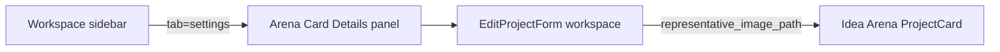

# Arena Card Details tab and large image preview

## Current behavior

The owner-only workspace tab lives in [`components/workspace/workspace-shell.tsx`](components/workspace/workspace-shell.tsx):

- Sidebar label: **Settings** (`SETTINGS_TAB`, `tab=settings` URL param)
- Panel heading: **Project settings**
- Content: [`EditProjectForm`](components/dashboard/edit-project-form.tsx) with `variant="workspace"`

The form’s image block is a **96×96** thumbnail (`h-24 w-24`), which does not match how the image appears on Idea Arena cards (**4:3**, `object-cover`):

```84:91:components/idea-arena/project-card.tsx
        <div className="aspect-4/3 relative bg-slate-300 rounded-lg overflow-hidden mb-2">
          <Image
            src={src}
            alt=""
            fill
            className="object-cover"
```

[`arenaProjectImageUrl`](components/idea-arena/utils.ts) is used on cards (custom upload or picsum placeholder); the edit form only shows a preview when `representative_image_path` is set, so inventors with no upload yet see **no** preview at all.

A dashboard deep link also says **Project settings** in [`components/dashboard/dashboard-project-progress-card.tsx`](components/dashboard/dashboard-project-progress-card.tsx) (`?tab=settings`).



## Goals

1. **Rename** all user-facing "Settings" / "Project settings" copy on this tab to **Arena Card Details** (and align the dashboard link).
2. **Large preview** at the same **4:3 + object-cover** framing as the live card so cropping feels WYSIWYG.
3. **Live preview** when the user picks a file (before Save) so they can swap images without guessing.

Keep the internal tab id `settings` and `?tab=settings` unchanged so existing bookmarks and [`dashboard-project-progress-card.tsx`](components/dashboard/dashboard-project-progress-card.tsx) links keep working.

## Implementation

### 1. Rename tab and panel copy — [`workspace-shell.tsx`](components/workspace/workspace-shell.tsx)

| Location | Change |
|----------|--------|
| `SETTINGS_TAB.label` | `"Arena Card Details"` |
| Panel `<h2>` | `"Arena Card Details"` |
| Panel description | Focus on Idea Arena card appearance (title, summary, cover image, team skills) — drop generic "Project settings" wording |
| Lucide icon | Replace `Settings` with something card/visual (e.g. `Image` or `LayoutTemplate`) on the sidebar button |

No change to `resolveTabId`, `tab === "settings"`, or URL param handling.

### 2. Dashboard link label — [`dashboard-project-progress-card.tsx`](components/dashboard/dashboard-project-progress-card.tsx)

- Link text: **Project settings** → **Arena Card Details**
- Keep `settingsHref` as `?tab=settings`

### 3. Large arena preview in workspace form — [`edit-project-form.tsx`](components/dashboard/edit-project-form.tsx)

**Scope:** `variant === "workspace"` only. Dashboard inline edit stays compact (small thumbnail is fine there).

**Preview source (priority):**

1. If user selected a file → `URL.createObjectURL(file)` (revoke on change/unmount)
2. Else → `arenaProjectImageUrl(project)` (includes picsum placeholder when no upload)

**Layout (workspace):**

- Move the image section to the **top** of the form (before title/description) so the hero preview is the first thing they see.
- Replace `h-24 w-24` with a full-width container inside the panel, e.g. `w-full max-w-xl mx-auto aspect-4/3 rounded-xl overflow-hidden border border-slate-200 bg-slate-300` with `Image` `fill` + `object-cover` (same as [`project-card.tsx`](components/idea-arena/project-card.tsx) / [`project-detail-view.tsx`](components/idea-arena/project-detail-view.tsx)).
- Short helper under preview: e.g. “This is how your cover appears on Idea Arena cards (4:3 crop).”
- Relabel field: **Representative image** → **Arena card image** (optional parenthetical “optional”).
- Keep existing file input, accept types, 5MB helper, and `updateProjectWithMediaAndSkills` action — no server changes.

**Cleanup:**

- `useEffect` to `revokeObjectURL` when `imageFileName` / blob URL changes or component unmounts.

**Import:** `arenaProjectImageUrl` from `@/components/idea-arena/utils`.

### 4. Optional small polish (same PR, low cost)

- Widen the workspace settings panel slightly if the preview feels cramped (`max-w-3xl` → `max-w-4xl` on the panel wrapper in `workspace-shell.tsx` only).
- `aria-label` on sidebar button: `"Arena Card Details"` for screen readers.

## Files to touch

| File | Change |
|------|--------|
| [`components/workspace/workspace-shell.tsx`](components/workspace/workspace-shell.tsx) | Tab label, icon, panel title/copy, optional panel width |
| [`components/dashboard/dashboard-project-progress-card.tsx`](components/dashboard/dashboard-project-progress-card.tsx) | Link label |
| [`components/dashboard/edit-project-form.tsx`](components/dashboard/edit-project-form.tsx) | Workspace-only large 4:3 preview + file blob preview |

## Out of scope

- In-form **crop/zoom/pan** controls (would need a new image editor dependency and upload pipeline changes).
- Renaming URL `tab=settings` to a new slug (can add alias later if desired).
- Changing dashboard collapsed `EditProjectForm` (non-workspace variant) layout.

## Manual test

1. As **project owner**, open workspace → sidebar shows **Arena Card Details** (not Settings).
2. Tab panel title and description match; form shows **large 4:3** preview at top.
3. Project **with** image: preview matches Idea Arena card crop; upload a new file → preview updates **before** Save; Save → refresh → persisted image still correct.
4. Project **without** image: preview shows picsum placeholder (same as card list).
5. Compare side-by-side with Idea Arena [`ProjectCard`](components/idea-arena/project-card.tsx) for same project — framing should match.
6. As **non-owner**: tab hidden; `?tab=settings` still falls back to messages.
7. Dashboard progress card link reads **Arena Card Details** and lands on the renamed tab.
