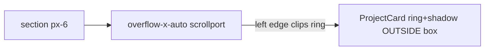

# Fix first arena card clipped on the left

## Problem

On [`app/idea-arena/page.tsx`](app/idea-arena/page.tsx), project cards render in a horizontal scroll row:

```120:120:app/idea-arena/page.tsx
          <div className="flex gap-6 overflow-x-auto pb-4 pt-1 snap-x snap-mandatory">
```

The parent section already has `px-6`, but **`overflow-x-auto` on this inner row creates its own scrollport**. Anything that paints outside a card’s layout box is clipped at that scrollport’s edges — not at the section padding.

[`ProjectCard`](components/idea-arena/project-card.tsx) adds outer paint on the selected card:

```76:78:components/idea-arena/project-card.tsx
      className={`group flex rounded-2xl bg-[#f0f0f0] shadow-md overflow-hidden w-[min(100%,292px)] shrink-0 snap-start transition-shadow hover:shadow-lg ${membershipBorderClass} ${
        selected ? "ring-2 ring-sky-500 ring-offset-2" : ""
      }`}
```

- `shadow-md` extends a few pixels beyond the card
- `ring-offset-2` + `ring-2` need ~10px of inset on each side

The first card sits flush against the scrollport’s left edge, so its left ring/shadow appears cut off. This is separate from the already-fixed team-avatar clip inside the card rail.



## Recommended fix (one-line, carousel-only)

Update the carousel container in [`app/idea-arena/page.tsx`](app/idea-arena/page.tsx) to add **inner horizontal inset**, following the same idea as the dashboard mini strip ([`dashboard-mini-project-strip.tsx`](components/dashboard/dashboard-mini-project-strip.tsx) uses `-mx-1 px-1` for its scroll row).

**Before:**
`flex gap-6 overflow-x-auto pb-4 pt-1 snap-x snap-mandatory`

**After (suggested):**
`flex gap-6 overflow-x-auto pb-4 pt-2 px-2 snap-x snap-mandatory scroll-pl-2 scroll-pr-2`

- `px-2` / `scroll-pl-2` / `scroll-pr-2`: ~8px inset — enough for `ring-offset-2` + `ring-2` and shadow on first/last cards
- `pt-2` (was `pt-1`): small bump so the top selection ring is less likely to clip when the first card is selected

No changes to [`project-card.tsx`](components/idea-arena/project-card.tsx), globals, or card sizing.

## If 8px is still tight after visual check

Bump to `px-3 scroll-pl-3 scroll-pr-3` (12px). Avoid changing section `px-6` — that affects the filter and headings, not the scrollport clip.

## Manual test

1. Open `/idea-arena` with multiple projects; confirm the **first card** shows a full left edge (rounded corner, border, and blue selection ring when selected).
2. Scroll to the **last card** — its right ring/shadow should also be fully visible.
3. Resize to mobile width — first card should not look clipped when snapped.
4. Confirm filter row and “Idea Arena” heading alignment are unchanged (only the card row gets inner padding).

## Out of scope

- Team avatar rail padding inside cards (already addressed in [`fix_arena_avatar_clip` plan](.cursor/plans/fix_arena_avatar_clip_6e98c4dc.plan.md))
- Full-bleed carousel layout or negative-margin bleed patterns
