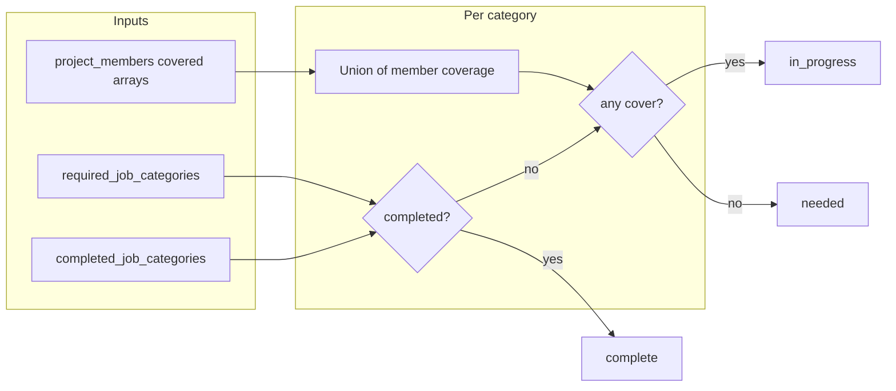

# Idea Arena: category in-progress and complete on cards

## Context

- **Join flow** already records which **job categories** a professional covers in [`project_members.covered_job_categories`](supabase/migrations/006_project_members_covered_categories.sql) (see [`joinProjectAsProfessional`](lib/project-members.ts)).
- **Detail UI** today treats “covered” as “someone on the team matches this category” ([`getArenaTeamDisplay`](lib/arena-team.ts) + [`ProjectDetailView`](components/idea-arena/project-detail-view.tsx)); there is no “work finished” state, and **project cards** use **static** icons ([`ProjectCard`](components/idea-arena/project-card.tsx)) with no real data.
- You confirmed scope is **job categories only** (not free-text `project_required_skills`).

## Status model (per required category)

For each category in `projects.required_job_categories` (same order as today):

| State | Meaning |
|--------|---------|
| **Needed** | Not in `completed_job_categories`, and no team member lists this category in their covered set (union across members for that project). |
| **In progress** | Not completed, and at least one member covers this category. |
| **Complete** | Category appears in new `projects.completed_job_categories` (inventor or teammate marked the slot done). |

Completed overrides “needed” / “in progress” for display (“no longer needed” / done).

## Data layer

1. **Migration** (new file under [`supabase/migrations/`](supabase/migrations/)): add `completed_job_categories text[] not null default '{}'` on `public.projects` (same storage style as `required_job_categories`).

2. **Types and reads** — extend [`ArenaProject`](lib/projects-arena.ts) with `completed_job_categories: string[]` and include the column in `listProjectsForArena` / `getProjectByIdForArena` selects; normalize with existing helpers (e.g. `normalizeRequiredJobCategoriesFromDb` or a small sibling that allows empty).

3. **List aggregation (no Clerk)** — after loading projects in [`listProjectsForArena`](lib/projects-arena.ts), run **one** additional query: `project_members` for `project_id in (...)` selecting `project_id` + `covered_job_categories`. Build a `Map<projectId, Set<category>>` = **union** of all members’ covered categories per project (same semantics as “covered” today, but batch-friendly).

4. **Return shape for cards** — either extend `ArenaProject` with a precomputed `category_statuses: { category: ProfessionalJobCategory; status: 'needed' | 'in_progress' | 'complete' }[]` (computed server-side in `listProjectsForArena`), or pass a parallel prop from [`app/idea-arena/page.tsx`](app/idea-arena/page.tsx). Prefer keeping computation in `lib/projects-arena.ts` so the page stays thin.

5. **Dashboard consistency (recommended)** — when saving project categories in [`app/dashboard/projects/actions.ts`](app/dashboard/projects/actions.ts), **intersect** stored `completed_job_categories` with the new `required_job_categories` so removed categories don’t leave stale completions.

## Server action (mark complete / reopen)

- Add a small `"use server"` module (e.g. [`app/idea-arena/[projectId]/category-actions.ts`](app/idea-arena/[projectId]/category-actions.ts)) with `setJobCategoryCompleted(projectId, category, completed: boolean)` (or toggle).
- **AuthZ**: reuse [`getWorkspaceAccessFlags`](lib/workspace-access.ts) — allow if `canAccess` (owner **or** team member), matching “inventor or someone on the team.”
- **Validation**: `category` must be in the project’s current `required_job_categories` (normalized).
- **Write**: `update projects set completed_job_categories = … where id = …`
- **`revalidatePath`**: `/idea-arena` and `/idea-arena/[projectId]`.

## UI

### Project cards ([`components/idea-arena/project-card.tsx`](components/idea-arena/project-card.tsx))

- Replace the **static** bottom icon row and/or the **decorative** right rail with **dynamic** slots driven by `project.required_job_categories` (up to **5**, per [`MAX_CATEGORIES`](components/dashboard/add-project-form.tsx)):
  - Compact treatment: small pills or dots with color + optional single-letter / abbreviated label; `aria-label` summarizing counts (e.g. “2 needed, 1 in progress, 2 complete”).
- Optional: right column becomes a **vertical stack of status glyphs** aligned to the same categories (instead of fake avatars), so the card stays scannable without loading Clerk for the list.

### Project detail ([`components/idea-arena/project-detail-view.tsx`](components/idea-arena/project-detail-view.tsx))

- For each category row, derive the three states from `project.completed_job_categories` + existing `categoryCoverage`.
- Copy/labels: e.g. “Needed”, “In progress” (contributor avatars stay as today), “Complete” / “No longer needed.”
- If `canOpenWorkspace` (or explicitly pass `canManageCategoryCompletion` from page using `getWorkspaceAccessFlags`), show a control per row: **Mark complete** / **Reopen** (toggle or button + confirm only if you want to avoid mis-clicks).

### Page wiring

- [`app/idea-arena/[projectId]/page.tsx`](app/idea-arena/[projectId]/page.tsx): pass `canManageCategoryCompletion` from `getWorkspaceAccessFlags` into `ProjectDetailView`.
- [`app/idea-arena/page.tsx`](app/idea-arena/page.tsx): ensure `ProjectCard` receives projects that already include per-category status (from extended `listProjectsForArena`).

## Testing / sanity checks

- Project with **no members**: only Needed vs Complete (manual complete).
- Project with **member covering category**: In progress until marked complete.
- **Non-team** viewer: sees statuses; **no** completion controls.
- **List page**: no N+1 Clerk calls; only projects + members query.

