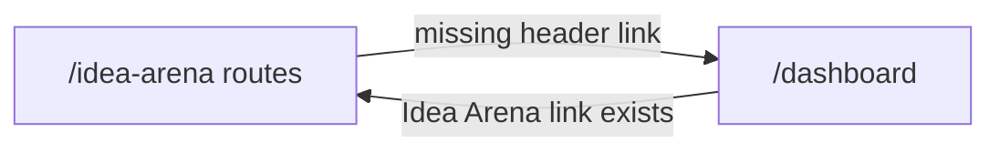

# Arena ↔ Dashboard navigation

## Problem

The screenshot shows **Dashboard** in the Idea Arena header (top right, before the avatar). In code, that link is missing: [`components/idea-arena/arena-header.tsx`](components/idea-arena/arena-header.tsx) only renders logo, landing anchors (INVENT/EARN/INVEST/HELP), and `VenUserButton`.

The return path **already exists** on the dashboard side:

```40:45:app/dashboard/page.tsx
            <Link
              href="/idea-arena"
              className="text-sm font-medium text-slate-700 hover:text-[#22c55e]"
            >
              Idea Arena
            </Link>
```

[`app/dashboard/profile/page.tsx`](app/dashboard/profile/page.tsx) already exposes both links. The gap is **one-way**: arena → dashboard is only reachable via inline body copy (empty states), not the header.



## Approach (minimal diff)

### 1. Add Dashboard link to `ArenaHeader`

Update [`components/idea-arena/arena-header.tsx`](components/idea-arena/arena-header.tsx):

- Wrap the right-side actions in a flex row (same pattern as dashboard header).
- Insert a **Dashboard** link before `VenUserButton`:

```tsx
<div className="flex items-center gap-4 shrink-0">
  <Link
    href="/dashboard"
    className="text-sm font-medium text-slate-700 hover:text-[#22c55e] transition-colors"
  >
    Dashboard
  </Link>
  <VenUserButton />
</div>
```

This automatically applies to all arena routes that use `ArenaHeader`:
- [`app/idea-arena/page.tsx`](app/idea-arena/page.tsx)
- [`app/idea-arena/[projectId]/page.tsx`](app/idea-arena/[projectId]/page.tsx)
- [`app/idea-arena/[projectId]/workspace/page.tsx`](app/idea-arena/[projectId]/workspace/page.tsx)

All three require auth, so no signed-out conditional is needed.

### 2. Keep dashboard return link as-is

No change required on [`app/dashboard/page.tsx`](app/dashboard/page.tsx) — **Idea Arena** already uses the same classes. Profile page already has both links with matching styling.

### 3. Optional consistency tweak (same PR, low cost)

[`app/page.tsx`](app/page.tsx) signed-in nav uses `ven-cta` (green pill) for Dashboard and plain text for Idea Arena. That is fine for marketing; app headers (arena + dashboard) will share the **text link + green hover** pattern. No landing-page change unless you want full parity later.

## Out of scope

- Extracting a shared `AppHeader` component (headers are duplicated in 3 places today; a refactor is nice-to-have but not required for this fix).
- Pink accent styling (you chose existing green/slate).
- Mobile hamburger for arena center nav (pre-existing; Dashboard link will still show on mobile next to the avatar, matching the screenshot layout).

## Verification

After implementation, manually check:

1. `/idea-arena` — header shows **Dashboard** → navigates to `/dashboard`
2. `/idea-arena/[id]` and `/idea-arena/[id]/workspace` — same header link present
3. `/dashboard` — **Idea Arena** link still works
4. `/dashboard/profile` — both links still work
5. Mobile width — Dashboard link visible beside avatar on arena pages
