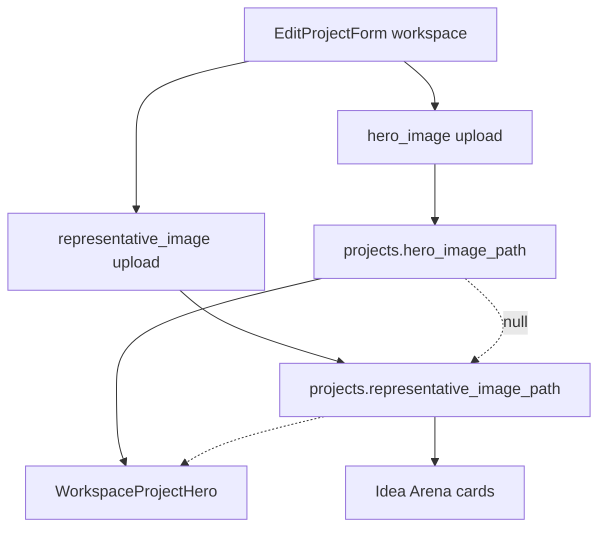

# Arena Card Details: dynamic file labels + hero image

## Current state

The **Arena Card Details** tab ([`components/workspace/workspace-shell.tsx`](components/workspace/workspace-shell.tsx)) renders [`EditProjectForm`](components/dashboard/edit-project-form.tsx) with `variant="workspace"`. Image upload is a single field:

- **DB:** `projects.representative_image_path` (storage path in `project-images` bucket)
- **Form field:** `representative_image` → uploaded as `{projectId}/cover.{ext}`
- **Consumers:** Idea Arena cards/detail (`arenaProjectImageUrl`) **and** workspace banner ([`WorkspaceProjectHero`](components/workspace/workspace-project-hero.tsx)) both read the same path

The button always reads **"Add a file"** even when a custom image is already saved (workspace preview always shows something because of the picsum placeholder).

```125:179:components/dashboard/edit-project-form.tsx
  const imageField = (
    <div>
      ...
          <label ...>
            Add a file
          </label>
```

## Goals

1. **Dynamic button label:** "Add a file" when no custom image exists; **"Change file"** when `representative_image_path` is set (or a new file is already picked).
2. **Hero image section:** New optional upload for the workspace top banner, stored separately, with **fallback to arena card image** (then picsum) when hero is unset.



## Implementation

### 1. Database — new column

Add migration [`supabase/migrations/014_project_hero_image.sql`](supabase/migrations/014_project_hero_image.sql):

```sql
alter table public.projects
  add column if not exists hero_image_path text;
```

Comment: storage path in `project-images` bucket (e.g. `{projectId}/hero.webp`), not a full URL — mirrors `representative_image_path`.

### 2. Upload pipeline — server

**[`lib/representative-image-upload.ts`](lib/representative-image-upload.ts)**

- Add optional `fileName` parameter to `readRepresentativeImageFromFormData` (default `cover.{ext}`; hero uses `hero.{ext}`).
- Reuse same validation (5MB, JPEG/PNG/WebP).

**[`app/dashboard/projects/actions.ts`](app/dashboard/projects/actions.ts)**

- Add `hero_image_path: string | null` to `ProjectRow`.
- Generalize `uploadRepresentativeImage` → `uploadProjectImage(projectId, image, fileName)` (or pass filename from parsed result).
- In `updateProjectWithMediaAndSkills`:
  - Read `hero_image` from formData (field name `hero_image`).
  - If present, upload to `{projectId}/hero.{ext}` and update `hero_image_path`.
  - Keep existing `representative_image` → `representative_image_path` flow unchanged.
- Include `hero_image_path` in project fetch/select queries in this file.

No change to project **create** flow unless desired later (hero can be added on edit only).

### 3. URL helper — hero with fallback

**[`components/idea-arena/utils.ts`](components/idea-arena/utils.ts)** (or [`lib/project-image-url.ts`](lib/project-image-url.ts)):

```ts
export function workspaceHeroImageUrl(project: {
  id: string;
  hero_image_path: string | null;
  representative_image_path: string | null;
}): string {
  const hero = publicProjectImageUrl(project.hero_image_path);
  if (hero) return hero;
  return arenaProjectImageUrl(project); // arena upload or picsum
}
```

### 4. Wire hero path through workspace

| File | Change |
|------|--------|
| [`lib/projects-arena.ts`](lib/projects-arena.ts) | Select/map `hero_image_path` on `ArenaProject` |
| [`app/workspace/[projectId]/page.tsx`](app/workspace/[projectId]/page.tsx) | Pass `heroImagePath` + include in `editableProject` |
| [`components/workspace/workspace-shell.tsx`](components/workspace/workspace-shell.tsx) | Add `heroImagePath` prop; pass to `WorkspaceProjectHero` and `EditProjectForm` key |
| [`components/workspace/workspace-project-hero.tsx`](components/workspace/workspace-project-hero.tsx) | Accept `heroImagePath` + `representativeImagePath`; use `workspaceHeroImageUrl` |

### 5. Form UI — [`edit-project-form.tsx`](components/dashboard/edit-project-form.tsx)

**Scope:** `variant === "workspace"` only for the new hero section. Dashboard variant keeps a single image field but can get the same dynamic button label.

**Extract a small local helper** (inline sub-component or render function) to avoid duplicating file-input/preview logic for two image fields:

| Field | Label | Preview aspect | Helper copy |
|-------|-------|----------------|-------------|
| Hero | **Hero image** (optional) | Wide banner matching hero: `w-full aspect-[5/1] max-h-44` (approximates `h-36 md:h-44` crop) | "This is how your project banner appears at the top of the workspace." |
| Arena card | **Arena card image** (optional) | Existing `aspect-4/3` preview | Existing 4:3 helper text |

**Preview priority (hero section):**

1. Blob URL from newly picked file
2. Saved `hero_image_path`
3. Saved `representative_image_path` (show with subtle note: "Using arena card image until you upload a hero.")
4. Picsum placeholder

**Button label logic (both sections):**

```ts
const hasCustomImage = !!(savedPath?.trim() || selectedFile);
// label = hasCustomImage ? "Change file" : "Add a file"
```

Use saved path only (not picsum) so placeholder state still shows "Add a file".

**Form field names:**

- `hero_image` (new)
- `representative_image` (unchanged)

**Layout order:** Hero image section **first**, then arena card image (matches workspace visual hierarchy: banner above card).

**State:** Mirror existing arena image state for hero (`selectedHeroFile`, `heroPreviewBlobUrl`, `heroInputRef`, reset on successful save).

### 6. Panel copy tweak (optional, low cost)

Update [`workspace-shell.tsx`](components/workspace/workspace-shell.tsx) panel description to mention both images: workspace banner + Idea Arena card.

## Files to touch

| File | Change |
|------|--------|
| `supabase/migrations/014_project_hero_image.sql` | New column |
| `lib/representative-image-upload.ts` | Configurable output filename |
| `app/dashboard/projects/actions.ts` | Hero upload + type/query updates |
| `components/idea-arena/utils.ts` | `workspaceHeroImageUrl` |
| `lib/projects-arena.ts` | Select `hero_image_path` |
| `app/workspace/[projectId]/page.tsx` | Pass hero path |
| `components/workspace/workspace-shell.tsx` | Props + editable project type |
| `components/workspace/workspace-project-hero.tsx` | Use hero URL helper |
| `components/dashboard/edit-project-form.tsx` | Hero section + dynamic labels |

## Out of scope

- Hero image on project **create** form
- Crop/zoom editor
- Changing Idea Arena to use hero image (cards/detail stay on `representative_image_path`)
- Dashboard inline edit hero section

## Manual test

1. Open workspace → **Arena Card Details** for a project **with** an arena card image: arena button reads **Change file**; hero button reads **Add a file**.
2. Pick a new arena file (don't save): button stays **Change file**; preview updates live.
3. Upload a hero image → Save → workspace top banner updates; Idea Arena card image unchanged.
4. Remove hero (not in scope unless we add delete — skip) / new project with only arena image: workspace banner shows arena card image (fallback).
5. Project with neither image: both sections show picsum; both buttons read **Add a file**.
6. Save both images in one submit → both paths persist.
