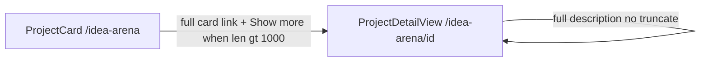

# Idea Arena: description in summary areas

## Scope (confirmed)

- **List** ([`/idea-arena`](app/idea-arena/page.tsx) via [`ProjectCard`](components/idea-arena/project-card.tsx)): show description in the card’s main column; truncate to **1000 characters**; when longer, append **Show more** (navigates to the same destination as the card: `/idea-arena/[id]` with existing filter query).
- **Detail** ([`/idea-arena/[projectId]`](app/idea-arena/[projectId]/page.tsx) via [`ProjectDetailView`](components/idea-arena/project-detail-view.tsx)): keep full description in the **Summary:** block (already wired to `project.description`); relax **`aspect-square`** on the hero image so the layout can grow naturally.

No API or schema changes: [`ArenaProjectForViewer`](lib/projects-arena.ts) already includes `description` from `listProjectsForArenaForViewer()`.

## List card — [`project-card.tsx`](components/idea-arena/project-card.tsx)

**1. Shared copy helper (inline or tiny local function)**

```ts
const DESC_PREVIEW_MAX = 1000;
const raw = project.description?.trim() ?? "";
const isTruncated = raw.length > DESC_PREVIEW_MAX;
const preview = isTruncated ? raw.slice(0, DESC_PREVIEW_MAX) : raw;
const summaryLabel = preview || null; // empty → omit block or short empty state
```

Match detail empty copy when missing: *"No summary yet. The inventor can add more detail from the dashboard."* (optional on list: only show when you want parity; otherwise omit the block when empty to keep cards compact).

**2. Summary block placement**

Insert after the image, before skill badges (same visual “summary” band as detail):

```tsx
<p className="text-[11px] text-slate-700 leading-snug mb-2">
  <span className="font-semibold">Summary: </span>
  {preview || "No summary yet…"}
  {isTruncated ? (
    <>
      …{" "}
      <span className="text-[#22c55e] font-medium group-hover:underline">
        Show more
      </span>
    </>
  ) : null}
</p>
```

Use `line-clamp` only if you want a **visual** cap in addition to the 1000-char cap (not required by spec). Prefer **no extra line-clamp** so the 1000-char limit is the single source of truth.

**3. Nested links**

The card is already a single [`<Link href={href}>`](components/idea-arena/project-card.tsx). **Do not** nest a second `<Link>` for “Show more”. Styled text inside the same link is enough (whole card + “Show more” go to detail). Update `aria-label` to include a short description snippet when present.

**4. Image box (non-square)**

Replace:

```114:114:components/idea-arena/project-card.tsx
        <div className="aspect-square relative bg-slate-300 rounded-lg overflow-hidden mb-2">
```

with a shorter fixed aspect, e.g. `aspect-[4/3]` or `h-36 w-full` (no `aspect-square`), so adding summary text does not fight a tall square image.

**5. Team rail height (minor)**

If cards grow taller, consider bumping `max-h-[200px]` on the team column slightly or leaving as-is after visual check.

## Detail page — [`project-detail-view.tsx`](components/idea-arena/project-detail-view.tsx)

**1. Full description (unchanged logic, explicit behavior)**

Keep:

```77:79:components/idea-arena/project-detail-view.tsx
  const summary =
    project.description?.trim() ||
    "No summary yet. The inventor can add more detail from the dashboard.";
```

No 1000-char truncation on detail.

**2. Non-square image**

Replace `aspect-square max-w-md` on the hero container (lines 89–106) with something like `aspect-[4/3] max-w-md w-full` (or `max-h-80` + `aspect-auto`) so the image area is wider than tall and the summary paragraph sits directly below without an oversized square gap.

Optional polish: wrap image + **Summary:** paragraph in one `space-y-3` group so it reads as one “summary area” (title stays above).

## Files touched

| File | Change |
|------|--------|
| [`components/idea-arena/project-card.tsx`](components/idea-arena/project-card.tsx) | Summary text + truncation + Show more; non-square image; aria-label |
| [`components/idea-arena/project-detail-view.tsx`](components/idea-arena/project-detail-view.tsx) | Non-square hero image; optional summary grouping |

No changes to [`app/idea-arena/page.tsx`](app/idea-arena/page.tsx), server queries, or forms.

## Verification

1. Project **with** description &lt; 1000 chars: list shows full text, no “Show more”; detail shows full text.
2. Project **with** description &gt; 1000 chars: list shows exactly 1000 chars + “…” + “Show more”; clicking card or “Show more” opens `/idea-arena/[id]` with filter query preserved.
3. Project **without** description: list empty state (if implemented) or omitted block; detail shows existing placeholder.
4. Horizontal scroll on `/idea-arena`: cards remain `shrink-0`, layout not broken on mobile.
5. Screen reader: `aria-label` still meaningful with description snippet.


