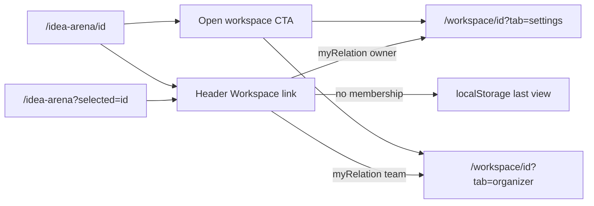

# Arena → Workspace: open the right project tab

## Problem

Idea Arena already knows membership via `myRelation` on each project ([`lib/projects-arena.ts`](lib/projects-arena.ts)) and `getWorkspaceAccessFlags` on the detail page ([`lib/workspace-access.ts`](lib/workspace-access.ts)). But workspace entry points ignore that context:

| Entry point | Today | Issue |
|-------------|-------|-------|
| Header **Workspace** link | [`workspaceHrefFromStorage`](lib/workspace-last-view.ts) in [`workspace-nav-link.tsx`](components/workspace/workspace-nav-link.tsx) | Opens last viewed project or `/workspace`, not the arena project you’re viewing |
| **Open workspace** on detail | `/workspace/${project.id}` in [`project-detail-view.tsx`](components/idea-arena/project-detail-view.tsx) | Correct project, wrong tab (defaults to Messages) |
| Idea Arena overview | No workspace shortcut | Header still uses stale last-view |

You confirmed the target is **`/workspace/{projectId}` with role-based tab**: owner → `?tab=settings` (Arena Card Details), team → `?tab=organizer`.



## Implementation

### 1. Shared href helper

Add a small pure helper in [`lib/workspace-arena-nav.ts`](lib/workspace-arena-nav.ts) (new file):

```ts
export function workspaceHrefForArenaMember(
  projectId: string,
  relation: "owner" | "team",
): string {
  const tab = relation === "owner" ? "settings" : "organizer";
  return `/workspace/${projectId}?tab=${tab}`;
}
```

No server-only imports — usable from server pages and client components.

### 2. Pass context href into the header

Extend [`components/idea-arena/arena-header.tsx`](components/idea-arena/arena-header.tsx):

- New optional prop: `contextWorkspaceHref?: string`
- Pass through to [`WorkspaceNavLink`](components/workspace/workspace-nav-link.tsx)

Update [`WorkspaceNavLink`](components/workspace/workspace-nav-link.tsx):

- Accept optional `contextWorkspaceHref`
- When **not** already on `/workspace/*`, prefer `contextWorkspaceHref` over `workspaceHrefFromStorage(userId)`
- Keep existing behavior when `contextWorkspaceHref` is undefined (workspace pages, landing, etc.)

### 3. Compute context on Idea Arena pages

**Detail page** — [`app/idea-arena/[projectId]/page.tsx`](app/idea-arena/[projectId]/page.tsx):

- Reuse existing `canOpenWorkspace` / `isProjectOwner` from `getWorkspaceAccessFlags`
- If `canOpenWorkspace`: `contextWorkspaceHref = workspaceHrefForArenaMember(projectId, isProjectOwner ? "owner" : "team")`

**Overview page** — [`app/idea-arena/page.tsx`](app/idea-arena/page.tsx):

- Only when `selected` query param is present **and** the selected project has `myRelation` of `"owner"` or `"team"` (avoid defaulting to first card when user hasn’t selected anything)
- Pass computed href to `ArenaHeader`

[`components/workspace/workspace-page-chrome.tsx`](components/workspace/workspace-page-chrome.tsx) unchanged — no context href on workspace routes.

### 4. Align **Open workspace** CTA

In [`components/idea-arena/project-detail-view.tsx`](components/idea-arena/project-detail-view.tsx):

- Replace both hardcoded `/workspace/${project.id}` links (lines ~229 and ~269) with the same helper:
  - owner → `?tab=settings`
  - team member → `?tab=organizer`
- Pass `isProjectOwner` (already available) into the href builder

### 5. Last-view persistence (small UX win)

When the user follows a context href from Idea Arena, [`workspace-shell.tsx`](components/workspace/workspace-shell.tsx) already calls `writeWorkspaceLastView(currentUserId, projectId)` on mount — so the header link will stay consistent after first visit. No extra work required beyond landing on `/workspace/{id}`.

## Files to change

| File | Change |
|------|--------|
| [`lib/workspace-arena-nav.ts`](lib/workspace-arena-nav.ts) | **New** — `workspaceHrefForArenaMember` |
| [`components/workspace/workspace-nav-link.tsx`](components/workspace/workspace-nav-link.tsx) | Prefer optional context href |
| [`components/idea-arena/arena-header.tsx`](components/idea-arena/arena-header.tsx) | Accept + forward `contextWorkspaceHref` |
| [`app/idea-arena/page.tsx`](app/idea-arena/page.tsx) | Compute href from explicit `?selected=` + `myRelation` |
| [`app/idea-arena/[projectId]/page.tsx`](app/idea-arena/[projectId]/page.tsx) | Compute href from access flags |
| [`components/idea-arena/project-detail-view.tsx`](components/idea-arena/project-detail-view.tsx) | Role-aware Open workspace links |

## Verification

- **Owner** on their project detail: header Workspace + Open workspace → `/workspace/{id}?tab=settings`, Arena Card Details tab active
- **Team member** on joined project detail: both links → `/workspace/{id}?tab=organizer`
- **Non-member** browsing arena: header Workspace → previous localStorage destination (unchanged)
- **Overview** with `?selected={ownedOrTeamProject}`: header Workspace → that project’s workspace with correct tab
- **Overview** without `?selected=`: header Workspace → localStorage fallback (no false default to first card)
- **Dual-role user** viewing a team project: lands on that project workspace (not inventor dashboard or a different last-view project)
