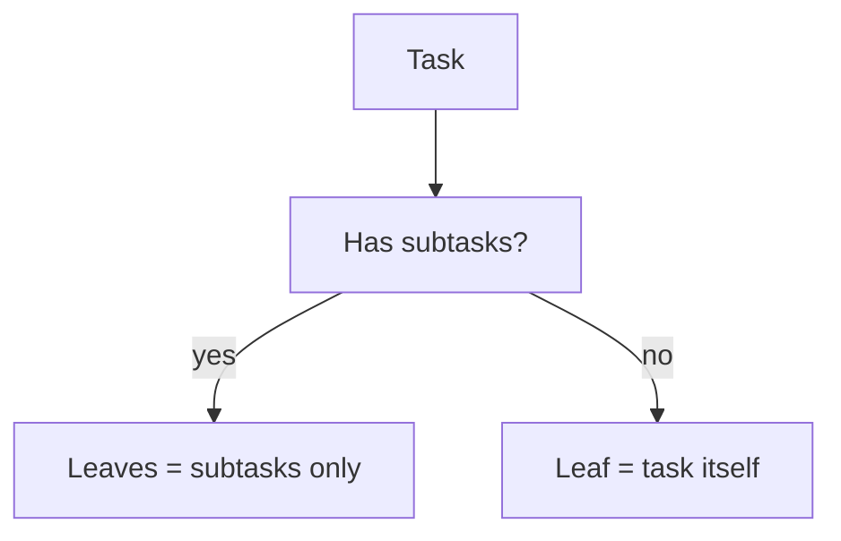

# Checkable tasks with no subtasks

## Problem

After the task list → task → subtask rollout, **only subtasks** are leaves. A newly added task (via **Add task**) has `subtasks: []` and cannot be checked off, so it never counts toward skill progress or Idea Arena completion.

## Leaf rule



- **`task.subtasks.length > 0`**: completion is subtask-only; ignore `task.completed`.
- **`task.subtasks.length === 0`**: task is a leaf; use `task.completed` and `task.id` for toggle/count/sync.

## Data model — [`lib/workspace-progress-checklist.ts`](lib/workspace-progress-checklist.ts)

Add `completed: boolean` to `WorkspaceProgressTask`:

```ts
export type WorkspaceProgressTask = {
  id: string;
  title: string;
  standard: boolean;
  completed: boolean;
  subtasks: WorkspaceProgressSubtask[];
};
```

Introduce a small shared leaf shape for counting/toggling (avoids overloading subtask type):

```ts
export type WorkspaceProgressLeaf = {
  id: string;
  title: string;
  completed: boolean;
};
```

Update helpers:

| Function | Change |
|----------|--------|
| `parseTask` | Read `completed` from JSON; default `false` |
| `legacyMinorToTask` | Set `completed: false` on wrapper task (subtask holds state) |
| `mergeChecklistWithTemplates` | Set `completed: false` on standard tasks; preserve `oldTask.completed` when merging custom tasks |
| `addCustomTask` | Push task with `completed: false` |
| `addCustomSubtask` | When adding first subtask, set `task.completed = false` |
| `collectLeavesForCategory` | Return `WorkspaceProgressLeaf[]`: emit each subtask; if `task.subtasks.length === 0`, emit the task |
| `setLeafCompleted` | If `leafId` matches a task with no subtasks, toggle `task.completed`; else toggle subtask as today |
| `setAllLeavesInCategory` | Toggle subtasks **and** `task.completed` for empty tasks |

`categoryAllLeavesComplete`, `categoryHasAnyLeafCompleted`, and `completedCategoriesFromChecklist` stay the same (they already delegate to `collectLeavesForCategory`).

No SQL migration — JSON field is additive; missing `completed` parses as `false`.

## Server actions — [`app/idea-arena/[projectId]/workspace/actions.ts`](app/idea-arena/[projectId]/workspace/actions.ts)

No new actions. Existing `actionProgressToggleLeaf(projectId, category, leafId, completed)` continues to work once `setLeafCompleted` accepts task ids for empty tasks.

Optional error copy tweak: `"Task not found."` already fits.

## UI — [`components/workspace/workspace-progress-panel.tsx`](components/workspace/workspace-progress-panel.tsx)

1. Generalize checkbox row helper to accept `{ id, title, completed }` (rename `renderSubtaskRow` → `renderLeafRow` or widen param type).
2. In the task list render loop, **before** `isCollapsedSingleSubtaskTask`:

```tsx
if (task.subtasks.length === 0) {
  return renderLeafRow(slot, task); // checkbox on task title
}
```

3. Existing collapsed single-subtask behavior unchanged (still checks subtask, not task).
4. Multi-subtask accordion unchanged.

Progress header (`X / Y subtasks done`) will automatically include empty tasks in the count via updated `collectLeavesForCategory`.

## Downstream

- [`lib/projects-arena.ts`](lib/projects-arena.ts) — no code changes (uses leaf helpers only).
- [`lib/workspace-progress-sync.ts`](lib/workspace-progress-sync.ts) — no changes.
- [`app/dashboard/projects/actions.ts`](app/dashboard/projects/actions.ts) — no changes.

## Manual test

1. Add a custom **task** with no subtasks → checkbox appears; checking it updates count and persists on reload.
2. Check all leaves in a skill (mix of subtasks + one empty task) → Idea Arena slot **Complete**.
3. Add a subtask to a previously checked empty task → task checkbox goes away; subtask starts unchecked; category returns to **In progress** until subtask is checked.
4. Standard template tasks (always have subtasks) behave as before.
