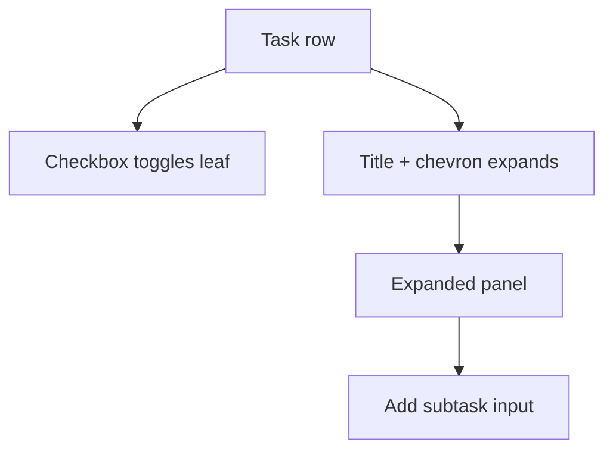
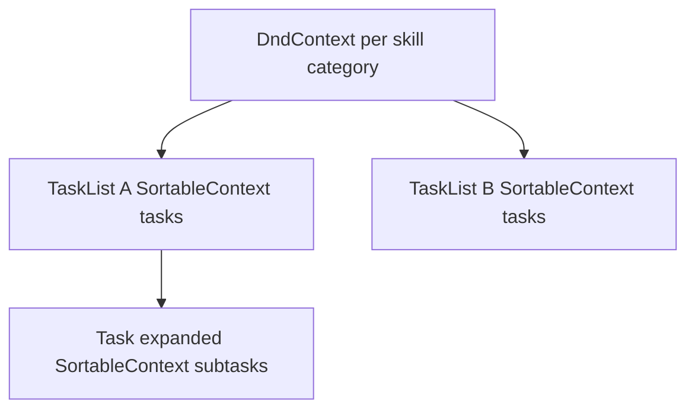

# Clickable tasks + drag-and-drop in Progress

## Problem today

In [`components/workspace/workspace-progress-panel.tsx`](components/workspace/workspace-progress-panel.tsx), two render shortcuts block the UX you want:

1. **Empty tasks** (`subtasks.length === 0`) render as a bare checkbox via `renderLeafRow` — no chevron, no **Add subtask** row.
2. **Single-subtask tasks** (`isCollapsedSingleSubtaskTask`) render as a flat subtask checkbox — the task header is hidden, so users cannot expand to add more subtasks.

Multi-subtask tasks already work: header toggles expand, expanded panel has subtasks + **Add subtask**.



## Part 1 — Always-clickable task rows

### Unified `ProgressTaskRow` component

Extract a small client component (new file [`components/workspace/progress-task-row.tsx`](components/workspace/progress-task-row.tsx)) used for **every** task, replacing the three branches at lines 332–439.

**Row layout (collapsed):**

| Drag handle (Part 2) | Checkbox | Title (flex-1) | Chevron |
|---|---|---|---|

**Checkbox rules (unchanged leaf logic from [`lib/workspace-progress-checklist.ts`](lib/workspace-progress-checklist.ts)):**

- `subtasks.length === 0` → checkbox toggles the **task** (`task.id`)
- `subtasks.length === 1` → checkbox toggles the **sole subtask** (even when titles match — keeps migrated template data working)
- `subtasks.length > 1` → no checkbox on header; subtask checkboxes inside expanded panel only

**Expand rules:**

- Chevron + title click → `toggleTask(task.id)`; `stopPropagation` on checkbox and drag handle
- Default **expanded** when user adds a task/subtask (set `expandedTasks` after successful add)
- Remove `isCollapsedSingleSubtaskTask` as a separate render path; optionally keep the helper only to default-collapse visually (single matching subtask starts collapsed, but row still shows chevron)

**Expanded panel:** existing subtask list + **Add subtask** input (same server action `actionProgressAddCustomSubtask`).

### Empty-task add-subtask path

When an empty task is expanded, show only the **Add subtask** row (no subtask list). Adding the first subtask already clears `task.completed` in `addCustomSubtask` — no model change needed.

---

## Part 2 — Drag-and-drop

### Dependency

Add **`@dnd-kit/core`**, **`@dnd-kit/sortable`**, **`@dnd-kit/utilities`** to [`package.json`](package.json). No existing DnD library in the repo; native HTML5 DnD is brittle for nested lists and accessibility.

Use `GripVertical` from `lucide-react` as the drag handle (not the whole row — avoids fighting checkbox clicks).

### Scope (per your answer)

| Entity | Allowed moves |
|--------|----------------|
| **Tasks** | Reorder within a task list **or** move to another task list in the **same skill category** |
| **Subtasks** | Reorder within their parent task only |
| **Task lists** | Not draggable in v1 |

One `DndContext` per **expanded skill panel** (category). Nested sortable contexts:



`onDragEnd` resolves:

- **`type: "task"`** — find source list, remove task, insert into target list at `over` index (same or different list within category)
- **`type: "subtask"`** — reorder within parent task’s `subtasks` array only; ignore drops on other tasks

Optimistic UI optional; v1 can persist then `router.refresh()` like other Progress mutations.

### Library helpers — [`lib/workspace-progress-checklist.ts`](lib/workspace-progress-checklist.ts)

Add:

```ts
moveTaskInCategory(
  checklist, category, taskId, targetTaskListId, targetIndex
): WorkspaceProgressChecklist | null

reorderSubtasksInTask(
  checklist, category, taskId, orderedSubtaskIds: string[]
): WorkspaceProgressChecklist | null
```

Validation: task/subtask must exist in the given category; reject cross-category moves; reject subtask moves that change parent task.

### Merge order preservation (critical)

Today [`mergeChecklistWithTemplates`](lib/workspace-progress-checklist.ts) rebuilds tasks in **template index order**, which would undo user drag order on the next dashboard skill sync.

Update merge to **prefer persisted sibling order** from `existing`:

- For each standard/custom task list: walk `oldTaskList.tasks` order first (merge template fields by id), then append any new template tasks not yet present (in template order)
- For each task’s subtasks: same pattern — preserve `oldTask.subtasks` order, append new template subtasks

This keeps drag order stable across reloads and `ensureWorkspaceProgressChecklistSynced`.

### Server actions — [`app/idea-arena/[projectId]/workspace/actions.ts`](app/idea-arena/[projectId]/workspace/actions.ts)

Add:

- `actionProgressMoveTask(projectId, category, taskId, targetTaskListId, targetIndex)`
- `actionProgressReorderSubtasks(projectId, category, taskId, orderedSubtaskIds)`

Same auth/merge/persist pattern as existing `actionProgressToggleLeaf`. Reorder actions do **not** need arena revalidation beyond existing `revalidateArenaAndWorkspace` (completion is id-based, not order-based).

---

## Part 3 — Wire up panel

Refactor [`components/workspace/workspace-progress-panel.tsx`](components/workspace/workspace-progress-panel.tsx):

1. Replace inline task branches with `ProgressTaskRow`
2. Wrap each skill’s expanded body in `DndContext` + per–task-list `SortableContext`
3. Pass drag callbacks into task/subtask rows
4. Disable DnD while `pending` transition is active

Accessibility: `@dnd-kit` keyboard sorting + `aria-grabbed` on handles; `disabled={pending}` on sortables during saves.

---

## Files to touch

| File | Change |
|------|--------|
| [`components/workspace/progress-task-row.tsx`](components/workspace/progress-task-row.tsx) | New unified task row (checkbox + expand + add subtask + sortable wrapper) |
| [`components/workspace/workspace-progress-panel.tsx`](components/workspace/workspace-progress-panel.tsx) | DndContext wiring; use ProgressTaskRow |
| [`lib/workspace-progress-checklist.ts`](lib/workspace-progress-checklist.ts) | `moveTaskInCategory`, `reorderSubtasksInTask`, merge order preservation |
| [`app/idea-arena/[projectId]/workspace/actions.ts`](app/idea-arena/[projectId]/workspace/actions.ts) | Two new reorder actions |
| [`package.json`](package.json) | Add `@dnd-kit/*` |

---

## Manual test plan

1. **Single-subtask template row** — checkbox works; chevron expands; **Add subtask** adds a second subtask and task becomes multi-subtask accordion.
2. **Empty custom task** — checkbox works; expand shows **Add subtask**; first subtask replaces task-as-leaf behavior.
3. **Drag task** within same task list — order persists after reload.
4. **Drag task** to a different task list in same skill — persists after reload.
5. **Drag subtask** within task — persists; cannot drop onto another task.
6. **Cannot drag** across skill categories (Finance task stays in Finance).
7. Edit required skills on dashboard → merge preserves custom drag order (standard + custom items).
8. Check-all / arena complete still driven by leaf completion, unaffected by reorder.

## Out of scope (v1)

- Drag task lists
- Delete/rename nodes
- Drag subtasks across tasks (would require merge semantics for completion state)
