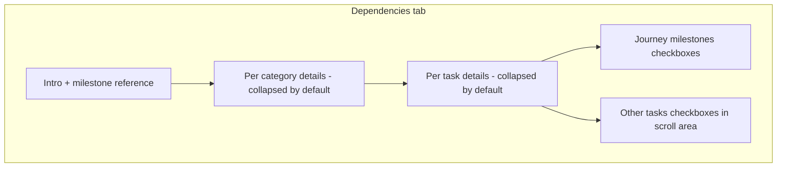

# Collapse template dependencies UI

## Problem

[`components/admin/template-dependencies-editor.tsx`](components/admin/template-dependencies-editor.tsx) renders **every prerequisite as a clickable pill** for **every checklist leaf**:

```99:119:components/admin/template-dependencies-editor.tsx
              <div className="flex flex-wrap gap-2">
                {prerequisiteOptions
                  .filter((opt) => opt.id !== leaf.id)
                  .map((opt) => {
                    const isOn = selected.includes(opt.id);
                    return (
                      <button
                        key={opt.id}
                        type="button"
                        onClick={() => toggleDep(leaf.id, opt.id)}
                        ...
                      >
                        {opt.title}
                      </button>
                    );
                  })}
              </div>
```

With a full template (multiple skill categories × standard task lists), each task can show **30+ buttons**, repeated for every task—hundreds of click targets on one tab.

**No backend or data-model changes** are needed; `toggleDep` / `setDeps` logic stays the same.

## Approach

Refactor only [`components/admin/template-dependencies-editor.tsx`](components/admin/template-dependencies-editor.tsx) to match patterns already used in [`components/admin/template-checklist-editor.tsx`](components/admin/template-checklist-editor.tsx) (`<details>` / `<summary>`).



### 1. Collapse by category and by task

- Group `leaves` by `leaf.category` (same grouping as Checklist tab).
- Outer `<details>` per category, **closed by default**.
- Inner `<details>` per task, **closed by default**.
- Summary lines show useful at-a-glance info:
  - Category: task count
  - Task: title + badge like `2 prerequisites` (or `None`)

### 2. Replace pill buttons with compact checkbox lists

When a task row is expanded, show two labeled sections instead of a flex-wrap pill grid:

| Section | Content |
|---------|---------|
| Journey milestones | 6 checkboxes (reuse `MILESTONE_OPTIONS`) |
| Other skill tasks | Checkboxes for other leaves only, in a `max-h-40 overflow-y-auto` container |

Checkboxes call the existing `toggleDep(leaf.id, depId)` handler—same behavior, less visual noise.

### 3. Show selections when collapsed (read-only)

In each task’s `<summary>`, show up to 2–3 selected prerequisite titles as small non-clickable chips (milestones + tasks), with `+N more` if needed. This lets admins scan configured deps without expanding every row.

### 4. Optional bulk controls (small addition)

Add two text buttons above the list:

- **Expand all** / **Collapse all** — toggles open state for category sections (and optionally nested task sections).

This is a ~20-line `useState` map or a single `expanded` boolean if we only collapse categories; nested task collapse can stay manual unless you want both levels controlled.

### 5. Keep the static milestone reference block

The existing read-only “VenShares journey milestones” info box at the top stays (or move milestone list into the picker section only—either is fine; recommend **keeping the reference box** and duplicating labels in checkboxes when expanded, since admins may not expand every task).

## Files to change

| File | Change |
|------|--------|
| [`components/admin/template-dependencies-editor.tsx`](components/admin/template-dependencies-editor.tsx) | UI restructure only |

No changes to [`components/admin/template-editor-shell.tsx`](components/admin/template-editor-shell.tsx), actions, or Supabase.

## Verification

Manual check on `/admin/templates/[id]` → Dependencies tab:

1. Page loads with categories collapsed; no wall of pills.
2. Expand one task → milestone + task checkboxes work; save persists overrides.
3. Summary chips reflect selections after toggling.
4. Template with zero checklist leaves still shows the existing empty-state message.
