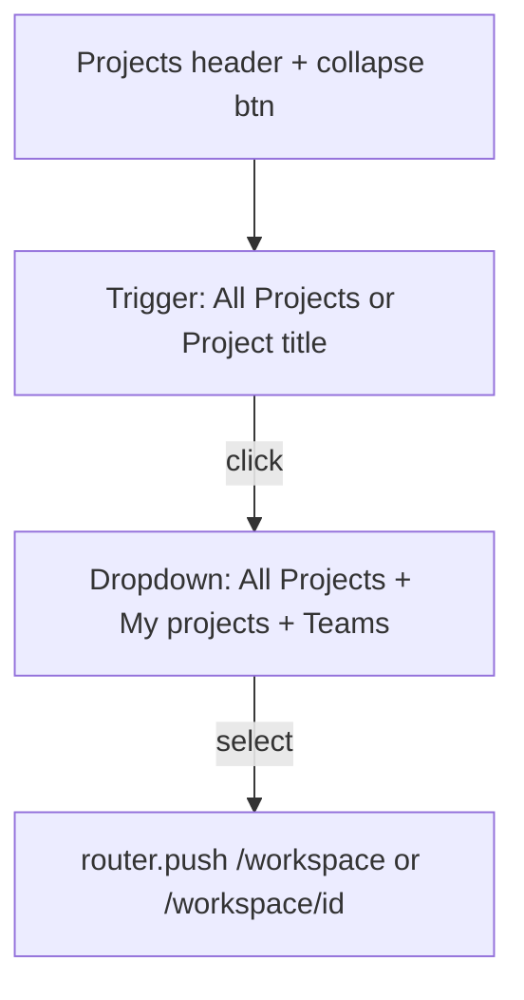

# Compact collapsible project picker

## Goal

Replace the expanded project list in the sidebar ([`workspace-project-picker.tsx`](components/workspace/workspace-project-picker.tsx)) with a **compact picker**: one trigger row showing the current context, a **dropdown** for switching to All Projects or any project, and a **collapse toggle** in the top-right of the Projects header to hide/show the picker block.

No data or routing changes — same `owned` / `joined` props, same `/workspace` and `/workspace/[projectId]` navigation, same `writeWorkspaceLastView` persistence.

---

## Current vs target

| Today | Target |
|-------|--------|
| "All Projects" link + always-visible grouped lists | Single trigger + dropdown only |
| ~N rows of thumbnails in sidebar | Collapsed to 1–2 rows when picker open |
| No collapse | Header row: **Projects** (left) + chevron (right) |

---

## UI design

### Header row (always visible when sidebar picker section is expanded)

- Left: `Projects` label (existing uppercase style)
- Right: collapse button (chevron up/down), matching [`dashboard-mini-project-strip.tsx`](components/dashboard/dashboard-mini-project-strip.tsx) pattern
- `aria-expanded` on collapse button; `aria-controls` pointing at picker body

### Picker body (hidden when section collapsed)

Single **trigger button** (full width of sidebar):

- Shows **All Projects** + `LayoutGrid` icon when `activeProjectId === null`
- Shows **active project title** + 32×32 thumbnail when a project is selected
- Trailing `ChevronDown` indicates dropdown
- `aria-haspopup="listbox"` / `aria-expanded` when menu open

### Dropdown menu

Reuse [`AnchoredMenuPanel`](components/workspace/anchored-menu-panel.tsx) (already used in workspace file menus) — portal-positioned, right-aligned to trigger, opens below (or above if clipped).

Menu contents (scrollable, `max-h-64`):

1. **All Projects** — `LayoutGrid` icon, highlighted when `activeProjectId === null`
2. **My projects** group header (only if `owned.length > 0`)
3. Owned project rows — thumbnail + title
4. **Teams I'm on** group header (only if `joined.length > 0`)
5. Joined project rows — thumbnail + title

Each row is a `Link` or `button` that:

- Calls `writeWorkspaceLastView`
- `router.push` to target
- Closes dropdown

Click outside / Escape closes menu (follow `AnchoredMenuPanel` + existing menu patterns).

---

## Collapse persistence

New key in [`lib/workspace-last-view.ts`](lib/workspace-last-view.ts) or inline in picker (prefer co-located in picker file like mini-strip):

- Key: `ven-shares:workspace-picker-collapsed:{userId}`
- Default: expanded (`false`)
- Read on mount, write on toggle

When collapsed: hide trigger + dropdown; only show header row with expand chevron.

---

## File changes

| File | Change |
|------|--------|
| [`components/workspace/workspace-project-picker.tsx`](components/workspace/workspace-project-picker.tsx) | Rewrite: remove `ProjectGroup` always-visible lists; add header collapse, trigger, `AnchoredMenuPanel` dropdown |
| [`components/workspace/workspace-app-shell.tsx`](components/workspace/workspace-app-shell.tsx) | No structural change expected (picker stays at sidebar top) |

Remove dead code: `ProjectRow` / `ProjectGroup` as always-visible list; inline into dropdown option component.

---

## Accessibility

- Collapse button: `aria-expanded`, label "Hide projects" / "Show projects"
- Trigger: `aria-expanded`, `aria-controls` menu id
- Dropdown: `role="listbox"` or menu with grouped `role="group"` + `aria-label` for each section
- Keyboard: Escape closes; optional arrow navigation (nice-to-have, not required if links are focusable)

---

## Manual test plan

- All Projects view: trigger reads "All Projects"; dropdown lists grouped projects
- Project view: trigger shows project title + thumb; selecting All Projects navigates to `/workspace`
- Selecting another project navigates and updates trigger label
- Collapse hides picker body; refresh preserves state
- Empty owned/joined: dropdown shows only All Projects
- Dual-role: both groups appear in dropdown only when opened
- Dropdown does not overflow viewport (AnchoredMenuPanel positioning)
