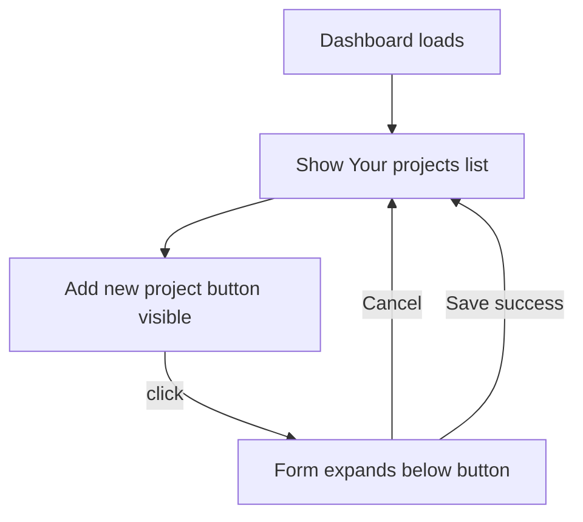

# Dashboard add project button toggle

## Current behavior

[`app/dashboard/page.tsx`](app/dashboard/page.tsx) always renders `<AddProjectForm />` **above** the "Your projects" list:

```79:89:app/dashboard/page.tsx
        {venRole === "inventor" ? (
          <div className="space-y-8 mb-10">
            <AddProjectForm />
            <section>
              <h2 className="text-lg font-semibold text-slate-900 mb-3">
                Your projects
              </h2>
              {projects.length === 0 ? (
                <p className="text-slate-600 text-sm">
                  No projects yet. Add one above.
```

[`components/dashboard/add-project-form.tsx`](components/dashboard/add-project-form.tsx) is already a client component with the full create form; no server/action changes are needed (`createProject` already `revalidatePath("/dashboard")`).

## Target UX



- Default view: **Your projects** section with existing project rows (or empty state).
- **Add new project** button in that section; form hidden until clicked.
- On click: form expands **inline below the button** (user preference).
- **Cancel** hides the form again without saving.
- On successful save: collapse form; refreshed list shows the new project (revalidation already in place).

## Implementation

### 1. New client wrapper: `AddProjectPanel`

Add [`components/dashboard/add-project-panel.tsx`](components/dashboard/add-project-panel.tsx):

- `useState(false)` for `isOpen`.
- Section layout:
  - Row: **Your projects** heading + **Add new project** button (hidden when form is open, or toggled to **Cancel** — prefer a dedicated Cancel inside the form area for clarity).
  - When `isOpen`: render `<AddProjectForm onSuccess={() => setIsOpen(false)} onCancel={() => setIsOpen(false)} />` below the button row.
- Button styling: match existing primary green used on Save (`bg-[#22c55e]`, same hover/disabled patterns as in `add-project-form.tsx`).

### 2. Extend `AddProjectForm` with optional callbacks

In [`components/dashboard/add-project-form.tsx`](components/dashboard/add-project-form.tsx):

- Add optional props: `onSuccess?: () => void`, `onCancel?: () => void`.
- In existing `useEffect` on `state.ok`, after form reset, call `onSuccess?.()`.
- Add a secondary **Cancel** button (`type="button"`) beside **Save project** when `onCancel` is provided; wire to `onCancel`.
- Keep the internal **Add a project** heading inside the form card (unchanged copy for the form itself).

No changes to [`app/dashboard/projects/actions.ts`](app/dashboard/projects/actions.ts).

### 3. Update dashboard page layout

In [`app/dashboard/page.tsx`](app/dashboard/page.tsx):

- Replace top-level `<AddProjectForm />` + nested `<section>` with a single `<AddProjectPanel projects={projects} />` **or** keep the page as server component and only swap:

```tsx
<section>
  <AddProjectPanel />
  {/* project list markup moved into panel OR passed as children */}
</section>
```

**Recommended structure:** pass `projects` into `AddProjectPanel` so the section owns both the toggle/form and the list (keeps page readable). Move the existing list JSX from `page.tsx` into the panel; keep `formatDate` either in the panel file or a tiny shared helper.

- Update empty state copy: **"No projects yet. Click Add new project to get started."** (remove "Add one above").

### 4. Docs touch

Update [`manual/how-to-add-a-project.md`](manual/how-to-add-a-project.md) step 4: click **Add new project** on the dashboard before filling the form (instead of "In Add a project").

## Files touched

| File | Change |
|------|--------|
| [`components/dashboard/add-project-panel.tsx`](components/dashboard/add-project-panel.tsx) | **New** — toggle button + conditional form + projects list |
| [`components/dashboard/add-project-form.tsx`](components/dashboard/add-project-form.tsx) | Optional `onSuccess` / `onCancel` + Cancel button |
| [`app/dashboard/page.tsx`](app/dashboard/page.tsx) | Remove always-visible form; use panel |
| [`manual/how-to-add-a-project.md`](manual/how-to-add-a-project.md) | Step 4 wording |

## Verification

1. `/dashboard` as inventor with existing projects: list visible immediately; no form at top.
2. Click **Add new project**: form appears below button; list still visible below form.
3. **Cancel**: form hides; list unchanged.
4. Save a valid project: form collapses; new row appears in list.
5. Empty state (no projects): message + button; same expand/collapse behavior.
6. Professional account: unchanged (no add panel).
