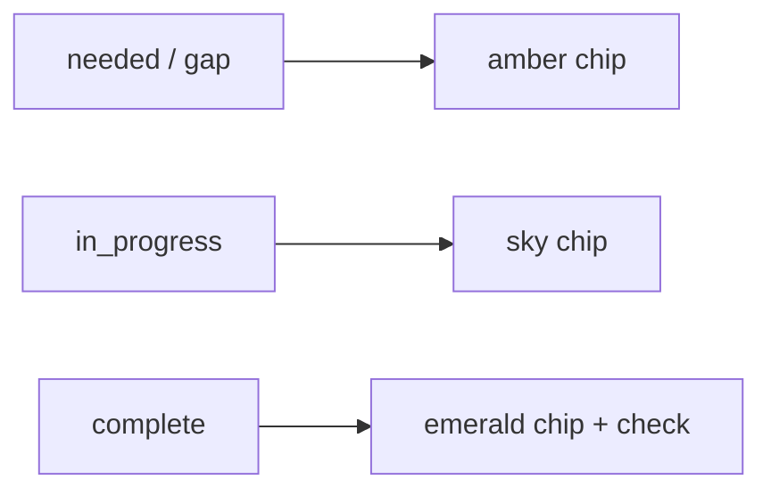

# Collapsible dashboard mini-project strip

## Goal

Above the vertically scrolling progress cards on [`app/dashboard/page.tsx`](app/dashboard/page.tsx), add a **left-to-right horizontal strip** with a compact tile per owned project. Each tile shows:

- Project **title** (truncated)
- **Overall status** indicator (derived from skill areas)
- One **chip per skill area** (same abbrev/check icon pattern as Idea Arena cards), colored with the **existing** status palette — not new red/orange literals:
  - `needed` → amber (`bg-amber-200 …`, same as [`project-card.tsx`](components/idea-arena/project-card.tsx) `slotClasses`)
  - `in_progress` → sky (`bg-sky-500 …`)
  - `complete` → emerald (`bg-emerald-500 …` + check icon)

User can **collapse/expand** the strip; preference persists in `localStorage`. **Clicking a tile** navigates to `/idea-arena/{id}/workspace?tab=organizer`.

Only shown for inventors with `projects.length > 0` (same gate as the card stack).

---

## Data — no new server fetches

[`WorkspaceOrganizerBundle`](lib/workspace-organizer-bundle.server.ts) already includes everything needed:

- `projectId`, `projectTitle`
- `categoryStatuses: ArenaCategorySlot[]` (status per skill area, from [`mapArenaRow`](lib/projects-arena.ts))

Add a small serializable summary type for the client strip (avoid passing full checklist/files):

```ts
type DashboardMiniProjectSummary = {
  projectId: string;
  projectTitle: string;
  categoryStatuses: ArenaCategorySlot[];
};
```

Map from existing `bundles` on the server page or inside the stack wrapper — **no extra DB calls**.

---

## Shared status helpers

New [`lib/dashboard-mini-status.ts`](lib/dashboard-mini-status.ts) (pure, no `"use client"`):

| Export | Purpose |
|--------|---------|
| `deriveProjectOverallStatus(slots)` | Worst-first rollup: any `needed` → `needed`; else any `in_progress` → `in_progress`; else `complete` (or `empty` if no slots) |
| `miniStatusChipClasses(status)` | Reuse exact Tailwind classes from arena `slotClasses` / `slotBadge` |
| `categoryAbbrev(category)` | Extract from [`project-card.tsx`](components/idea-arena/project-card.tsx) (lines 19–34) so abbrev logic is not duplicated |

Refactor [`project-card.tsx`](components/idea-arena/project-card.tsx) to import `categoryAbbrev` + chip classes from the shared lib (minimal touch — keeps arena and dashboard visually aligned).

---

## UI components

### 1. `DashboardMiniProjectStrip` (new client component)

[`components/dashboard/dashboard-mini-project-strip.tsx`](components/dashboard/dashboard-mini-project-strip.tsx)

```
+-- [^] Overview -------------------------------------+
|  +-------------+  +-------------+  +----------→   |
|  | Project A   |  | Project B   |  | ... snap scroll|
|  | ● Overall   |  | ● Overall   |                  |
|  | [IP][Eng]…  |  | [Fin][Mkt]  |                  |
|  +-------------+  +-------------+                  |
+-----------------------------------------------------+
```

**Layout / behavior:**

- Wrapper with collapse control (chevron + "Overview" label) in a header row
- When **collapsed**: hide tile row; show compact bar with expand chevron only (`mb-4`)
- When **expanded**: `overflow-x-auto` flex row, `gap-3`, `snap-x snap-mandatory`, `pb-2` (mirror Idea Arena card rail patterns from [`project-card.tsx`](components/idea-arena/project-card.tsx))
- Each tile: `Link` to workspace organizer tab, `shrink-0`, fixed min-width (~140–160px), `rounded-lg border bg-white shadow-sm`, hover ring
- Tile header: truncated title + small overall-status dot/badge using rollup helper
- Tile body: row of skill chips — abbrev text or `Check` icon when complete (same as arena cards)
- `title` attribute on each chip = full category name; `aria-label` on tile summarizes counts ("2 needed, 1 in progress, 3 complete")
- **Persist collapse** via `localStorage` key `ven-shares:dashboard-mini-strip-collapsed:{userId}` (same pattern as [`use-workspace-skill-expand.ts`](lib/use-workspace-skill-expand.ts))

### 2. Wire into stack

Update [`components/dashboard/dashboard-project-progress-stack.tsx`](components/dashboard/dashboard-project-progress-stack.tsx):

- Accept same `bundles` + `currentUserId`
- Render `DashboardMiniProjectStrip` **above** the vertical card list with `mb-6`
- Pass mapped `DashboardMiniProjectSummary[]`

No changes required to [`dashboard-project-progress-card.tsx`](components/dashboard/dashboard-project-progress-card.tsx) unless we later add scroll-to-card (user chose workspace navigation).

[`app/dashboard/page.tsx`](app/dashboard/page.tsx) stays as-is — stack owns the strip.

---

## Visual reference (status colors)

Reuse existing mappings — do **not** introduce literal red/orange:



Overall project dot uses the same three statuses from `deriveProjectOverallStatus`.

---

## Files to touch

| File | Change |
|------|--------|
| `lib/dashboard-mini-status.ts` | New — rollup + shared chip/abbrev helpers |
| `components/dashboard/dashboard-mini-project-strip.tsx` | New — collapsible horizontal strip |
| `components/dashboard/dashboard-project-progress-stack.tsx` | Mount strip above cards |
| `components/idea-arena/project-card.tsx` | Import shared abbrev/chip classes (DRY) |

---

## Manual test plan

- Inventor, 0 projects: no strip (unchanged empty state)
- Inventor, 1 project: strip shows one tile; skill chips match workspace Organizer statuses
- Inventor, 2+ projects: horizontal scroll works; each tile links to correct workspace organizer tab
- Collapse strip → refresh page → stays collapsed
- Expand strip → refresh → stays expanded
- Project with mixed statuses: overall indicator reflects worst status (`needed` wins)
- Professional dashboard: unchanged (no strip)
