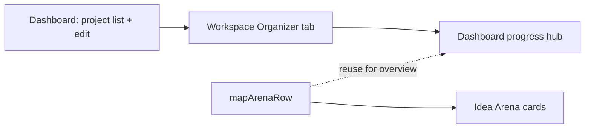
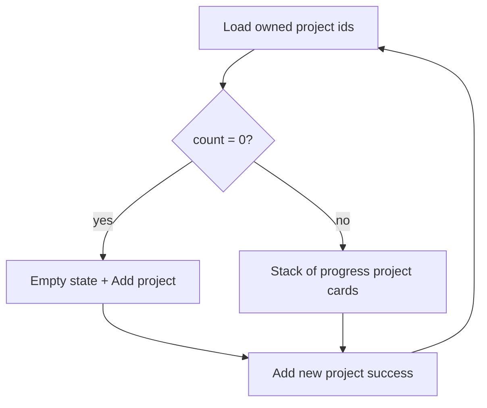

# Dashboard as multi-project progress hub

## Current behavior

[`app/dashboard/page.tsx`](app/dashboard/page.tsx) is a thin account page. For inventors it renders [`AddProjectPanel`](components/dashboard/add-project-panel.tsx): a project list with descriptions, inline [`EditProjectForm`](components/dashboard/edit-project-form.tsx), and “Open workspace” links — **no progress data**.

Real progress lives in the workspace **Organizer** tab ([`WorkspaceOrganizerPanel`](components/workspace/workspace-progress-panel.tsx) in [`workspace-shell.tsx`](components/workspace/workspace-shell.tsx)), fed by `ensureWorkspaceProgressChecklistSynced` and arena-style `category_statuses` from [`mapArenaRow`](lib/projects-arena.ts) (lines 129–189).



## Target UX

| Projects | Main content | Add project |
|----------|--------------|-------------|
| 0 | Empty state + CTA | Button in page header row |
| 1+ | **One card per project**, each card containing the **entire** workspace Organizer progress area (interactive checklist + per-skill files), not a summary-only strip | Same header button |

**Unified card pattern (1 or many projects):** Same UI whether the inventor has one project or ten — avoids a special-case layout when `count === 1`.

**Card chrome** (above the Organizer body):

- Project **title** (H2) + optional created date
- One-line **aggregate** optional in header: “8 / 24 tasks complete” (quick scan when scrolling)
- **Open workspace** → `/idea-arena/{id}/workspace?tab=organizer`
- **Project settings** → `?tab=settings` (replaces inline dashboard `EditProjectForm`)

**Card body:** Full [`WorkspaceOrganizerPanel`](components/workspace/workspace-progress-panel.tsx) — same controls as workspace Organizer (expand skills, toggle tasks, drag-reorder, add tasks, uploads, etc.).

**Scroll/layout:** Vertical stack only (see mockup). Idea Arena’s horizontal card rail stays appropriate for **compact** arena tiles, not for full Organizer bodies on the dashboard.

**Optional polish (2+ projects):** Collapse/expand **card body** via chevron in the card header; default **expanded** so the whole progress area is visible without an extra click. If the page gets too long, default to “first card expanded, rest collapsed” rather than switching to horizontal scroll.

**Professionals** on `/dashboard`: keep existing copy + profile link; no project progress (they do not own projects via [`listProjectsForCurrentUser`](app/dashboard/projects/actions.ts)).

---

## Screen mockup (layout by region)

Shared chrome on every inventor visit (same as today): full-width **top bar** on `#f8fafc` background.

```
+------------------------------------------------------------------+
|  [VenShares logo]                    Idea Arena    [User avatar] |
+------------------------------------------------------------------+
|                         MAIN (max-w varies by branch)            |
|  ... content below ...                                           |
|                                                                  |
|  Back to home (green text link, bottom of main)                  |
+------------------------------------------------------------------+
```

### Region map (all states)

| Region | Control / display | Behavior |
|--------|-------------------|----------|
| **A — Global header** | Logo (home), “Idea Arena” link, `VenUserButton` | Unchanged from current dashboard |
| **B — Page title row** | H1 “Your progress”, optional one-line subtitle | Replaces “Dashboard” + account-type paragraph for inventors |
| **C — Primary action** | Green **Add new project** button (top-right of B) | Always visible for inventors; opens inline form panel below B when clicked |
| **D — Add-project form** | `AddProjectForm` (title, skills, image, etc.) | Shown only while C is active; collapses on success/cancel |
| **E — Main body** | Branches on project count (see below) | Core of the redesign |
| **F — Footer link** | “Back to home” | Unchanged |

Professional accounts: **B** reads “Dashboard”, **C/D/E** omitted; body shows account type, “Adding projects is for inventors”, and **Edit profile skills** link (unchanged).

---

### E — Main body: zero projects

```
+------------------------------------------+
|  Your progress              [Add new project]
+------------------------------------------+
|  (optional AddProjectForm block)         |
+------------------------------------------+
|  +------------------------------------+  |
|  |  Empty state copy                  |  |
|  |  "No projects yet. Click Add new   |  |
|  |   project to get started."         |  |
|  +------------------------------------+  |
+------------------------------------------+
```

No progress widgets until the first project exists.

---

### E — Main body: one or more projects (progress project cards)

**Scroll direction: vertical (confirmed).** Cards stack top-to-bottom; the **page** scrolls down through projects. Do **not** use a left–right carousel for full Organizer embeds — nested horizontal scroll + tall checklist UIs is hard to use on desktop and mobile.

**Width:** main column `max-w-3xl` (Organizer content width). `gap-6` between cards; single column only (no side-by-side cards).

```
+----------------------------------------------------------+
|  Your progress                        [Add new project]   |
+----------------------------------------------------------+
|  (optional AddProjectForm)                                |
+----------------------------------------------------------+
|  +-- CARD: Project Alpha -------------------------------+ |
|  |  HEADER (card chrome, white bg, border-b)           | |
|  |    Project Alpha                    Jun 3, 2026     | |
|  |    8 / 24 tasks complete  (optional one-liner)      | |
|  |    Open workspace    Project settings    [v] fold?  | |
|  +-----------------------------------------------------+ |
|  |  BODY (rounded-xl border shadow-sm, padded)         | |
|  |    << full WorkspaceOrganizerPanel >>               | |
|  |    - Skill sections + badges + team roster          | |
|  |    - Task lists, checkboxes, drag-drop, add rows    | |
|  |    - Per-skill files + uncategorized files          | |
|  +-----------------------------------------------------+ |
|  +-- CARD: Project Beta --------------------------------+ |
|  |  HEADER ...                                         | |
|  |  BODY << full WorkspaceOrganizerPanel >>            | |
|  +-----------------------------------------------------+ |
+----------------------------------------------------------+
```

**Per-card regions:**

| Card zone | Display | Interaction |
|-----------|---------|-------------|
| **Header** | Title, date, optional task aggregate, workspace/settings links | Links navigate away; optional chevron collapses **body** only |
| **Body** | Entire Organizer progress UI for that `projectId` | Fully interactive (same server actions as workspace) |

**Not on dashboard:** workspace tab bar (Messages / Meeting). Reach via **Open workspace** in each card header.

**1 vs many:** Identical structure; with one project the stack has a single card.

---

### State transition diagram



---

## 1. Server data: organizer bundle per project

Extract [`loadWorkspaceOrganizerBundle(projectId, userId)`](lib/workspace-organizer-bundle.server.ts) from [`app/idea-arena/[projectId]/workspace/page.tsx`](app/idea-arena/[projectId]/workspace/page.tsx) — same fetches the workspace Organizer needs:

- `ensureWorkspaceProgressChecklistSynced(projectId)` (persist merged checklist; run **per project** on dashboard load)
- `getProjectByIdForArena`, `getArenaTeamDisplay`, `listWorkspaceFiles`, `resolveViewerCoveredCategories`, display names

Dashboard page:

1. List owned project ids (ordered `created_at` desc) — can reuse/extend [`listProjectsForCurrentUser`](app/dashboard/projects/actions.ts) or `listOwnedProjectsWithProgress()` for ids + title/date only.
2. `Promise.all(ids.map((id) => loadWorkspaceOrganizerBundle(id, userId)))` to build props for each card.

**Performance note:** N projects ⇒ N parallel bundle loads (acceptable for typical inventor counts; if needed later, lazy-load card bodies when expanded).

Header aggregate line: sum `collectLeavesForCategory` across categories from each bundle’s checklist (client or server).

---

## 2. UI: `DashboardProjectProgressCard`

New component [`components/dashboard/dashboard-project-progress-card.tsx`](components/dashboard/dashboard-project-progress-card.tsx):

- Outer: `rounded-xl border border-slate-200 bg-white shadow-sm overflow-hidden`
- **Header** row: title, date, aggregate text, links, optional collapse control
- **Body:** `WorkspaceOrganizerPanel` with bundle props (`isProjectOwner={true}`)

List wrapper [`components/dashboard/dashboard-project-progress-stack.tsx`](components/dashboard/dashboard-project-progress-stack.tsx) maps bundles → cards with spacing.

Remove the prior **summary-only** overview design (skill chips + read-only counts without Organizer body).

---

## 3. Dashboard page layout refactor

Update [`app/dashboard/page.tsx`](app/dashboard/page.tsx):

- Replace role/account boilerplate with a clear title: e.g. “Your progress”
- **Header row**: title + [`AddProjectForm`](components/dashboard/add-project-form.tsx) trigger (extract button + modal/panel from `AddProjectPanel` into a slim `DashboardAddProjectButton` client wrapper, or keep `AddProjectPanel` only for the form state and hide the old list UI)
- `ownedProjects.length === 0` → empty state; else render `DashboardProjectProgressStack`
- Remove or stop rendering the old per-project list + inline `EditProjectForm` in `AddProjectPanel` (editing remains in workspace settings)

Keep footer / Idea Arena nav link in header as today.

`revalidatePath("/dashboard")` in [`app/dashboard/projects/actions.ts`](app/dashboard/projects/actions.ts) already exists — ensure new progress actions revalidate dashboard if toggling from embedded single-project panel (workspace actions likely revalidate workspace path only; extend revalidation to `/dashboard` in [`workspace/actions.ts`](app/idea-arena/[projectId]/workspace/actions.ts) progress mutations when `isProjectOwner`).

---

## 5. Files to touch (concise)

| File | Change |
|------|--------|
| `lib/workspace-organizer-bundle.server.ts` (new) | Shared loader; workspace page refactors to use it |
| [`app/dashboard/page.tsx`](app/dashboard/page.tsx) | Load bundles, render card stack |
| `components/dashboard/dashboard-project-progress-card.tsx` (new) | Card chrome + embedded Organizer |
| `components/dashboard/dashboard-project-progress-stack.tsx` (new) | Vertical list of cards |
| `components/dashboard/dashboard-add-project-header.tsx` (new, optional) | Add button + form without old list |
| [`components/dashboard/add-project-panel.tsx`](components/dashboard/add-project-panel.tsx) | Deprecate list UI or reduce to form-only |
| [`app/idea-arena/.../workspace/actions.ts`](app/idea-arena/[projectId]/workspace/actions.ts) | `revalidatePath("/dashboard")` on progress updates |

---

## 6. Manual test plan

- Inventor, 0 projects: empty state + Add new project still works
- Inventor, 1 project: single card with full Organizer; toggling tasks works; header links work
- Inventor, 2+ projects: each card shows full Organizer; edits on project A do not affect project B
- Add project from dashboard adds a new card to the stack
- Professional dashboard unchanged
- Project with no skills: warning on card / empty organizer message
