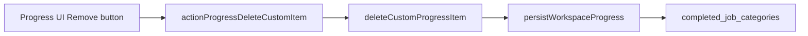

# Delete custom Progress tasks

## Current state

**Users cannot delete tasks.** The Workspace **Progress** tab ([`components/workspace/workspace-progress-panel.tsx`](components/workspace/workspace-progress-panel.tsx)) supports:

- Check/uncheck leaves
- Add custom task lists / tasks / subtasks
- Drag-and-drop reorder
- Mark all complete / Reopen skill

There is no delete UI and no server action. The original Progress plan ([`.cursor/plans/workspace_progress_checklist_8d2907f9.plan.md`](.cursor/plans/workspace_progress_checklist_8d2907f9.plan.md)) listed `deleteProgressItem(...)` as optional and **custom-only**.

Custom items are identifiable by `standard: false` and `cust:` id prefix (see [`addCustomTask`](lib/workspace-progress-checklist.ts) at line 801). Standard template rows use `standard: true` and `std:` ids and must not be removable.



## Scope rules

| Item | Removable? | Notes |
|------|------------|-------|
| Custom task list | Yes | Only when `!taskList.standard` |
| Custom task | Yes | Only when `!task.standard`; removes all its subtasks |
| Custom subtask | Yes | Only when `!subtask.standard` |
| Standard template rows | No | Hide remove control; server rejects if forced |

After removal, [`persistWorkspaceProgress`](lib/workspace-progress-sync.ts) already recomputes `completed_job_categories` via `completedCategoriesFromChecklist`, so Idea Arena card completion stays in sync.

## 1. Lib — delete helpers

Add to [`lib/workspace-progress-checklist.ts`](lib/workspace-progress-checklist.ts):

```typescript
export type ProgressCustomItemKind = "taskList" | "task" | "subtask";

export function deleteCustomProgressItem(
  checklist: WorkspaceProgressChecklist,
  category: ProfessionalJobCategory,
  kind: ProgressCustomItemKind,
  itemId: string,
): WorkspaceProgressChecklist | null
```

Implementation (mirror existing add/move helpers):

- **`taskList`**: find list by id; if `list.standard` return `null`; `splice` from `block.taskLists`
- **`task`**: find task in any list; if `task.standard` return `null`; remove from `list.tasks`
- **`subtask`**: find subtask under any task; if `sub.standard` return `null`; remove from `task.subtasks` (parent task remains, even if now empty — consistent with add-first-subtask behavior)

Return `null` when item not found or not custom.

## 2. Server action

Add one action in [`app/idea-arena/[projectId]/workspace/actions.ts`](app/idea-arena/[projectId]/workspace/actions.ts):

```typescript
export async function actionProgressDeleteCustomItem(
  projectId: string,
  category: ProfessionalJobCategory,
  kind: ProgressCustomItemKind,
  itemId: string,
): Promise<{ ok: true } | { ok: false; error: string }>
```

Follow the same auth/load/persist/revalidate pattern as `actionProgressAddCustomTask` (lines 158–184):

- `canAccessWorkspace` (owner or team member)
- Category must be in `required_job_categories`
- Call `deleteCustomProgressItem`; map `null` → `"That item cannot be removed."`
- `persistWorkspaceProgress` + `revalidateArenaAndWorkspace`

## 3. UI — remove controls with inline confirm

Reuse the **two-step inline confirm** from workspace files ([`workspace-shell.tsx`](components/workspace/workspace-shell.tsx) lines 752–783): click **Remove** → show “Remove this task?” with Cancel / Remove.

### Task list header

In [`workspace-progress-panel.tsx`](components/workspace/workspace-progress-panel.tsx) task list header (lines 338–354): when `!taskList.standard`, show a small **Remove** link/button beside the Custom badge. Track `pendingDeleteId` + `deleteBusy` at the skill body level (same pattern as files).

### Task row

In [`progress-task-row.tsx`](components/workspace/progress-task-row.tsx): when `!task.standard`, add **Remove** on the task header row (right side, `stopPropagation` so expand/drag still work). Inline confirm replaces the row header briefly.

### Subtask row

In `SortableSubtaskRow`: when `!subtask.standard`, add **Remove** after the label. Shorter confirm copy (“Remove this subtask?”).

Wire handlers through `SkillProgressBody` props:

- `onDeleteItem(kind, itemId)` → `actionProgressDeleteCustomItem` via existing `onRun` pending wrapper
- Clear expanded state if deleted task was open (`expandedTasks.delete(taskId)`)

**Copy:** use “Remove” (matches Files tab), not “Delete”.

## 4. Manual verification

- Custom task list / task / subtask: Remove works; item disappears; JSON persisted
- Standard rows: no Remove button visible
- Direct API call with standard id returns error
- Delete last incomplete custom leaf in a skill → arena card may flip to complete
- Delete a checked custom leaf → skill may reopen on arena card
- Drag handle, checkbox, and expand still work when Remove is not confirming

## Files to touch

| File | Change |
|------|--------|
| [`lib/workspace-progress-checklist.ts`](lib/workspace-progress-checklist.ts) | `deleteCustomProgressItem` |
| [`app/idea-arena/[projectId]/workspace/actions.ts`](app/idea-arena/[projectId]/workspace/actions.ts) | `actionProgressDeleteCustomItem` |
| [`components/workspace/progress-task-row.tsx`](components/workspace/progress-task-row.tsx) | Remove UI for custom tasks + subtasks |
| [`components/workspace/workspace-progress-panel.tsx`](components/workspace/workspace-progress-panel.tsx) | Remove UI for custom task lists; wire action + confirm state |

No migration needed — checklist is already JSON in `projects.workspace_progress_checklist`.
