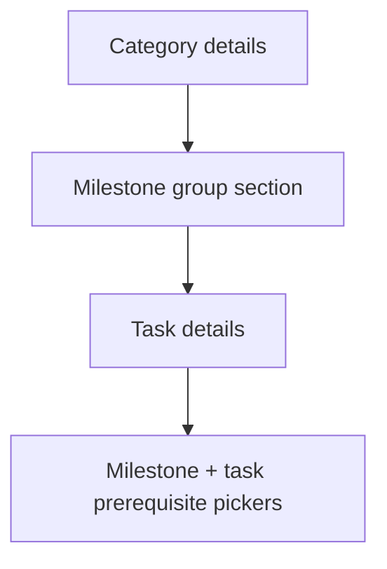

# Show milestone groups in template Dependencies tab

## Context

The Dependencies tab ([`components/admin/template-dependencies-editor.tsx`](components/admin/template-dependencies-editor.tsx)) already receives full leaf metadata from [`collectLeafDefsFromChecklistDefinition`](lib/project-templates.ts), including `taskListTitle` (the milestone group name). Today it only groups by **skill category** and conditionally shows `taskListTitle` as secondary text when it differs from the task title:

```204:209:components/admin/template-dependencies-editor.tsx
                  const taskMeta =
                    leaf.taskListTitle &&
                    leaf.taskListTitle !== leaf.title &&
                    !isPlaceholderChecklistTitle(leaf.taskListTitle)
                      ? leaf.taskListTitle
                      : null;
```

That hides the group in common cases (e.g. when a group has one task, or titles overlap). The Checklist tab uses a clearer hierarchy: **category → milestone group → tasks**.

**No backend, schema, or data-model changes** — `ChecklistLeafDef.taskListTitle` is already populated.

## Target hierarchy



## Implementation (single file)

Refactor only [`components/admin/template-dependencies-editor.tsx`](components/admin/template-dependencies-editor.tsx).

### 1. Add grouping helpers (local to component)

- Reuse `isPlaceholderChecklistTitle` from [`lib/project-templates.ts`](lib/project-templates.ts).
- Add `formatMilestoneGroupLabel(title)` → returns `null` for placeholders, else the group title.
- Build `leavesByCategoryAndGroup: Map<category, { groupTitle: string; leaves: ChecklistLeafDef[] }[]>` preserving checklist order (iterate `categories`, then task-list order as leaves are already emitted in definition order from `collectLeafDefsFromChecklistDefinition`).

### 2. Nest milestone groups inside each category

Inside each category `<details>` block, replace the flat `categoryLeaves.map(...)` with:

- A sub-section per milestone group (non-collapsible `<div>` with a header, or a lightweight `<details>` default-open — recommend **static group header** to avoid 3 levels of collapse fatigue).
- Group header: milestone group title + task count (e.g. `Brand foundation · 4 tasks`). For placeholder titles (`"New milestone group"`), show a muted fallback like `Untitled group`.
- Render existing per-task `<details>` rows inside each group.

### 3. Always show milestone group on each task row

On every task `<summary>`:

- Add a small badge/chip with the milestone group name (same label logic as group header).
- Remove the brittle `taskMeta` conditional; the badge is always present when the group has a real title.
- Keep task title + prerequisite count badge + summary chips as today.

### 4. Group prerequisite checkboxes by milestone group

In the **Other skill tasks** fieldset, replace the flat `otherLeaves.filter(...).map(...)` list with grouped rendering:

- **Outer**: skill category label (only when multiple categories have tasks).
- **Inner**: milestone group subheading.
- **Rows**: checkbox + `leaf.title` (short title), not the full `leaf.label` breadcrumb (category/group are now visible from structure).

Preserve existing `toggleDep` behavior and scroll container (`max-h-40 overflow-y-auto`).

### 5. Expand / collapse controls

Keep **Expand all / Collapse all** at the category level only (no change to behavior). Milestone group sections stay visible when a category is expanded.

## Files

| File | Change |
|------|--------|
| [`components/admin/template-dependencies-editor.tsx`](components/admin/template-dependencies-editor.tsx) | Grouping, badges, grouped prerequisite picker |

No changes to [`components/admin/template-editor-shell.tsx`](components/admin/template-editor-shell.tsx), actions, or Supabase.

## Verification

On `/admin/templates/[id]` → **Dependencies** tab:

1. Each category shows milestone group sections with correct task counts.
2. Every task row displays its milestone group badge, including when group title equals task title.
3. Expanding a task shows prerequisite checkboxes grouped by category → milestone group.
4. Toggling prerequisites still updates summary chips and persists on save.
5. Template with placeholder `"New milestone group"` shows muted group label, not blank.
6. Empty checklist still shows the existing empty-state message.
