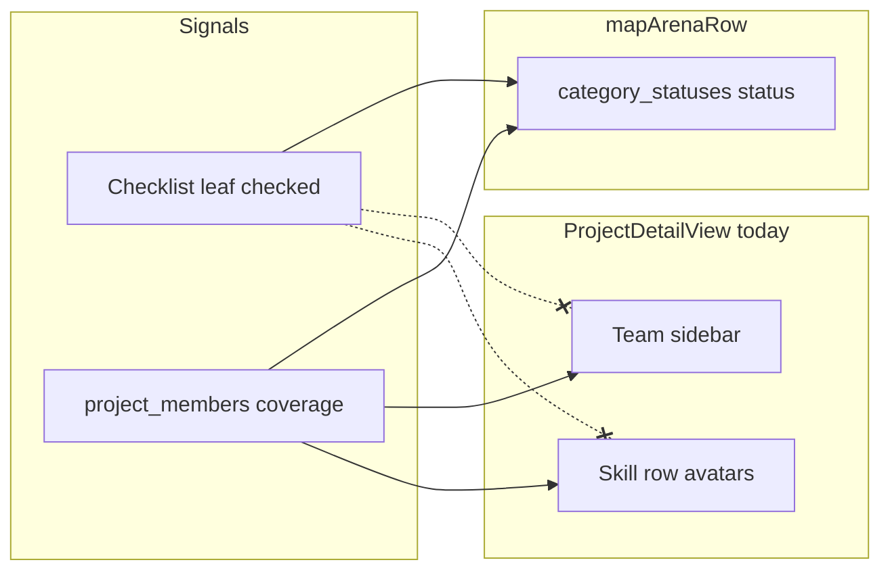

# Project detail: Team sidebar + skill rows vs checklist progress

## What you’re seeing

The screenshot is **[`ProjectDetailView`](components/idea-arena/project-detail-view.tsx)** on `/idea-arena/[projectId]`, not the carousel card.

Skill status is driven in [`mapArenaRow`](lib/projects-arena.ts) by **two** signals ([`project_page_skill_status` plan](.cursor/plans/project_page_skill_status_322fcfce.plan.md)):

- **Workspace checklist** — any checked leaf in that category → can be **In progress**
- **Team coverage** — `project_members.covered_job_categories` union → can be **In progress**

The **Team** column and per-row avatars only use [`getArenaTeamDisplay`](lib/arena-team.ts) (`teamMembers` / `categoryCoverage`). If **no one has joined** but the **inventor checked tasks** in the workspace, you get exactly your screenshot:

- Right rail: **“No professionals on this team yet.”** (still true)
- **Design / UX**: **In progress** with **no avatars** (no `coverMembers`)

So the UI is **internally inconsistent** for users: it looks like “someone is working on Design” but “no one is on the team.”

## Approach

### 1. Expose why each skill is in its state (server)

In [`lib/projects-arena.ts`](lib/projects-arena.ts), extend **`ArenaCategorySlot`** with two booleans computed inside `mapArenaRow` (no extra DB round-trips; `mergedChecklist` and `coveredUnion` are already there):

- **`teamCoversCategory`** — `coveredUnion.has(category)` (same meaning as today’s coverage union)
- **`workspaceChecklistStarted`** — `categoryHasAnyLeafCompleted(block)` on the merged block for that category

Existing consumers ([`ProjectCard`](components/idea-arena/project-card.tsx), filters) only use `category` + `status`; they can ignore the new fields.

### 2. Team sidebar (upper right)

In [`ProjectDetailView`](components/idea-arena/project-detail-view.tsx), when **`teamMembers.length === 0`**:

- Keep the primary line that there are **no professionals** on the team (accurate).
- Add a **short secondary line** (muted, smaller type) explaining that **skill badges can still show In progress** when work is tracked in the **workspace checklist**, and optionally point owners to open the workspace (reuse existing `canOpenWorkspace` / role if you want a single conditional link).

When **`teamMembers.length > 0`**, keep the current avatar + name + `coveredCategories` layout (already aligned with the card pattern).

### 3. “Team skills needed” rows (lower area)

For each skill row, after the existing badge + avatars + “Covered by …” copy:

- If **`status === "in_progress"`** and **`coverMembers.length === 0`** and **`workspaceChecklistStarted`** (from the new slot field): show a concise line such as **“Progress from workspace checklist”** (and, if appropriate, a **Open workspace** text link when `canOpenWorkspace` is true — avoid duplicating the big CTA in the main column if it’s already visible).
- If **`teamCoversCategory`** and still no `coverMembers` (should be rare after roster fixes): you can show a muted **“Coverage data pending”** line or rely on the same checklist line when `workspaceChecklistStarted` is true.

This makes the **lower** section match user expectations: **In progress** always has a **visible reason** (people and/or checklist).

### 4. Verification

- Project with **no** `project_members`, **some** checklist boxes checked for one category → detail page: sidebar explains checklist; that row shows checklist progress note; **Needed** rows unchanged.
- Project with **joined** professional covering a skill → row shows avatars + names as today; sidebar lists members.
- Idea Arena **cards** unchanged aside from carrying optional new fields on slots (unused).
