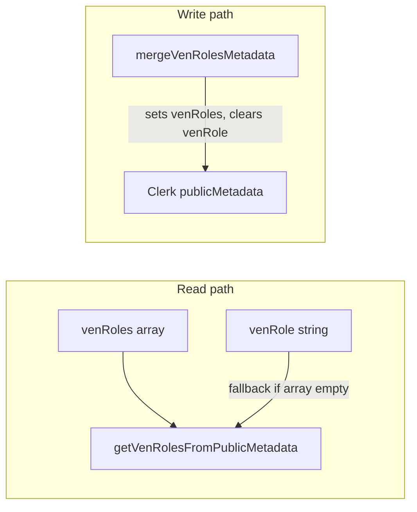

# Dual-role accounts (inventor + professional)

## Current limitation

The app stores **one** role in Clerk `publicMetadata.venRole`:

```14:14:lib/ven-role.ts
export type VenRole = "inventor" | "professional";
```

Signup ([`/auth/complete-signup`](app/auth/complete-signup/route.ts)) and role recovery ([`/auth/complete-role`](app/auth/complete-role/actions.ts)) **set or skip** that single value. Every gate uses equality checks, e.g. `venRole === "inventor"` in [`app/dashboard/projects/actions.ts`](app/dashboard/projects/actions.ts) and `venRole === "professional"` in [`lib/project-members.ts`](lib/project-members.ts). The dashboard renders **either** inventor **or** professional UI ([`app/dashboard/page.tsx`](app/dashboard/page.tsx) lines 66–95).

Self-join is already blocked (`project.clerk_user_id === userId`), so a dual-role user can own projects and join **other** teams safely.

## Data model

Canonical field going forward: `venRoles` array in Clerk `publicMetadata`:

| Key | Type | Example |
|-----|------|---------|
| `venRoles` | `("inventor" \| "professional")[]` | `["inventor", "professional"]` |

Legacy field (read-only after migration): `venRole` string — kept for existing users until lazily upgraded.

### Read shim ([`lib/ven-role.ts`](lib/ven-role.ts))

```ts
export const VEN_ROLES_METADATA_KEY = "venRoles" as const;
export const VEN_ROLE_METADATA_KEY = "venRole" as const; // legacy, do not write on new paths

export function getVenRolesFromPublicMetadata(meta): VenRole[] {
  const roles = meta?.[VEN_ROLES_METADATA_KEY];
  if (Array.isArray(roles)) {
    const filtered = roles.filter(isVenRole);
    return [...new Set(filtered)]; // dedupe
  }
  // legacy fallback
  const single = meta?.[VEN_ROLE_METADATA_KEY];
  return isVenRole(single) ? [single] : [];
}
```

New capability helpers (all gates use these — never read `venRole` directly):

- `hasInventorRole(meta)` → `getVenRolesFromPublicMetadata(meta).includes("inventor")`
- `hasProfessionalRole(meta)` → `...includes("professional")`
- Server: `isCurrentUserInventor()` / `isCurrentUserProfessional()` use the array
- Client: extend [`lib/ven-role.client.ts`](lib/ven-role.client.ts) with `useVenRoles()`, `useHasInventorRole()`, `useHasProfessionalRole()`

Keep `getVenRoleFromPublicMetadata` as a **deprecated** internal helper used only by the shim (or inline in `getVenRolesFromPublicMetadata`).

### Lazy write migration

All metadata **writes** go through one helper, e.g. `mergeVenRolesMetadata(existingMeta, nextRoles: VenRole[])`:

```ts
// Writes venRoles; removes legacy venRole key
return {
  ...existingMeta,
  [VEN_ROLES_METADATA_KEY]: nextRoles,
  [VEN_ROLE_METADATA_KEY]: undefined, // Clerk omits on merge if supported, or explicit delete
};
```

Migration happens automatically when:

- User completes signup / complete-role
- User adds a second role via `addVenRole`
- User saves professional onboarding or skills profile (already touches `publicMetadata`)

No bulk Clerk script required for v1 — existing users (`inventor1`, `professional1`, etc.) keep working via the read shim until their next metadata write.

**Supabase:** no schema or row changes needed. Projects and `project_members` are keyed by `clerk_user_id`, which is unchanged.



## Signup: both roles at account creation

### 1. Complete-role page ([`app/auth/complete-role/page.tsx`](app/auth/complete-role/page.tsx))

Add a third option **“Both”**. Update [`setVenRoleFromCompleteRole`](app/auth/complete-role/actions.ts) to:

- Accept `venRoles` (array) instead of a single `venRole`
- Write via `mergeVenRolesMetadata` — e.g. `["inventor", "professional"]` when “Both” is chosen
- Skip if user already has any roles (same idempotency as today, but check `getVenRolesFromPublicMetadata` not legacy key alone)
- If array includes `"professional"` and onboarding is incomplete → redirect to `/onboarding/professional`

### 2. Post-signup route ([`app/auth/complete-signup/route.ts`](app/auth/complete-signup/route.ts))

Change from **set-if-empty** to **append-if-missing**, using the read shim for existing roles:

```ts
const existing = getVenRolesFromPublicMetadata(user.publicMetadata);
const next = fromCookie && !existing.includes(fromCookie)
  ? [...existing, fromCookie]
  : existing;
// mergeVenRolesMetadata(user.publicMetadata, next)
```

Redirect: if `next` includes `"professional"` and onboarding incomplete → onboarding; else dashboard.

### 3. Signup hub copy ([`app/auth/signup/page.tsx`](app/auth/signup/page.tsx))

Add short note: “You can add the other role later from your account menu.”

## Add second role later (signed-in users)

New server action + thin routes:

| Route / action | Behavior |
|----------------|----------|
| `addVenRole("inventor")` | Append `"inventor"` if missing via `mergeVenRolesMetadata` → redirect `/dashboard?tab=inventor` |
| `addVenRole("professional")` | Append `"professional"` if missing → redirect `/onboarding/professional` if incomplete, else `/dashboard?tab=professional` |

Surface in UI:

- [`components/ven-user-button.tsx`](components/ven-user-button.tsx) menu items: “Add inventor profile” / “Add professional profile” when the role is missing
- Optional dedicated page [`app/dashboard/account/roles/page.tsx`](app/dashboard/account/roles/page.tsx) for clearer copy

When a **signed-in** user hits `/auth/signup/professional` (or inventor), middleware should redirect to the add-role handler instead of showing Clerk `<SignUp />` again.

## Middleware ([`middleware.ts`](middleware.ts))

Update guards to use `getVenRolesFromPublicMetadata` (shim covers legacy users):

1. **No roles** (empty after shim) → redirect `/auth/complete-role`
2. **Professional-only + incomplete onboarding** → redirect `/onboarding/professional`
3. **Dual-role + incomplete professional onboarding** → **allow through** (inventor tab must work; professional actions stay gated in server actions)

```ts
const roles = getVenRolesFromPublicMetadata(meta);
const needsProOnboarding =
  roles.includes("professional") && !isProfessionalOnboardingComplete(meta);
if (needsProOnboarding && !roles.includes("inventor")) {
  redirect("/onboarding/professional");
}
```

## Dashboard: Inventor / Professional tabs

Refactor [`app/dashboard/page.tsx`](app/dashboard/page.tsx):

- Read `venRoles` once via shim; determine which tabs to show
- **Single role** → no tab chrome (current UX)
- **Both roles** → tab switcher: **Inventor** | **Professional**
- Persist active tab via URL: `/dashboard?tab=inventor` | `?tab=professional` (server-readable, shareable, no client-only state)
- Default tab when `tab` missing: `"inventor"` if both
- Fetch **both** datasets when user has both roles (owner projects + joined projects); render only the active tab’s stack

New component: [`components/dashboard/dashboard-role-tabs.tsx`](components/dashboard/dashboard-role-tabs.tsx) — link-based tabs using `?tab=`.

Each tab reuses existing blocks:

- Inventor tab → `DashboardAddProjectHeader` + owner `DashboardProjectProgressStack`
- Professional tab → `DashboardProfessionalHeader` + member `DashboardProjectProgressStack`
- If professional role present but onboarding incomplete → professional tab shows CTA to `/onboarding/professional` instead of join stack

## Update all capability gates (~10 call sites)

Replace `getVenRoleForCurrentUser() === "X"` with `hasXRole` helpers:

| File | Change |
|------|--------|
| [`app/dashboard/projects/actions.ts`](app/dashboard/projects/actions.ts) | `hasInventorRole` for create/list/edit |
| [`lib/project-members.ts`](lib/project-members.ts) | `hasProfessionalRole` for join/list |
| [`app/idea-arena/page.tsx`](app/idea-arena/page.tsx) | skill filter when `hasProfessionalRole` |
| [`app/idea-arena/[projectId]/page.tsx`](app/idea-arena/[projectId]/page.tsx) | join UI when professional |
| [`components/idea-arena/project-detail-view.tsx`](components/idea-arena/project-detail-view.tsx) | pass `hasProfessionalRole` boolean instead of scalar `venRole` |
| [`lib/ven-role.server.ts`](lib/ven-role.server.ts) | `getVenUserButtonProfileMode`: professional modes if `hasProfessionalRole`; inventor-only if no professional |

Idea Arena remains browsable to inventors; join/sign-up-for-task stays professional-only (already enforced in [`joinProjectAsProfessional`](lib/project-members.ts)).

## Profile modal / skills tab

No structural change needed: [`getVenUserButtonProfileMode`](lib/ven-role.server.ts) already keys off professional onboarding. Dual-role users with complete professional onboarding get **Skills & availability**; inventor-only users do not.

## Migration for existing users

1. **Runtime read shim** — existing `venRole: "inventor"` / `"professional"` users work immediately with no Clerk edits
2. **Lazy write migration** — any metadata update writes `venRoles` and clears `venRole`
3. **Optional bulk script** (not required): Clerk Backend API loop to set `venRoles: [venRole]` and delete `venRole` for all users — useful to clean up metadata before launch, but not blocking

Existing Supabase projects, members, and workspace data require no changes.

## Test plan

- **Legacy users unchanged:** sign in as existing `inventor1` / `professional1` — dashboard, projects, arena, and skills tab behave as today (shim reads legacy `venRole`)
- **Lazy migration:** after legacy user saves skills or adds second role, Clerk metadata shows `venRoles` array and no `venRole`
- New user → complete-role **Both** → finishes professional onboarding → dashboard shows two tabs
- Inventor-only signup → single view, can add professional from avatar menu → onboarding → both tabs appear
- Professional-only signup → forced onboarding, single professional view; can add inventor → inventor tab appears
- Dual-role user: create project (inventor tab), join **another** user’s project (professional tab / arena); cannot join own project
- Middleware: dual-role + incomplete pro onboarding can use inventor tab; join action returns onboarding error

## Out of scope (follow-ups)

- Inventor-specific deferred onboarding (upload/address from PDFs) — still tracked in [`lib/onboarding-deferred.ts`](lib/onboarding-deferred.ts)
- Supabase `profiles` mirror of roles (not used for gating today)
- Admin UI to revoke a role
- Mandatory bulk Clerk migration script (optional cleanup only)
