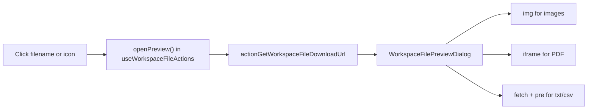

# Click-to-preview in Files area

## Current state

The active Files UI is in [`components/workspace/organizer-skill-files.tsx`](components/workspace/organizer-skill-files.tsx) — a **Files** subsection under each skill on the Organizer tab (also embedded on the dashboard via [`WorkspaceOrganizerPanel`](components/workspace/workspace-progress-panel.tsx)).

Preview **already works** but is hard to discover:

| How to preview today | Works for |
|---|---|
| Click thumbnail | Images and PDFs only (visual thumbnail renders) |
| More → Preview | Images, PDF, txt/csv — but buried in menu |
| Click filename | **Nothing** — plain text |
| Text/csv icon | **Not clickable** — [`WorkspaceFileThumbnail`](components/workspace/workspace-file-thumbnail.tsx) ignores `onThumbClick` on placeholder icons |
| Uncategorized files | **Disabled** — `allowPreview: false` in `OrganizerUncategorizedFiles` |

Existing preview pipeline (keep as-is):

Supported preview types are defined in [`lib/workspace-preview.ts`](lib/workspace-preview.ts): images, PDF, txt/csv. Word/Excel/ZIP remain download-only.

---

## Implementation

### 1. Clickable filename in `FileRow`

In [`organizer-skill-files.tsx`](components/workspace/organizer-skill-files.tsx), when `previewable` is true, replace the static filename `
` with a `<button>`:

- `onClick={() => void onPreview(file)}`
- Styling: keep current truncate/weight; add `text-left`, `hover:underline`, `cursor-pointer`, `focus-visible:outline` so it reads as a link
- `aria-label={`Preview ${file.filename}`}`

When not previewable, keep the existing plain `
`.

### 2. Make thumbnail/icon clickable for all previewable types

In [`workspace-file-thumbnail.tsx`](components/workspace/workspace-file-thumbnail.tsx), when `onThumbClick` is provided, wrap **all** thumbnail states in the same `<button>` pattern — not only the loaded ``:

- Placeholder icons (text, generic file, failed PDF/image load)
- Loading skeleton (optional: disable click while loading, or allow click immediately since preview fetches separately)

Extract a small inner helper (e.g. `ThumbnailButton`) to avoid duplicating the button wrapper in three branches.

### 3. Enable preview for uncategorized files

In [`organizer-skill-files.tsx`](components/workspace/organizer-skill-files.tsx), change `OrganizerUncategorizedFiles` row props from `allowPreview: false` to `allowPreview: true`.

This also surfaces **Preview** in the More menu for those rows (currently hidden by design in the prior menu plan).

### 4. Optional polish (same PR, low cost)

- **Archived rows**: add the same click-to-preview on [`ArchivedFileRow`](components/workspace/organizer-skill-files.tsx) filename + thumbnail for previewable archived files (download-only today). Reuse `useWorkspaceFileActions` preview state already mounted in parent components.
- **Deep link**: when `?file=` highlights a row, auto-open preview if the file is previewable (nice for forwarded links). Skip if you prefer highlight-only.

---

## Files to change

| File | Change |
|------|--------|
| [`components/workspace/organizer-skill-files.tsx`](components/workspace/organizer-skill-files.tsx) | Clickable filename in `FileRow`; `allowPreview: true` for uncategorized; optional archived preview |
| [`components/workspace/workspace-file-thumbnail.tsx`](components/workspace/workspace-file-thumbnail.tsx) | Wire `onThumbClick` on placeholder/skeleton states |

**No changes needed** to server actions, storage, or [`workspace-file-preview-dialog.tsx`](components/workspace/workspace-file-preview-dialog.tsx).

---

## Manual test plan

1. **Image / PDF** — click filename and thumbnail both open modal with correct content
2. **txt / csv** — click filename and file icon both open text preview in modal
3. **Word / zip** — filename and icon stay non-interactive; Download still works; no Preview in More menu
4. **Uncategorized files** — same click behavior as skill-grouped files
5. **Download / More menu** — still work independently; clicks do not bubble from action buttons
6. **Keyboard** — filename/icon buttons focusable; Escape closes modal
7. **Deep link** (if implemented) — `?tab=organizer&file={id}` opens preview on load
