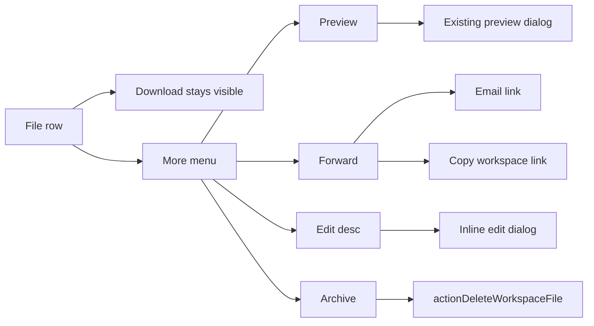

# File row "More …" menu (Preview, Forward, Edit desc, Archive)

## Context

Active file UI lives in [`components/workspace/organizer-skill-files.tsx`](components/workspace/organizer-skill-files.tsx) (Organizer tab per skill + Uncategorized). Each row today shows:

- Optional **Eye** preview button
- **Download** text link
- **Remove** text link (soft-delete via [`actionDeleteWorkspaceFile`](app/idea-arena/[projectId]/workspace/actions.ts))

[`workspace-files-panel.tsx`](components/workspace/workspace-files-panel.tsx) duplicates the same row pattern but is **not mounted** anywhere after the Files tab removal—update only if we want parity; **primary target is organizer-skill-files**.

Related prior work: [`workspace_archive_ux_86702880.plan.md`](.cursor/plans/workspace_archive_ux_86702880.plan.md) renames Remove → Archive in copy; this plan folds Archive into the More menu and applies archive wording in the same pass.



---

## 1. Shared menu component

Add [`components/workspace/workspace-file-more-menu.tsx`](components/workspace/workspace-file-more-menu.tsx):

- **Trigger**: text button `More …` (or `More` + ellipsis character), `aria-haspopup="menu"`, `aria-expanded`
- **Dropdown**: same interaction pattern as [`skill-recommend-menu.tsx`](components/workspace/skill-recommend-menu.tsx) (relative container, pointer-down outside + Escape to close, `role="menu"`)
- **Menu items** (top level):
  1. **Preview** — disabled/hidden when `getWorkspacePreviewKind(file) === null` or `allowPreview === false` (Uncategorized)
  2. **Forward** — expands inline sub-rows (still under Forward) or flyout with:
     - **Email link** → `window.location.href = mailtoHref`
     - **Copy link** → `navigator.clipboard.writeText(url)` with brief "Copied!" feedback
  3. **Edit desc** — opens description editor (see §3)
  4. **Archive** — closes menu, triggers archive confirm flow (see §4)
- Props: `file`, `projectId`, `projectTitle`, `allowPreview`, callbacks for preview/archive/edit, permission flags (`canEdit`, `canArchive`)

Keep **Download** as the only always-visible action beside More (unchanged).

Remove standalone Eye button and Remove text from [`FileRow`](components/workspace/organizer-skill-files.tsx).

---

## 2. Forward helper

Add [`lib/workspace-file-share.ts`](lib/workspace-file-share.ts) (pure, no `"use client"`):

```ts
buildWorkspaceFileShareInvite({
  origin,
  projectId,
  projectTitle,
  fileId,
  filename,
  description?,
  jobCategory?,
}): { shareUrl: string; mailtoHref: string }
```

- **shareUrl**: `${origin}/idea-arena/${projectId}/workspace?tab=organizer&file=${fileId}` (deep link to Organizer; optional highlight in §5)
- **mailto subject/body**: filename, optional description, skill category, shareUrl (mirror tone of [`skill-recommend-invite.ts`](lib/skill-recommend-invite.ts))

Pass `projectTitle` into `OrganizerSkillFiles` / `OrganizerUncategorizedFiles` from [`workspace-progress-panel.tsx`](components/workspace/workspace-progress-panel.tsx) (already has project context via shell props).

---

## 3. Edit description — server + UI

**Out of scope today** per [`organizer_skill_files_44424797.plan.md`](.cursor/plans/organizer_skill_files_44424797.plan.md); column already exists on `project_workspace_files`.

### Server — [`lib/workspace.ts`](lib/workspace.ts)

Add `updateWorkspaceFileDescription(projectId, fileId, description, userId)`:

- `UPDATE … SET description = $desc WHERE id = $fileId AND project_id = $projectId AND deleted_at IS NULL`
- Trim; allow empty string → `null`; max 500 chars (reuse `MAX_WORKSPACE_FILE_DESCRIPTION_LENGTH` from actions)
- Optional activity `file_updated` with `{ file_id, filename }` (nice for feed consistency)

### Action — [`app/idea-arena/[projectId]/workspace/actions.ts`](app/idea-arena/[projectId]/workspace/actions.ts)

`actionUpdateWorkspaceFileDescription(projectId, fileId, description)`:

- Auth + `canAccessWorkspace`
- Permission: uploader **or** project owner (same as delete)
- Call lib helper; `revalidatePath`

### UI

Small dialog (or anchored panel) opened from **Edit desc**:

- Textarea pre-filled with `file.description ?? ""`, maxLength 500
- Save / Cancel; pending state; inline error
- On success: `router.refresh()` and close

`canEdit` = same rule as archive (uploader or owner). Show Edit desc disabled with title when not allowed, or hide item.

---

## 4. Archive (replaces Remove)

Keep existing [`softDeleteWorkspaceFile`](lib/workspace.ts) / `actionDeleteWorkspaceFile` — **no DB migration**.

UX changes in organizer file rows:

- Menu item **Archive** (not Remove)
- Inline confirm row (keep current replace-row pattern): *"Archive this file? It will move to archived files."* + Cancel / **Archive** / pending **Archiving…**
- Section headers: **Archived files** / **Archived uncategorized** (was "Removed …")
- Metadata: **Archived by** (was "Removed by")
- Archived badge label **Archived**

Update user-facing error strings in actions/lib (`"File is already archived."`, etc.) and [`workspace-shell.tsx`](components/workspace/workspace-shell.tsx) activity text for `file_deleted` → `Archived {filename}`.

---

## 5. Optional deep link highlight

When URL has `?file={id}` on Organizer tab:

- In [`workspace-progress-panel.tsx`](components/workspace/workspace-progress-panel.tsx) or `OrganizerSkillFiles`, read `searchParams.get("file")`
- Expand the skill card containing that file; scroll row into view; brief highlight ring (`ring-amber-200`) on matching `FileRow`

Low-cost polish so forwarded links land on the right file.

---

## 6. Refactor organizer file actions

In [`organizer-skill-files.tsx`](components/workspace/organizer-skill-files.tsx):

- Extend `useWorkspaceFileActions` with description-edit state + `onSaveDescription`
- Replace `FileRow` action column with `Download` + `WorkspaceFileMoreMenu`
- Rename delete state to archive naming (`pendingArchiveId`, `archiveBusy`, `onRequestArchive`, etc.)
- Pass `projectTitle` into both `OrganizerSkillFiles` and `OrganizerUncategorizedFiles`

Wire `projectTitle` from [`workspace-progress-panel.tsx`](components/workspace/workspace-progress-panel.tsx) (prop already available from shell as `projectTitle` or editable project title).

---

## Files to touch

| File | Change |
|------|--------|
| `components/workspace/workspace-file-more-menu.tsx` | **New** — More menu + forward sub-actions + edit/archive triggers |
| `lib/workspace-file-share.ts` | **New** — shareUrl + mailto builder |
| `lib/workspace.ts` | `updateWorkspaceFileDescription` |
| `app/idea-arena/.../workspace/actions.ts` | `actionUpdateWorkspaceFileDescription`; archive wording in delete errors |
| `components/workspace/organizer-skill-files.tsx` | FileRow layout, archive copy, hook extensions |
| `components/workspace/workspace-progress-panel.tsx` | Pass `projectTitle`; optional `?file=` highlight |
| `components/workspace/workspace-shell.tsx` | Activity feed "Archived …" for files |
| `components/workspace/workspace-files-panel.tsx` | Optional parity (same menu) if kept for future dashboard embed |

---

## Manual test plan

1. **More menu** — Opens/closes correctly; Escape and outside click dismiss; only Download + More visible on row
2. **Preview** — Opens existing preview dialog; disabled for non-previewable types and Uncategorized (`allowPreview: false`)
3. **Forward → Email** — mailto opens with filename, description, organizer link
4. **Forward → Copy link** — clipboard gets organizer deep link; brief copied feedback
5. **Edit desc** — Save updates row description after refresh; empty clears; unauthorized users cannot edit
6. **Archive** — Confirm flow; file leaves active list; appears under **Archived files**; download still works; activity says archived
7. **Deep link** — Opening shared URL highlights and scrolls to file row
8. **Permissions** — Non-owner/non-uploader: no Archive or Edit desc in menu (Preview + Forward + Download still OK)

## Out of scope

- Unarchive / restore
- Move file to another skill (Forward is share-only, per your choice)
- Project-end purge
- Messages/tasks archive UX (separate plan)
