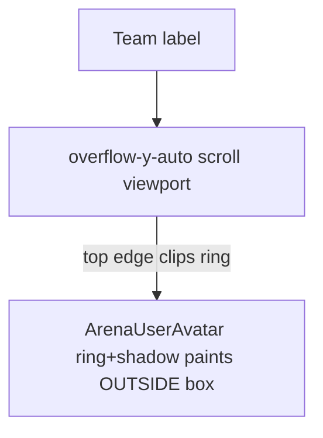

# Fix clipped team avatar on arena card

## Problem

On [`components/idea-arena/project-card.tsx`](components/idea-arena/project-card.tsx), the right **Team** column renders avatars directly under the “Team” label inside a scrollable container:

```129:133:components/idea-arena/project-card.tsx
      <div className="w-[76px] shrink-0 bg-slate-700 flex flex-col items-stretch py-3 px-1.5 border-l border-slate-600/80">
        <p className="text-[9px] font-semibold uppercase tracking-wide text-slate-400 text-center mb-2">
          Team
        </p>
        <div className="flex-1 min-h-0 max-h-[200px] overflow-y-auto flex flex-col items-center gap-3 px-0.5">
```

[`ArenaUserAvatar`](components/idea-arena/arena-user-avatar.tsx) draws a **ring + shadow** outside the 32×32 layout box:

```31:36:components/idea-arena/arena-user-avatar.tsx
  const ring = "ring-2 ring-white shadow-sm";
  // ...
        className={`relative inline-flex shrink-0 rounded-full overflow-hidden ${ring} ${className}`}
```

The card rail also adds `className="ring-1 ring-slate-500/80"`, stacking more outer paint.

`overflow-y-auto` on the scroll viewport clips anything that extends above the first avatar’s layout edge — so the **top of the circle/ring** appears cut off right below the label.

The detail page team sidebar does **not** hit this: it uses `overflow-visible` on desktop and has no vertical scroll clip on avatars ([`project-detail-view.tsx`](components/idea-arena/project-detail-view.tsx) ~line 277).



## Recommended fix (minimal, card-only)

Update the team preview scroll container in [`project-card.tsx`](components/idea-arena/project-card.tsx):

- Add **top inset** so rings/shadows fit inside the scrollport: e.g. `pt-1` (4px; enough for `ring-2` + `shadow-sm`).
- Add matching **bottom inset** for the last avatar when scrolled: `pb-1`.
- Keep `overflow-y-auto` and `max-h-[200px]` unchanged (still needed when 4+ members).

**Before:** `... overflow-y-auto flex flex-col items-center gap-3 px-0.5`

**After:** `... overflow-y-auto flex flex-col items-center gap-3 px-0.5 pt-1 pb-1`

No server or data changes.

## Optional polish (same file, low risk)

If padding alone still looks tight on some displays:

- Replace the rail-specific `className="ring-1 ring-slate-500/80"` with an **inset border** that does not extend outside the 32px box, e.g. `border border-slate-500/80` (and drop the extra ring class so it doesn’t fight `ring-2 ring-white` from the avatar component).

Only do this if visual QA shows residual clipping; padding is usually sufficient.

## Files to touch

| File | Change |
|------|--------|
| [`components/idea-arena/project-card.tsx`](components/idea-arena/project-card.tsx) | Add `pt-1 pb-1` to team scroll container; optional border tweak on rail avatars |

## Manual test

1. Open **Idea Arena** (`/idea-arena`) with at least one project that has team members.
2. On a carousel **ProjectCard**, confirm the **first avatar** under “Team” shows a full circle (no flat cut at the top).
3. With **4+ team members**, scroll the rail — first and last avatars should remain fully visible (rings not clipped at scroll edges).
4. Compare with **project detail** team column — should still look correct (unchanged).
5. Select a card (`ring-offset-2`) — membership border and selection ring should be unaffected.

## Out of scope

- Changing [`ArenaUserAvatar`](components/idea-arena/arena-user-avatar.tsx) globally (detail view and roster components rely on current ring styling).
- Removing `overflow-hidden` from the card `Link` (needed for `rounded-2xl` corners; not the cause of this specific clip).
