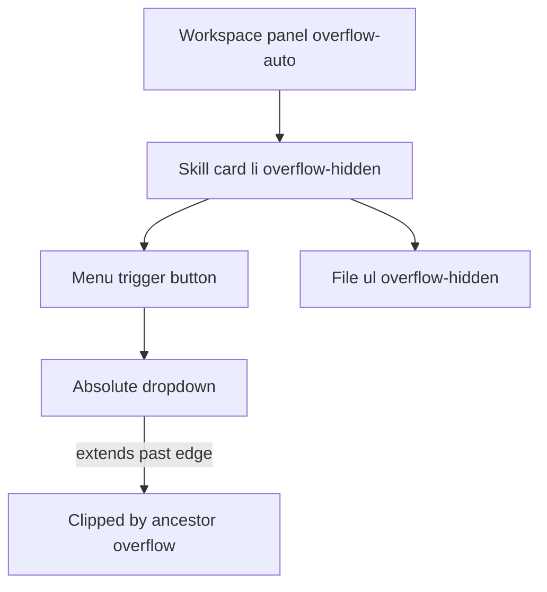

# Fix clipped workspace dropdown menus

## Problem

Both [`workspace-file-more-menu.tsx`](components/workspace/workspace-file-more-menu.tsx) and [`skill-recommend-menu.tsx`](components/workspace/skill-recommend-menu.tsx) render menus as `absolute right-0 top-full` children of a `relative` wrapper. That works only when every ancestor allows overflow. Several parents clip descendants:

| Container | File | Why it clips |
|-----------|------|--------------|
| Skill card `<li>` | [`workspace-progress-panel.tsx`](components/workspace/workspace-progress-panel.tsx) ~883 | `overflow-hidden` on rounded card |
| File list `<ul>` | [`organizer-skill-files.tsx`](components/workspace/organizer-skill-files.tsx) ~526, ~655 | `overflow-hidden` on rounded list |
| Uncategorized card | [`organizer-skill-files.tsx`](components/workspace/organizer-skill-files.tsx) ~647 | `overflow-hidden` |
| Dashboard card `<article>` | [`dashboard-project-progress-card.tsx`](components/dashboard/dashboard-project-progress-card.tsx) ~33 | `overflow-hidden` |
| Workspace main panel | [`workspace-shell.tsx`](components/workspace/workspace-shell.tsx) ~439 | `overflow-auto` scroll area |

That is why clipping is **intermittent**: it depends on which row is clicked, whether the skill card is expanded, and whether the view is embedded in the dashboard card vs full workspace.

Removing `overflow-hidden` from cards/lists alone is **not sufficient** — the workspace scroll panel (`overflow-auto`) would still clip menus near the bottom of the viewport, and the dashboard wrapper would still clip embedded organizer rows.

## Recommended fix: portaled fixed-position menus

Add a small shared helper that both menus use to render the dropdown panel via `createPortal(..., document.body)` with `position: fixed` coordinates derived from the trigger’s `getBoundingClientRect()`.

### 1. New shared component — `components/workspace/anchored-menu-panel.tsx`

Responsibilities:

- Accept `open`, `triggerRef`, `children`, and existing menu `className` (keep current visual styles: rounded border, shadow, min-width).
- Portal menu to `document.body` when `open`.
- Position with `fixed`, right-aligned to trigger (`left = trigger.right - menu.width`), `top = trigger.bottom + 4px`.
- **Auto-flip**: if menu would extend below viewport, open above trigger instead (`top = trigger.top - menu.height - 4px`).
- Clamp horizontal position so menu stays within viewport padding.
- Recompute on `resize` and `scroll` (capture phase so nested scroll containers update position).
- Use `z-40` (above cards, below modal overlays at `z-50`).
- Expose `menuRef` (or accept a ref callback) so parent click-outside logic can treat portaled menu as “inside”.

Keep the hook lightweight — no new dependencies (no Floating UI / Radix in this repo today).

### 2. Update [`workspace-file-more-menu.tsx`](components/workspace/workspace-file-more-menu.tsx)

- Add `triggerRef` on the “More …” button.
- Replace inline absolute `
` with `<AnchoredMenuPanel>`.
- Update pointer-outside handler to ignore clicks inside **both** `rootRef` (trigger wrapper) **and** portaled `menuRef`.
- Preserve existing behavior: Forward sub-panel, Preview / Edit desc / Archive items, Escape to close, copied feedback.

### 3. Update [`skill-recommend-menu.tsx`](components/workspace/skill-recommend-menu.tsx)

- Same pattern: `triggerRef` on button, portaled panel for Email invite / Copy invite link.
- Same click-outside fix for portaled menu.

## Why not CSS-only?

- `overflow-hidden` on cards/lists exists for rounded-corner clipping; removing it is a partial fix and requires touch-testing multiple surfaces.
- `overflow-auto` on the workspace content area cannot be removed without breaking scroll behavior.
- Portaling is the standard fix for dropdowns inside scroll/clip containers and fixes both reported menus in one pattern.

## Files to touch

| File | Change |
|------|--------|
| **New** [`components/workspace/anchored-menu-panel.tsx`](components/workspace/anchored-menu-panel.tsx) | Portal + fixed positioning + flip + scroll/resize sync |
| [`components/workspace/workspace-file-more-menu.tsx`](components/workspace/workspace-file-more-menu.tsx) | Use shared panel |
| [`components/workspace/skill-recommend-menu.tsx`](components/workspace/skill-recommend-menu.tsx) | Use shared panel |

No changes required to [`organizer-skill-files.tsx`](components/workspace/organizer-skill-files.tsx) or card wrappers if portaling works correctly.

## Manual test plan

1. **Workspace Organizer tab** — expand a skill with files; click **More …** on the **last file row** → full menu visible (Preview, Forward, Edit desc, Archive as applicable); Forward sub-options not cut off.
2. Same skill — click **Recommend Team Member** in the card header (collapsed and expanded) → both invite options fully visible.
3. **Dashboard** embedded progress card — repeat steps 1–2 inside the dashboard card (extra `overflow-hidden` wrapper).
4. Scroll workspace panel so the trigger is near the **bottom of the viewport** — menu should flip **upward** instead of clipping.
5. Click outside / Escape — menu closes; actions still work (email link, copy, preview, archive confirm).
6. Open file preview or description dialog — dropdown should sit below modal overlay (`z-50`), not cover it.

## Out of scope

- Migrating to Radix/shadcn DropdownMenu (larger dependency + restyle).
- Removing `overflow-hidden` from card/list wrappers (optional cosmetic cleanup only; not required for the fix).
