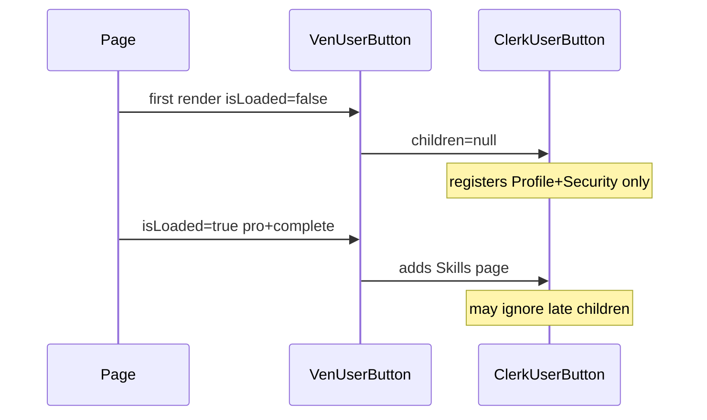

# Fix professional skills in Manage account modal

## Problem

You see only Clerk’s default **Profile** and **Security** in Manage account. VenShares skills (job categories + hours) are meant to appear as a **separate sidenav item**, **Skills & availability** — not inside Profile details.

The implementation already exists on `main` ([`components/ven-user-button.tsx`](components/ven-user-button.tsx), [`components/profile/professional-skills-profile-panel.tsx`](components/profile/professional-skills-profile-panel.tsx)), but the custom pages are rendered only when **all** of this is true on the client:

```tsx
isLoaded && isProfessional && onboardingComplete
```

That pattern is fragile: on first paint `isLoaded` is false, so `UserButton` mounts with **no** `UserProfilePage` children. Clerk often snapshots modal nav at mount; when metadata arrives later, the Skills tab may never appear (matches your screenshot on `ven-shares-beige.vercel.app` even though code is committed).



## Approach

### 1. Drive modal config from the server (primary fix)

Add a small server helper in [`lib/ven-role.server.ts`](lib/ven-role.server.ts) (or adjacent file):

```ts
export type VenUserButtonProfileMode =
  | "signed-out"
  | "inventor"
  | "professional-incomplete"
  | "professional-complete";

export async function getVenUserButtonProfileMode(): Promise<VenUserButtonProfileMode>
```

Logic: read `currentUser()` → `venRole` + `professionalOnboardingComplete` (same keys as [`lib/professional-onboarding.ts`](lib/professional-onboarding.ts)).

Update [`components/ven-user-button.tsx`](components/ven-user-button.tsx):

- Accept optional prop `profileMode?: VenUserButtonProfileMode`.
- When `profileMode` is provided, use it for rendering `UserProfilePage` / menu links (do **not** wait on `isLoaded`).
- When omitted (rare), fall back to current `useUser()` logic for backwards compatibility.
- Set `key={profileMode}` on `<UserButton>` so Clerk remounts when mode changes (e.g. after onboarding completes).

Keep page order as today: **Skills & availability** → Account → Security.

### 2. Thin server wrapper for headers

Add [`components/ven-user-button-from-server.tsx`](components/ven-user-button-from-server.tsx) (async server component):

- Calls `getVenUserButtonProfileMode()`
- Renders `<VenUserButton profileMode={mode} />`

Replace bare `<VenUserButton />` in server layouts:

- [`app/dashboard/page.tsx`](app/dashboard/page.tsx)
- [`app/dashboard/profile/page.tsx`](app/dashboard/profile/page.tsx)
- [`app/page.tsx`](app/page.tsx) (marketing header)

For [`components/idea-arena/arena-header.tsx`](components/idea-arena/arena-header.tsx) (client): add prop `profileMode` and pass it from [`app/idea-arena/page.tsx`](app/idea-arena/page.tsx) (already server-side + has `currentUser()`).

### 3. Discoverability (secondary)

Users naturally open **Profile** looking for skills. Add back a dropdown entry without duplicating the full form:

- In `professional-complete` mode, add `<UserButton.MenuItems>` with `<UserButton.UserProfileLink label="Skills & availability" url="skills" />` (Clerk deep-link into the custom page).
- Optionally keep [`/dashboard/profile`](app/dashboard/profile/page.tsx) as the full-page editor (already documented in copy).

Update Idea Arena empty-skills CTA in [`app/idea-arena/page.tsx`](app/idea-arena/page.tsx) copy to mention **Manage account → Skills & availability**, not only `/dashboard/profile`.

### 4. Verify `professional1` metadata (ops)

In Clerk Dashboard → Users → `professional1`, confirm **Public metadata**:

| Key | Expected |
|-----|----------|
| `venRole` | `"professional"` |
| `professionalOnboardingComplete` | `true` |
| `professionalJobCategories` | non-empty array (optional but needed for matching) |
| `professionalHoursBand` | valid band e.g. `"5-10"` |

If `professionalOnboardingComplete` is missing but the user can reach the dashboard, that indicates metadata drift — set the flag (or re-run onboarding save) so server and client agree.

Middleware already enforces onboarding at [`middleware.ts`](middleware.ts) lines 63–70; a user on dashboard should be `professional-complete`, but the Clerk modal bug can still hide the tab.

### 5. Deploy and manual test

- Deploy `main` to `ven-shares-beige` (or promote latest production deployment).
- Sign in as professional with complete metadata.
- Avatar → **Manage account** → left nav must show **Skills & availability** (in addition to Profile/Security).
- Open Skills tab → edit categories/hours → Save → confirm `publicMetadata` updates and Idea Arena “Matches my skills” reflects changes.
- Confirm Profile tab still handles avatar only (no duplicate photo in Skills compact form per [`professional-skills-profile-panel.tsx`](components/profile/professional-skills-profile-panel.tsx)).
- Inventor account: still only Profile + Security (no Skills page).

### 6. Optional follow-up (lower priority)

[`app/dashboard/profile/actions.ts`](app/dashboard/profile/actions.ts) still `redirect("/dashboard")` after save, which closes the modal. Acceptable for v1; later could use `revalidatePath` only if you want save-in-place inside the modal.

## Files to touch

| File | Change |
|------|--------|
| [`lib/ven-role.server.ts`](lib/ven-role.server.ts) | `getVenUserButtonProfileMode()` |
| [`components/ven-user-button.tsx`](components/ven-user-button.tsx) | Server `profileMode` prop + `key` remount + menu deep link |
| [`components/ven-user-button-from-server.tsx`](components/ven-user-button-from-server.tsx) | New server wrapper |
| [`app/dashboard/page.tsx`](app/dashboard/page.tsx), [`app/dashboard/profile/page.tsx`](app/dashboard/profile/page.tsx), [`app/page.tsx`](app/page.tsx) | Use server wrapper |
| [`components/idea-arena/arena-header.tsx`](components/idea-arena/arena-header.tsx), [`app/idea-arena/page.tsx`](app/idea-arena/page.tsx) | Pass `profileMode` into client header |
| [`app/idea-arena/page.tsx`](app/idea-arena/page.tsx) | CTA copy tweak |

## Out of scope

- Injecting skills **inside** Clerk’s built-in Profile tab (not supported by Clerk).
- Changing onboarding flow on [`app/onboarding/professional`](app/onboarding/professional/page.tsx).
