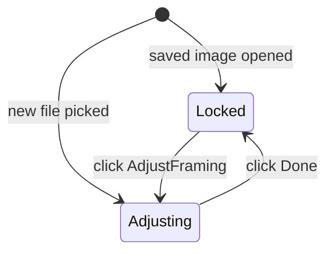

# Gate image zoom/pan behind Adjust button

## Problem

[`components/dashboard/project-image-crop-field.tsx`](components/dashboard/project-image-crop-field.tsx) always mounts `react-easy-crop` with drag-to-pan, scroll/pinch zoom, and a zoom slider. In **Arena Card Details** ([`components/dashboard/edit-project-form.tsx`](components/dashboard/edit-project-form.tsx), `variant="workspace"`), that makes saved images easy to move by accident while scrolling or dragging.

This is the **only** image zoom/pan surface in the repo.

## Approach

Keep the cropper mounted at all times (so `onCropComplete` still produces `croppedAreaPixels` for save), but add an **`isAdjusting`** mode that gates interaction:



| Mode | Pan (mouse/touch) | Scroll/pinch zoom | Zoom slider | UI |
|------|-------------------|-------------------|-------------|-----|
| Locked | blocked | blocked | hidden | "Adjust framing" button |
| Adjusting | enabled | enabled | visible | hint + slider + "Done" button |

### Block interaction while locked

In [`project-image-crop-field.tsx`](components/dashboard/project-image-crop-field.tsx), when `!isAdjusting`:

- `zoomWithScroll={false}`
- `onTouchRequest={() => false}` — blocks touch pan/pinch
- `onWheelRequest={() => false}` — blocks scroll zoom
- `cropperProps={{ className: "pointer-events-none" }}` — blocks mouse drag (no mouse-cancel API in react-easy-crop 5.5.7)

When `isAdjusting`, omit those blocks (normal cropper behavior).

### Controls and copy

Below the crop frame:

- **Locked:** secondary button **Adjust framing** (matches existing file-picker button styling in the form — reuse `workspaceFileFieldButtonClass` pattern or a small neutral outline button in the crop field itself)
- **Adjusting:** existing hint ("Drag to reposition. Use the slider to zoom."), zoom slider, and a **Done** button that sets `isAdjusting` false

### Auto-adjust on new uploads

Add prop `initialAdjusting?: boolean` (default `false`).

Parent already remounts the crop field via `cropResetKey` when the image source changes. Pass:

- Arena field: `initialAdjusting={!!selectedImageFile}`
- Hero field: `initialAdjusting={!!selectedHeroFile}`

Result: picking a new file remounts with adjust mode on; reopening saved crop metadata stays locked until the user clicks **Adjust framing**.

Initialize state with:

```ts
const [isAdjusting, setIsAdjusting] = useState(initialAdjusting ?? false);
```

Reset when `imageSrc` or `initialAdjusting` changes (small `useEffect`) so remount/key behavior stays consistent.

## Files to change

| File | Change |
|------|--------|
| [`components/dashboard/project-image-crop-field.tsx`](components/dashboard/project-image-crop-field.tsx) | Add `initialAdjusting`, `isAdjusting` state, interaction gating, Adjust/Done buttons, conditional slider/hint |
| [`components/dashboard/edit-project-form.tsx`](components/dashboard/edit-project-form.tsx) | Pass `initialAdjusting={!!selectedImageFile}` / `!!selectedHeroFile` into both `ProjectImageCropField` usages |

No migration, server, or display-consumer changes. Save pipeline and `croppedAreaPixels` logic stay the same.

## Verification

1. **Saved arena image** — open Arena Card Details: image does not move on drag/scroll; slider hidden; **Adjust framing** enables pan/zoom; **Done** locks again.
2. **New arena upload** — pick file: adjust mode opens automatically; can pan/zoom immediately; Save exports crop.
3. **Hero field** — same locked/adjust behavior; new hero file auto-adjusts.
4. **Save without crop changes** — title-only save still works (`arenaCropState.dirty` false → no re-export).
5. **Re-crop saved image** — click Adjust framing, move frame, Save → card updates.
