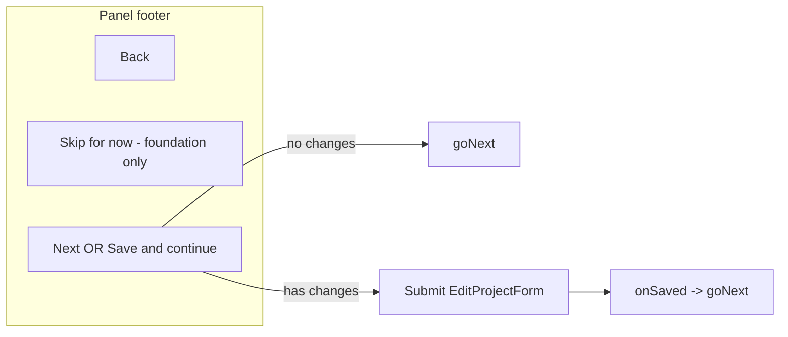

# Get Started footer Next / Save & continue

## Problem

Editable Get Started steps render [`EditProjectForm`](components/dashboard/edit-project-form.tsx) with an inline submit button (`Save & continue`), while the panel footer only shows a hint:

```300:304:components/workspace/project-get-started-panel.tsx
              {!currentStepMeta.editable || step === "preview" ? null : (
                <p className="text-xs text-slate-500">
                  Use Save & continue above to save this step.
                </p>
              )}
```

Owners reviewing already-complete steps must look above the footer to proceed, and cannot use a familiar **Next** affordance when nothing changed.

## Target UX



For every **editable** step (`images`, `basics`, `foundation`, `skills`):

| State | Footer right button | Behavior |
|-------|---------------------|----------|
| No unsaved changes | **Next** (with chevron, same styling as Welcome) | `goNext()` — no API call |
| Unsaved changes | **Save & continue** (primary dark button) | Submit the step form |
| Saving | **Saving…** (disabled) | While server action is pending |

- Remove the inline submit button from forms used in Get Started.
- Remove the “Use Save & continue above…” hint.
- Keep **Back** on the left and **Skip for now** on foundation (unchanged).

Non-editable steps stay as-is: Welcome keeps **Next**; Preview keeps “You are all set.”

## Implementation

### 1. Extend `EditProjectForm` — [`components/dashboard/edit-project-form.tsx`](components/dashboard/edit-project-form.tsx)

Add optional props (only used by Get Started today):

```ts
formId?: string;
hideSubmitButton?: boolean;
onFormActivityChange?: (state: { dirty: boolean; pending: boolean }) => void;
```

Changes inside the form:

- Set `id={formId}` on the `<form>` element.
- Conditionally hide the existing inline submit when `hideSubmitButton` is true.
- Compute `isDirty` per active `section`:
  - **images**: `selectedImageFile`, `selectedHeroFile`, `arenaCropState.dirty`, `heroCropState.dirty` (state already tracked for submit).
  - **basics / foundation / skills**: compare current form values to an initial snapshot from `project` (title, description, foundation fields, sorted categories, skill rows). Recompute on form `input`/`change` events and when `selected` categories change.
- Call `onFormActivityChange({ dirty: isDirty, pending })` whenever dirty or pending changes (including after successful save resets image/crop state).

Dashboard / settings usage stays unchanged — no new props passed, inline submit remains.

### 2. Wire footer actions in Get Started panel — [`components/workspace/project-get-started-panel.tsx`](components/workspace/project-get-started-panel.tsx)

For each `EditProjectForm` instance (images, basics, foundation, skills):

- Pass stable `formId` (e.g. `get-started-${projectId}-${section}`).
- Pass `hideSubmitButton`.
- Pass `onFormActivityChange` to store `{ dirty, pending }` in local state.
- Reset activity state when `step` changes (so the footer does not flash stale dirty from the previous step).

Replace the hint block in the footer with a single primary action on the right:

```tsx
{currentStepMeta.editable && step !== "preview" ? (
  isDirty ? (
    <button type="submit" form={formId} disabled={pending} className="...primary...">
      {pending ? "Saving…" : "Save & continue"}
    </button>
  ) : (
    <button type="button" onClick={goNext} className="...primary...">
      Next
      <ChevronRight />
    </button>
  )
) : /* existing welcome / preview branches */}
```

Use the same primary button classes as the Welcome **Next** button for visual consistency.

### 3. Files touched

| File | Change |
|------|--------|
| [`components/dashboard/edit-project-form.tsx`](components/dashboard/edit-project-form.tsx) | New props, dirty detection, optional hidden submit |
| [`components/workspace/project-get-started-panel.tsx`](components/workspace/project-get-started-panel.tsx) | Footer CTA, wire form state, remove hint |

No changes to server actions, routing, or step completion logic.

## Verification

1. Open `/workspace/[projectId]?tab=get-started&step=images` with existing hero + arena images — footer shows **Next**; clicking advances without a save/network call.
2. Upload or recrop an image — footer switches to **Save & continue**; submit saves and auto-advances via existing `onSaved={goNext}`.
3. Repeat for **Summary**, **Foundation**, and **Team needs** (edit a field → Save & continue; no edit → Next).
4. **Foundation**: **Skip for now** still works alongside the new right-side button.
5. **Welcome** and **Preview** footers unchanged.
6. Edit project from non–Get Started context (if any) still shows inline Save button.
