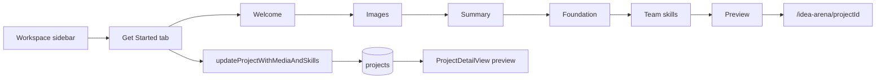

# Get Started workspace tab

## Goal

Give project owners a guided setup flow at `/workspace/[projectId]?tab=get-started` — the **first item** in the workspace sidebar. It walks them through the same content professionals see on the Idea Arena detail page, including the six new foundation fields (problem statement, vision, goals, target customer, prior knowledge, pitch deck).

**Audience:** owners only (same access model as today's Arena Card Details tab).

**Relationship to Arena Card Details:** both edit the same project data. Get Started is the guided path; `?tab=settings` remains the direct edit form for power users.



---

## Wizard steps

| Step | Label | Content (reused components) | Save trigger |
|------|-------|----------------------------|--------------|
| 1 | Welcome | Short intro: what the Idea Arena card is, what professionals see | None (Next only) |
| 2 | Look & feel | Arena card image + workspace hero banner | Save & continue |
| 3 | Summary | Title + description | Save & continue |
| 4 | Foundation | All 6 fields via [`ProjectFoundationFields`](components/dashboard/project-foundation-fields.tsx) | Save & continue |
| 5 | Team needs | Job category checkboxes + [`ProjectRequiredSkillRows`](components/dashboard/project-required-skill-rows.tsx) | Save & continue |
| 6 | Preview | [`ProjectDetailView`](components/idea-arena/project-detail-view.tsx) in preview mode + link to live arena page | Done |

Each editable step calls the existing [`updateProjectWithMediaAndSkills`](app/dashboard/projects/actions.ts) server action (same as [`EditProjectForm`](components/dashboard/edit-project-form.tsx) today). No new server actions or DB changes.

Optional step progress: a small helper in new [`lib/project-get-started.ts`](lib/project-get-started.ts) checks completion (e.g. has custom image, description filled, ≥1 skill category, any foundation field) to show checkmarks in the step list — purely cosmetic, no gating.

---

## Key files to change

### 1. Sidebar + routing — [`components/workspace/workspace-shell.tsx`](components/workspace/workspace-shell.tsx)

- Add a **separate** `GET_STARTED_TAB` constant (not inside `TABS`) rendered **above** the existing Journey/Roadmap/… list, owner-only — same conditional pattern as `SETTINGS_TAB` today.
- Extend `TabId` with `"get-started"`.
- Update `resolveTabId` to accept `get-started` for owners; non-owners fall back to `messages`.
- Render new panel when `tab === "get-started" && editableProject`.
- Icon suggestion: `Rocket` or `Sparkles` from lucide-react.

Current tab list starts at line 63; settings is owner-only at line 326 — mirror that pattern for Get Started at the top.

### 2. New panel — `components/workspace/project-get-started-panel.tsx`

Client component responsible for:
- Step state (`useState`, optionally synced to `?step=` query param for back/forward)
- Step sidebar or horizontal stepper (match workspace slate/white styling)
- Back / Save & continue / Skip (foundation step only) / Done navigation
- Per-step form sections (see refactor below)
- Final step: embed `ProjectDetailView` + "View in Idea Arena" link

Props (passed from `WorkspaceShell`):
- `editableProject` (existing type)
- `arenaProject` — full `ArenaProject` for preview (needs `category_statuses`)
- `teamMembers`, `categoryCoverage` — for preview
- `projectId`

### 3. Refactor `EditProjectForm` for step reuse — [`components/dashboard/edit-project-form.tsx`](components/dashboard/edit-project-form.tsx)

Add optional props to avoid duplicating form logic:

```ts
type EditProjectFormProps = {
  // ...existing
  section?: "all" | "images" | "basics" | "foundation" | "skills";
  onSaved?: () => void;           // wizard: advance step after success
  submitLabel?: string;           // e.g. "Save & continue"
  hideOuterChrome?: boolean;      // wizard provides its own headings
};
```

Conditionally render only the matching section(s). When `section !== "all"`, submit saves just that step's fields (action already accepts partial updates). Keep default `section="all"` so Arena Card Details tab is unchanged.

### 4. Preview mode on arena detail — [`components/idea-arena/project-detail-view.tsx`](components/idea-arena/project-detail-view.tsx)

Add optional `variant?: "default" | "preview"`:
- Hide action area (Open workspace, Join team, owner copy)
- Hide "Back to Idea Arena" footer link
- Optional subtle banner: "Preview — how professionals see your card"

This lets Get Started "grab that screen" without navigation clutter.

### 5. Pass preview data from server — [`app/workspace/[projectId]/page.tsx`](app/workspace/[projectId]/page.tsx)

Today the page loads `arenaProject` and `organizerBundle.categoryCoverage` but does **not** pass `teamMembers` to the shell. Extend [`WorkspaceOrganizerBundle`](lib/workspace-organizer-bundle.server.ts) to include `arenaTeamMembers: ArenaTeamMemberDisplay[]` (already fetched via `getArenaTeamDisplay` at line 83 — just not returned today).

Pass to `WorkspaceShell`:
- `arenaProject` (or a serializable subset with `category_statuses`)
- `arenaTeamMembers`

Only needed for the preview step; no extra DB round-trips.

### 6. Update owner deep link (optional but recommended) — [`lib/workspace-arena-nav.ts`](lib/workspace-arena-nav.ts)

Change owner href from `?tab=settings` → `?tab=get-started` so "Open workspace" from Idea Arena lands on the guided flow. Settings tab remains accessible from sidebar.

---

## UX details

- **Hero banner:** keep [`WorkspaceProjectHero`](components/workspace/workspace-project-hero.tsx) visible on all tabs (consistent with other tabs).
- **Default tab:** leave default as `messages` for now; only change the arena → workspace deep link for owners.
- **Pitch deck hint:** foundation step reuses existing hint from [`lib/project-foundation.ts`](lib/project-foundation.ts) — full file upload stays in Organizer/Files, no change.
- **Errors:** per-step save errors shown inline (same red alert pattern as `EditProjectForm`).
- **Refresh after save:** router.refresh() after successful step save so preview reflects latest data.

---

## Out of scope

- Team member access to Get Started
- Completion gates / blocking other tabs until setup is done
- Pitch deck file upload in the wizard
- Replacing or removing Arena Card Details tab
- Changing default workspace tab for all visits
