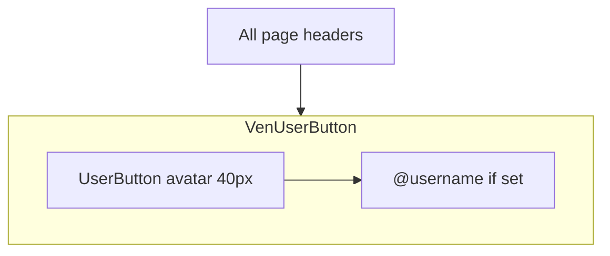

# Larger account icon with username below

## Context

All signed-in headers use [`VenUserButton`](components/ven-user-button.tsx), which wraps Clerk's `UserButton`:

- Landing page ([`app/page.tsx`](app/page.tsx) — desktop + mobile menu)
- Dashboard ([`app/dashboard/page.tsx`](app/dashboard/page.tsx))
- Profile ([`app/dashboard/profile/page.tsx`](app/dashboard/profile/page.tsx))
- Idea Arena ([`components/idea-arena/arena-header.tsx`](components/idea-arena/arena-header.tsx))

Changing **one file** updates every upper-right account control.

Current component is a bare `UserButton` with optional professional menu links — no sizing or label:

```24:43:components/ven-user-button.tsx
  return (
    <UserButton>
      {isProfessional ? (
        <UserButton.MenuItems>
          ...
        </UserButton.MenuItems>
      ) : null}
    </UserButton>
  );
```

## Approach

Update [`components/ven-user-button.tsx`](components/ven-user-button.tsx) only.

### 1. Layout — avatar stacked above handle

Wrap the button in a vertical flex container:

```tsx
<div className="flex flex-col items-center gap-0.5 shrink-0">
  <UserButton appearance={userButtonAppearance} ... />
  {handle ? (
    <span className="max-w-[5rem] truncate text-[10px] font-medium text-slate-600 leading-tight">
      @{handle}
    </span>
  ) : null}
</div>
```

- Label is **decorative** (avatar remains the click target for the Clerk menu).
- Use `truncate` + `max-w-[5rem]` so long usernames don't blow out the header on mobile.

### 2. Handle text (confirmed preference)

- **Show** `@username` only when `user.username` is set.
- **Hide** the label entirely when username is missing (no first-name / email fallback).

### 3. Larger avatar

Bump avatar from Clerk's default (~32px) to **40px** via the `appearance` prop on `UserButton`:

```tsx
const userButtonAppearance = {
  elements: {
    userButtonAvatarBox: { width: "2.5rem", height: "2.5rem" },
    userButtonTrigger: { padding: 0 },
  },
};
```

Use inline CSS objects (not Tailwind classes in `appearance.elements`) to avoid needing `cssLayerName` changes in [`app/layout.tsx`](app/layout.tsx) / [`app/globals.css`](app/globals.css).

Apply the same `appearance` + wrapper to the loading branch (`if (!isLoaded)`) so layout doesn't jump on hydration.

### 4. Do **not** use `showName`

Clerk's `showName` prop places the name **beside** the avatar, not below it — it conflicts with the requested layout.

## Files touched

| File | Change |
|------|--------|
| [`components/ven-user-button.tsx`](components/ven-user-button.tsx) | Wrapper layout, conditional `@username` label, larger avatar via `appearance` |

No header file edits required.

## Verification

1. **User with username** — avatar visibly larger; `@handle` centered below on landing, dashboard, profile, and Idea Arena headers.
2. **User without username** — larger avatar only; no empty gap or placeholder text.
3. **Mobile landing menu** — stacked label still fits inside the dropdown (`app/page.tsx` mobile `VenUserButton`).
4. **Professional menu** — existing "Complete your profile" / "Profile & skills" links still appear in the Clerk dropdown.
5. **Loading state** — no layout shift when `useUser` resolves.


