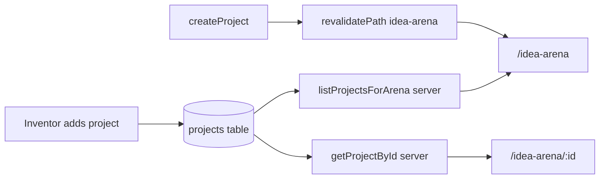

# Idea Arena: show inventor projects (overview + detail)

## Current state

- Projects are stored in [`supabase/migrations/001_projects.sql`](supabase/migrations/001_projects.sql) (`id`, `title`, `description`, `clerk_user_id`, `created_at`). Inserts happen in [`app/dashboard/projects/actions.ts`](app/dashboard/projects/actions.ts) via `createProject`; listing today is **inventor-only** and **scoped to the current user** (`listProjectsForCurrentUser`).
- There is **no Idea Arena route** yet; [`app/page.tsx`](app/page.tsx) and [`app/dashboard/page.tsx`](app/dashboard/page.tsx) do not link to one.
- **Access (confirmed):** any **signed-in** user may browse the arena.

## Data and security

- Keep using [`createServerSupabaseClient()`](lib/supabase-server.ts) (service role) only in **Server Components** or **server actions**—never in client bundles.
- Add server-only helpers, e.g. `listProjectsForArena()` and `getProjectByIdForArena(id)`, that:
  - `auth()`-guard: if no `userId`, return empty / null (pages will `redirect("/auth/sign-in")`).
  - Query `projects` ordered by `created_at` desc (list) or by `id` (detail).
  - Return a **public projection** for UI: `id`, `title`, `description`, `created_at`—omit `clerk_user_id` from props passed to client components unless you later need it for a server-only “Join” action.

## Routing and UX (aligned with mockups)

| Screen | Route | Behavior |
|--------|--------|----------|
| Overview | [`app/idea-arena/page.tsx`](app/idea-arena/page.tsx) | Hero strip + horizontal row (flex + overflow-x) of **compact cards**; one card can show **selected** state (border) via `?selected=<uuid>` or client state synced to URL. |
| Detail / close-up | [`app/idea-arena/[projectId]/page.tsx`](app/idea-arena/[projectId]/page.tsx) | Full **detail layout**: title, large image area, “Summary:” + description, right **team rail** (placeholders), “Team still needed” row (icons), primary **Join Team** button (disabled or stub until join flow exists). |

- Reuse existing tokens: [`app/globals.css`](app/globals.css) (`--ven-green`, `.ven-cta`, `.hero-bg` pattern) so the arena feels consistent with the landing page.
- Use **lucide-react** (already in [`package.json`](package.json)) for small role / “needed” icons; team avatars can be **deterministic placeholders** (e.g. colored circles + initials from title) until a real `project_members` (or similar) table exists.

## Implementation steps

1. **Server data layer** — Extend [`app/dashboard/projects/actions.ts`](app/dashboard/projects/actions.ts) (or a small `lib/projects-arena.ts` if you prefer separation) with `listProjectsForArena` and `getProjectByIdForArena`, plus a shared `ArenaProject` type (no sensitive fields).
2. **Cache revalidation** — In `createProject`, add `revalidatePath("/idea-arena")` (and if you use dynamic segments, revalidate the detail segment as appropriate for your Next cache API).
3. **Pages** — Implement `idea-arena` layout (header with VenShares + nav links + `UserButton` / logout pattern like dashboard), overview page, and dynamic detail page. Validate `projectId` UUID; `notFound()` when missing.
4. **Components** — Add focused UI under e.g. [`components/idea-arena/`](components/idea-arena/): `ProjectCard` (compact + selected), `ProjectDetailPanel` or page sections for the close-up. Keep props driven by `ArenaProject`.
5. **Placeholders for mock fidelity** — Without a migration yet:
   - **Image:** deterministic placeholder (e.g. `picsum.photos` seed from `id`, or a solid + grid pattern) so every project has a visual square.
   - **Team rail / “still needed”:** static or icon-only placeholders so layout matches the reference images; document as temporary.
6. **Navigation** — For signed-in users, add a clear link to `/idea-arena` from [`app/page.tsx`](app/page.tsx) nav and/or [`app/dashboard/page.tsx`](app/dashboard/page.tsx) so inventors and professionals can reach the arena after sign-in.

## Follow-ups (not required for “shows up like the photos” v1)

- **Migration:** `cover_image_url` (or Supabase Storage) + optional `needed_skills` JSON for real “Team still needed” data.
- **Join Team:** server action gated by `venRole === "professional"` per [`lib/ven-role.server.ts`](lib/ven-role.server.ts), plus persistence.

## Testing

- Manual: sign in as inventor → add project on dashboard → open `/idea-arena` and `/idea-arena/<new-id>` and confirm title/description and placeholders render.
- Sign out → confirm arena redirects or blocks per your chosen pattern (mirror [`app/dashboard/page.tsx`](app/dashboard/page.tsx) `redirect`).
