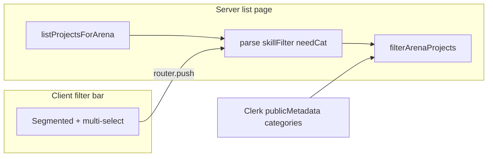

# Idea Arena: filter projects by team skills (categories)

## Domain alignmentIn this codebase, **“skills” for matching professionals to jobs** are the fixed **professional job categories** from [`lib/professional-onboarding.ts`](lib/professional-onboarding.ts) (`PROFESSIONAL_JOB_CATEGORY_OPTIONS`), stored on projects as `required_job_categories` and on professionals in Clerk `publicMetadata` (`professionalJobCategories`). Join eligibility already uses [`professionalCanJoinProject`](lib/skills-match.ts) / [`getProfessionalJoinSkillBlockReason`](lib/skills-match.ts) with [`normalizeRequiredJobCategoriesFromDb`](lib/skills-match.ts).

Per-project **free-text** rows in `project_required_skills` are **not** on the professional profile; filtering by those would require a different product rule (e.g. text search). This plan filters by **categories only**, consistent with the “Team skills needed” UI in [`components/idea-arena/project-detail-view.tsx`](components/idea-arena/project-detail-view.tsx).

## Behavior

| Mode | Who sees it | Rule |
|------|-------------|------|
| **All jobs** | Everyone | No filter (current behavior). |
| **Matches my skills** | `venRole === "professional"` only | Keep projects where `professionalCanJoinProject(myCategories, project.required_job_categories)` after normalizing DB values. Same overlap rule as Join Team when the project lists required categories. Projects with **no** required categories: **exclude** from this view (they cannot join today; user can switch to All). |
| **Jobs needing selected skills** | Everyone | User picks one or more categories; keep projects where **any** selected category appears in the project’s `required_job_categories` (after normalize). If **no** categories selected in this mode, treat as **no results** and show a short hint to pick at least one. |

**Selected card:** Keep today’s [`selected`](app/idea-arena/page.tsx) behavior: if `selected` is missing or not in the **filtered** list, default to the first filtered project.

**Professionals with empty profile categories** using “Matches my skills”: show an empty state with copy pointing to profile / onboarding to add categories (reuse patterns from [`app/dashboard/profile/page.tsx`](app/dashboard/profile/page.tsx) or dashboard CTA).

## URL contract (shareable, server-friendly)

Extend the Idea Arena list page `searchParams` (alongside existing `selected`):

- `skillFilter`: `all` | `mine` | `need` (names can be adjusted; keep short).
- `needCat`: repeated query key for each selected category, **values must be validated** against `PROFESSIONAL_JOB_CATEGORY_OPTIONS` (ignore junk).

Parsing/serialization helpers live in a small **`lib/arena-skill-filter.ts`** (or similar): `parseArenaSkillFilterParams`, `filterArenaProjectsBySkillMode`, and `buildIdeaArenaSearchParams` for links.

## UI

- Add a **client** control (e.g. [`components/idea-arena/arena-skill-filter.tsx`](components/idea-arena/arena-skill-filter.tsx)) that reads `useSearchParams` / `useRouter` and updates the URL (preserve `selected` when still valid; otherwise drop it so the server can pick the first card).
- Layout: segmented control **All** / **Matches my skills** / **By team skill**; when **By team skill** is active, show a compact multi-select (checkbox list or popover) of `PROFESSIONAL_JOB_CATEGORY_OPTIONS`, matching existing typography/spacing from the arena.
- Render the control only on [`app/idea-arena/page.tsx`](app/idea-arena/page.tsx) under the “Idea Arena” heading; **hide “Matches my skills”** for non-professionals (inventors/investors still get All + By team skill).

## Data flow

- [`listProjectsForArena`](lib/projects-arena.ts) stays unchanged (still loads all projects server-side); filtering is **in-memory** on the server after fetch—acceptable unless the project count grows large (then revisit with a Supabase query).

## Navigation continuity

- [`ProjectCard`](components/idea-arena/project-card.tsx): add optional prop for **current filter query**; set `href` to `/idea-arena/[projectId]?skillFilter=...&needCat=...&selected=...` so the detail route can rebuild the “Back to Idea Arena” link.
- [`app/idea-arena/[projectId]/page.tsx`](app/idea-arena/[projectId]/page.tsx): accept `searchParams`, forward a **return query string** into [`ProjectDetailView`](components/idea-arena/project-detail-view.tsx).
- Update the “Back to Idea Arena” [`Link`](components/idea-arena/project-detail-view.tsx) to `/idea-arena?${returnQuery}` (include `selected` + filter params).

## Files to touch (concise)

- New: `lib/arena-skill-filter.ts` — parse, validate, filter, build query string.
- New: `components/idea-arena/arena-skill-filter.tsx` — client URL sync + UI.
- Edit: [`app/idea-arena/page.tsx`](app/idea-arena/page.tsx) — read `searchParams`, `getVenRoleForCurrentUser`, `currentUser()` for metadata, filter projects, pass props to `ProjectCard` and the filter bar.
- Edit: [`components/idea-arena/project-card.tsx`](components/idea-arena/project-card.tsx) — append filter query to detail `href`.
- Edit: [`app/idea-arena/[projectId]/page.tsx`](app/idea-arena/[projectId]/page.tsx) + [`components/idea-arena/project-detail-view.tsx`](components/idea-arena/project-detail-view.tsx) — preserve filters on back navigation.

## Testing (manual)

- Professional with overlapping categories: **Matches my skills** shows only overlapping projects; Join Team still blocked/enabled consistently with detail page.
- **By team skill** with one category: only projects listing that category.
- **All** restores full list.
- Non-professional: no “Matches my skills” segment; other modes work.
- Deep link with invalid `needCat` values: ignored safely.
