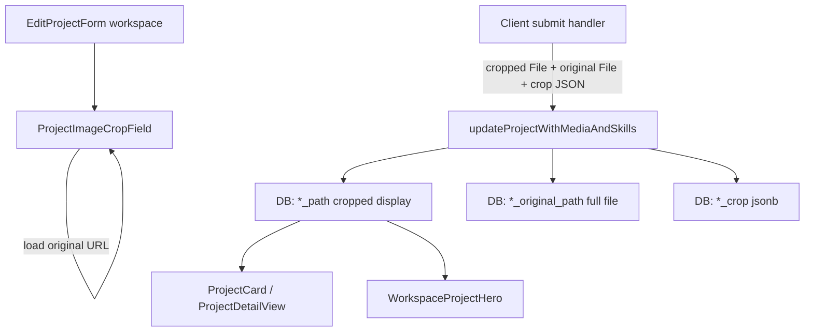

# Arena card and hero image crop editor

## Goal

In **Arena Card Details** ([`components/dashboard/edit-project-form.tsx`](components/dashboard/edit-project-form.tsx), `variant="workspace"`), replace static `object-cover` previews with an interactive cropper (drag to pan, slider/pinch to zoom). On **Save**, upload a **cropped display image** (what Idea Arena cards and the workspace banner show today) plus persist the **full original** and **crop state** so a later edit can zoom back out to parts that were off-screen.

Prior plans explicitly deferred this ([`arena_card_details_tab_8334e36c.plan.md`](.cursor/plans/arena_card_details_tab_8334e36c.plan.md)); this implements it with the re-edit requirement you specified.

## Architecture



**Display consumers stay unchanged** — they keep reading `representative_image_path` / `hero_image_path` via [`arenaProjectImageUrl`](components/idea-arena/utils.ts) and [`workspaceHeroImageUrl`](components/idea-arena/utils.ts). Only the edit form and upload pipeline grow.

## 1. Database migration

New file: [`supabase/migrations/015_project_image_crop_metadata.sql`](supabase/migrations/015_project_image_crop_metadata.sql)

```sql
alter table public.projects
  add column if not exists representative_image_original_path text,
  add column if not exists representative_image_crop jsonb,
  add column if not exists hero_image_original_path text,
  add column if not exists hero_image_crop jsonb;
```

Crop JSON shape (stored client-side, validated loosely server-side):

```ts
type ProjectImageCropMeta = {
  crop: { x: number; y: number };
  zoom: number;
};
```

## 2. Dependency

Add **`react-easy-crop`** — small, maintained crop/pan/zoom UI. No other image libs needed; canvas export follows their documented pattern.

## 3. New client utilities and component

| File | Purpose |
|------|---------|
| [`lib/project-image-crop.ts`](lib/project-image-crop.ts) | Shared `ProjectImageCropMeta` type + parse/stringify helpers |
| [`lib/crop-image.client.ts`](lib/crop-image.client.ts) | `getCroppedImageBlob(src, croppedAreaPixels)` via canvas (WebP output) |
| [`components/dashboard/project-image-crop-field.tsx`](components/dashboard/project-image-crop-field.tsx) | Reusable crop UI wrapping `react-easy-crop` |

**`ProjectImageCropField` props (essential):**

- `imageSrc` — always the **original** when available (see fallback below)
- `aspect` — `4/3` (arena) or `5/1` (hero, matching current preview)
- `initialCrop` — from saved `*_crop` or `{ x: 0, y: 0 }` + default zoom
- `containerClassName` — reuse existing preview dimensions from `ProjectImageUploadField`
- `onCropChange(meta, croppedAreaPixels, dirty)` — parent tracks state for submit

**UX inside the crop frame:**

- Drag to reposition; range slider for zoom (and trackpad pinch via library)
- Short hint: “Drag to reposition. Use the slider to zoom.”
- Picsum **placeholder** (no custom upload): keep static `<Image object-cover>` — no cropper on fake stock images

**Original source priority for cropper:**

1. In-memory `File` from a new pick (blob URL)
2. Saved `*_original_path` public URL
3. Legacy fallback: saved display `*_path` (re-crop only; cannot zoom out past what was already cropped)

## 4. Form changes — [`edit-project-form.tsx`](components/dashboard/edit-project-form.tsx)

### Replace preview in workspace fields

Refactor `ProjectImageUploadField` so the workspace variant uses `ProjectImageCropField` instead of static `Image` when a real custom image exists (`savedPath` or `selectedFile`).

Keep file picker + “Add a file” / “Change file” labels as-is.

### State per image (arena + hero)

- `selectedOriginalFile` / `selectedCroppedAreaPixels` / `cropMeta` / `cropDirty`
- Reset crop state when a **new file** is picked; restore from `project.*_crop` on mount when re-editing

### Hero fallback note

When hero preview uses the arena image ([`heroUsesArenaFallback`](components/dashboard/edit-project-form.tsx)), cropper loads the **arena original** (or arena display as legacy fallback). Saving a hero crop creates dedicated `hero_image_path` + `hero_image_original_path` without changing the arena card image.

### Submit interception

Switch workspace form to `onSubmit` (preventDefault):

1. Build `FormData` from the form
2. **Arena** — if cropper active and (`selectedFile` or `cropDirty`): canvas-export cropped blob → `representative_image` File; if new file also attach `representative_image_original`; always set hidden `representative_image_crop` JSON when cropper was used
3. **Hero** — same pattern with `hero_image` / `hero_image_original` / `hero_image_crop`
4. Remove empty native file inputs from FormData to avoid accidental re-uploads
5. Call `formAction(fd)` inside `startTransition`

Non-workspace dashboard variant: unchanged (small thumbnail, no cropper) unless you want parity later.

## 5. Server upload pipeline — [`app/dashboard/projects/actions.ts`](app/dashboard/projects/actions.ts)

Extend `ProjectRow` and all project selects with the four new columns.

In `updateProjectWithMediaAndSkills` (and optionally `createProject` later — out of scope for now):

| Form field | Storage | DB column |
|------------|---------|-----------|
| `representative_image` (cropped) | `{projectId}/cover-{ts}.ext` | `representative_image_path` |
| `representative_image_original` | `{projectId}/cover-original-{ts}.ext` | `representative_image_original_path` |
| `representative_image_crop` (JSON) | — | `representative_image_crop` |
| `hero_image` / `hero_image_original` / `hero_image_crop` | same pattern with `hero` / `hero-original` | hero columns |

Reuse [`readRepresentativeImageFromFormData`](lib/representative-image-upload.ts) with new field names + `baseName`s (`cover-original`, `hero-original`).

Add a small helper to parse crop JSON from FormData (ignore malformed; treat as null).

**Cleanup:** when replacing originals or cropped display files, call existing [`removeStoredProjectImage`](app/dashboard/projects/actions.ts) for previous paths (both display and original where applicable).

**Column-missing fallback:** mirror the existing `hero_image_path` pattern — if migration not applied, skip original/crop writes and surface a clear error only if crop fields are required.

## 6. Wire new fields through workspace

| File | Change |
|------|--------|
| [`app/workspace/[projectId]/page.tsx`](app/workspace/[projectId]/page.tsx) | Pass original paths + crop JSON into shell / editable project |
| [`components/workspace/workspace-shell.tsx`](components/workspace/workspace-shell.tsx) | Extend editable project type + `EditProjectForm` props |

No changes to [`project-card.tsx`](components/idea-arena/project-card.tsx), [`project-detail-view.tsx`](components/idea-arena/project-detail-view.tsx), or [`workspace-project-hero.tsx`](components/workspace/workspace-project-hero.tsx).

## 7. CORS note

Re-cropping saved originals loads Supabase public URLs into canvas. The cropper image must use `crossOrigin="anonymous"`. Verify the `project-images` bucket allows this in manual testing; if blocked, add a same-origin image proxy route as a follow-up (unlikely for public Supabase buckets).

## 8. Legacy projects

Existing rows with only `representative_image_path` / `hero_image_path`:

- Cropper opens on the display image
- Re-framing works, but zoom-out is limited to what is already in the saved crop
- Picking a **new file** stores a full original going forward

No backfill migration required.

## Manual test plan

1. **New arena upload** — pick image, pan/zoom, Save → Idea Arena card matches crop; re-open Arena Card Details → same framing restored; zoom out reveals off-screen areas
2. **Re-crop without new file** — adjust framing, Save → card updates; original file in storage unchanged
3. **New hero upload** — wide crop saves; workspace banner updates; arena card unchanged
4. **Hero from arena fallback** — crop hero starting from arena image; Save creates separate hero paths
5. **No custom image** — picsum placeholder; no cropper; buttons still say “Add a file”
6. **Legacy project** (pre-migration paths only) — cropper works on display image; new upload unlocks full original retention
7. **Save without crop changes** — title-only edit does not re-upload images
8. **CORS** — re-crop saved original without picking a new file succeeds (canvas export does not throw)

## Out of scope

- Crop editor on dashboard create/edit (`add-project-form`, collapsed dashboard edit)
- View-only zoom on live hero banner or Idea Arena cards
- Server-side cropping (Sharp) — client canvas export is sufficient
- Perfect hero WYSIWYG across all viewport widths (preview stays `aspect-5/1`; live banner is `h-36 md:h-44` + full width — same approximation as today)
