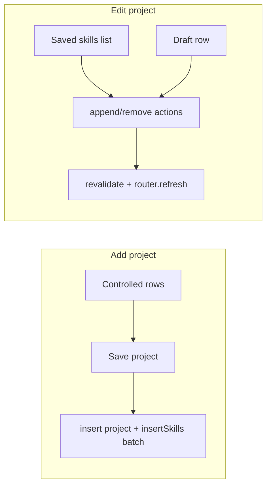

# Inventor dashboard: save multiple custom skills / save-then-add-another

## Current behavior

- Custom skills are stored in Supabase [`project_required_skills`](supabase/migrations/005_project_image_and_required_skills.sql) and loaded with projects in [`listProjectsForCurrentUser`](app/dashboard/projects/actions.ts).
- The add flow uses [`AddProjectForm`](components/dashboard/add-project-form.tsx); the edit flow uses [`EditProjectForm`](components/dashboard/edit-project-form.tsx). Both embed [`ProjectRequiredSkillRows`](components/dashboard/project-required-skill-rows.tsx).
- On create/update, [`parseRequiredSkillsFromFormData`](lib/project-required-skills.ts) pairs `FormData.getAll("skill_name")` with `getAll("skill_description")` by index; [`replaceSkillsForProject`](app/dashboard/projects/actions.ts) replaces all rows on edit.

## Problem

[`ProjectRequiredSkillRows`](components/dashboard/project-required-skill-rows.tsx) keeps row metadata in React state but uses **uncontrolled** inputs (`defaultValue={row.skill_name}` / `skill_description`). Typed text lives in the DOM, not in `rows`, so re-renders (add/remove row, pending states, etc.) can desync what the user sees from what submits—consistent with “only one skill works” or “Add skill feels one-time.”

Init keys use `` `init-${i}-${r.skill_name}` ``; duplicate names from the server would also risk **duplicate React keys**.

## Recommended implementation

### 1. Controlled skill rows (both add and edit)

- In [`components/dashboard/project-required-skill-rows.tsx`](components/dashboard/project-required-skill-rows.tsx), drive each row with `value={row.skill_name}` / `value={row.skill_description}` and `onChange` handlers that update `rows` state.
- Use stable unique keys for every row at creation time (e.g. `crypto.randomUUID()` for **all** rows including those seeded from `initialRows`, not `skill_name` in the key).
- Optional: pass `disabled` while parent form is pending if you want to avoid edits mid-submit.

This keeps **one “Save project”** path correct for multiple skills on both create and full edit.

### 2. “Save custom skill & add another” on **existing** projects

New skills need a `project_id`, so incremental save fits the **edit** surface after a project exists.

- **Expose row ids** for dashboard/Arena consistency: extend the selected embed to include `id` (e.g. `project_required_skills ( id, skill_name, skill_description, sort_order )`) in [`listProjectsForCurrentUser`](app/dashboard/projects/actions.ts) and align [`ProjectRow`](app/dashboard/projects/actions.ts) / [`ProjectRequiredSkill`](lib/project-required-skills.ts) (add optional `id?: string` or a narrow dashboard type) plus [`lib/projects-arena.ts`](lib/projects-arena.ts) selects and `normalizeSkillRows` so Idea Arena keeps working (extra field is harmless if typed as optional).
- **Server actions** in [`app/dashboard/projects/actions.ts`](app/dashboard/projects/actions.ts) (same auth/owner checks as `updateProjectWithMediaAndSkills`):
  - `appendProjectRequiredSkill(projectId, skill_name, skill_description)` — trim, validate (reuse caps/rules from [`lib/project-required-skills.ts`](lib/project-required-skills.ts): max 10 rows per project, name required if description present, length limits), set `sort_order` to `max+1` or `skills.length`, `insert` one row, `revalidatePath` for `/dashboard`, `/idea-arena`, `/idea-arena/[id]`.
  - `removeProjectRequiredSkill(projectId, skillId)` — `delete` where `project_id` + `id` match and project is owned by current user; revalidate same paths.
- **UI** in [`EditProjectForm`](components/dashboard/edit-project-form.tsx):
  - Render **saved** skills from `project.project_required_skills` (read from server props) with a remove control calling `removeProjectRequiredSkill`.
  - Single “draft” row (name + description) + button **“Save skill & add another”** calling `appendProjectRequiredSkill` via `useTransition` or `useActionState`; on success call `router.refresh()` so the server component refetches projects and the list updates.
  - Keep the existing **Save project** for title, description, categories, and image; either **remove** the bulk multi-row `ProjectRequiredSkillRows` from edit (to avoid two competing editors) or keep it only for bulk replace if you prefer—cleanest is **incremental-only on edit** once (1) and (2) ship.

**Create project** flow: still attaches multiple skills on first insert via controlled `ProjectRequiredSkillRows` + `createProject` (no `project_id` until insert completes, so true per-skill DB save before create is not worth the complexity unless you add a draft-project concept).

## Files to touch

| Area | File |
|------|------|
| Row reliability | [`components/dashboard/project-required-skill-rows.tsx`](components/dashboard/project-required-skill-rows.tsx) |
| Types + parse caps | [`lib/project-required-skills.ts`](lib/project-required-skills.ts) — export small helpers for append validation if useful |
| List + actions | [`app/dashboard/projects/actions.ts`](app/dashboard/projects/actions.ts) |
| Edit UI | [`components/dashboard/edit-project-form.tsx`](components/dashboard/edit-project-form.tsx) |
| Arena selects (id optional) | [`lib/projects-arena.ts`](lib/projects-arena.ts) |

## Testing (manual)

- Add project: add 3 custom skills with distinct names; submit once; confirm all three in DB / Idea Arena detail.
- Edit project: save one skill via “Save skill & add another,” fields clear, list shows new row; repeat; remove one skill; confirm Arena updates after refresh.

## Out of scope

- Changing join eligibility (still `required_job_categories` presets only).
- Admin approval of custom skills (deferred in prior plans).
