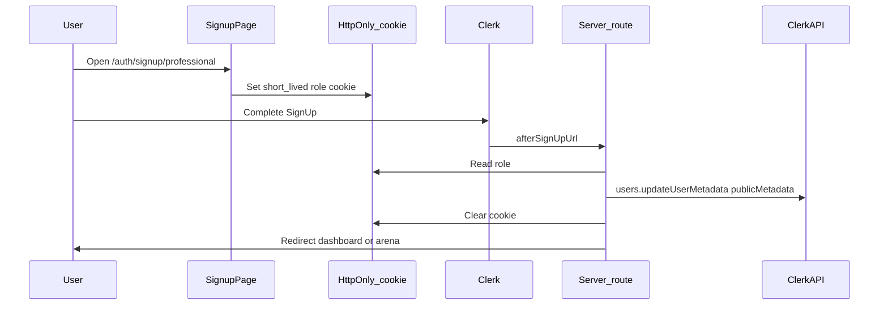

# Inventor vs professional sign-up (round 1)

## Reference PDFs (extracted text)

The following comes from the **user-pdf-reader** MCP (`read_pdf`) on files under [`reference_docs/Small/`](reference_docs/Small/). Filenames are exact (note the double space in the Landing PDF filename).

### Shared login (both roles)

[`VenShares Website Design 3-25-2026 Login page 2 -2.pdf`](reference_docs/Small/VenShares%20Website%20Design%203-25-2026%20Login%20page%202%20-2.pdf): Username or Email, Password, Forgot Password, Sign in with Apple, **“New to VenShares? Create Account”** (no separate inventor/professional picker on this screen—role comes from where “Create Account” is launched or a prior step).

### Skilled professional–specific onboarding (post–create account)

[`VenShares Website Design 3-25-2026 Login page pt 2 -3.pdf`](reference_docs/Small/VenShares%20Website%20Design%203-25-2026%20Login%20page%20pt%202%20-3.pdf) frames the **professional** journey as owning shares and working with IP. It asks users to **have ready** (copy, not necessarily all collected in v1):

- Valid U.S. Driver’s License  
- Proof of U.S. Citizenship  
- Sign appropriate NDAs  
- Link a bank account for dividend payouts (when accepting a project)

**Form fields on this screen:** First Name, Last Name, Email Address, Address, City State Zip, Phone → **“Let’s Build”** → **Personalize Your Projects List:** up to **5 job categories**, **work hours per week** (bands: 1–5, 5–10, 15–20, 25–30, 35–40, plus “I’m All In…”), then **“Ready to Select Project >>”** / Save & Exit.

This aligns with **Idea Arena**: professionals choose projects/categories and hours before “select project.”

### Inventor-specific profile (idea submission path)

[`VenShares Website Design 3-25-2026 File Inventor page -4.pdf`](reference_docs/Small/VenShares%20Website%20Design%203-25-2026%20File%20Inventor%20page%20-4.pdf): **Upload files**, “Hello Inventor!”, **UserName**, First Name, Last Name, Address, City State Zip, Phone → **Ready to Submit Idea >>** / Save & Exit.

[`VenShares Website Design 3-25-2026 Inventor page -5.pdf`](reference_docs/Small/VenShares%20Website%20Design%203-25-2026%20Inventor%20page%20-5.pdf): Marketing/inventor value prop (no additional form fields beyond the file-inventor page).

### Marketing / joint positioning

[`VenShares Website Design 3-25-2026 Joint Info page -6.pdf`](reference_docs/Small/VenShares%20Website%20Design%203-25-2026%20Joint%20Info%20page%20-6.pdf) and [`VenShares Website Design 3-25-2026 Landing page  -1.pdf`](reference_docs/Small/VenShares%20Website%20Design%203-25-2026%20Landing%20page%20%20-1.pdf) (two spaces before `-1`): dual audience (inventors vs skilled professionals), **same flow** as [`app/page.tsx`](app/page.tsx) (submit idea → professionals check IP → join team → crowdfunding, etc.).

### Summary: two user types in the documents

- **Inventor:** Lighter contact + profile identity; **upload** + idea submission; no job categories / hours in the inventor PDFs.
- **Skilled professional:** Identity + **IP/legal readiness** messaging; **job categories (≤5)**; **hours per week**; CTA toward **select project** (Idea Arena).

The landing page already has separate CTAs but they all point to the same URL, and **there is no auth route yet**—only [`app/(auth)/.gitkeep`](app/(auth)/.gitkeep). Links like `/auth/signup` will 404 until you add routes.

## Target behavior (simplified v1)

1. **Two sign-up paths** (distinct URLs), e.g. `/auth/signup/inventor` and `/auth/signup/professional`, each rendering Clerk’s [`<SignUp />`](https://clerk.com/docs/components/authentication/sign-up) with path-based routing consistent with your URL structure.
2. **One canonical field**: `role` ∈ `{ inventor, professional }` (names can match your product language; keep stable enums in code).
3. **Persist `role` on the user** so server and client can gate Idea Arena task signup:
   - **Minimum viable**: Clerk **`publicMetadata`** (e.g. `venRole` or `profileRole`) set once after signup.
   - **Optional but common next step**: mirror into Supabase [`profiles`](lib/supabase.ts) for relational queries and RLS; can be phase 2 if you want the smallest diff now.
4. **Login stays generic** (existing modal [`SignInButton`](app/page.tsx)); role is established at sign-up (and later you can add “change role” admin flows if needed).

## How to attach `role` to Clerk (recommended pattern)

Clerk’s hosted `<SignUp />` does not automatically know “which marketing page” the user came from unless you pass it through. A reliable v1 pattern:

- **Set** a short-lived **httpOnly** cookie (e.g. 10–15 minutes, `SameSite=Lax`, `Path=/`) when the user hits `/auth/signup/inventor` or `/auth/signup/professional` (via a tiny Route Handler `GET` that redirects to the same page with cookie set, or middleware that sets the cookie for those paths—keep the logic in one place).
- **after sign-up**, a dedicated route (e.g. `app/auth/after-signup/route.ts` or a Server Action) runs **authenticated**: read `auth().userId`, read the cookie, **validate** the value against the allowed enum, call `clerkClient().users.updateUser()` to set `publicMetadata`, clear cookie, redirect.
- **Idempotency**: if `publicMetadata` already has `venRole`, skip overwrite (or only allow if empty) to avoid tampering across repeated visits.

**Security note**: anyone could hit the professional signup URL; “simplified v1” accepts that. Later you can add application review, verified credentials, or admin approval for professionals.

## UI / routing work

| Item | Action |
|------|--------|
| [`app/page.tsx`](app/page.tsx) | Point “Get Started as Inventor” → `/auth/signup/inventor`, “Join as Professional” → `/auth/signup/professional`, and the same for section CTAs. |
| New routes under `app/(auth)/` | Implement nested catch-all segments Clerk expects for path routing (pattern mirrors Clerk Next.js App Router docs in your installed `next` package—read the local doc file under `node_modules/next/dist/docs/` before wiring `routing="path"`). |
| Optional | Thin `/auth/signup` page that explains both paths and links to the two URLs (avoids dead links from bookmarks). |

## Idea Arena gating (consumer of `role`)

- **Server**: `currentUser()` from `@clerk/nextjs/server` and check `user.publicMetadata.venRole === 'professional'` (exact key TBD in implementation).
- **Client**: `useUser()` from `@clerk/nextjs` for conditional UI.
- **API routes** that assign tasks: enforce the same check; do not rely on client-only UI.

## Clerk Dashboard checklist (non-code)

- Configure **Allowed redirect URLs** / **After sign-up** URLs to include your `afterSignUp` / `afterSignIn` paths for local and production domains.
- If you use OAuth providers, ensure the redirect flow still lands on your completion route so metadata is set.

## Out of scope for “simplified first round” (unless you want them)

- **Full PDF parity** on first screen: inventor file-upload + full address book, or professional license/NDA/ID uploads and bank link—those are **separate onboarding steps** after Clerk account creation; the PDFs already separate **account** vs **professional personalization** (“Login pt 2”).
- **Deferred but PDF-specified for later:** inventor `UserName` + upload + address block; professional job categories (max 5), hours bands, “have ready” checklist (license, citizenship proof, NDAs), bank link for payouts.
- Supabase `profiles` + RLS mirroring these fields (recommended before heavy Idea Arena data).
- Role changes, appeals, or moderation.

## Pre-implementation read (required by project rules)

Before writing routes, open the relevant guide under `node_modules/next/dist/docs/` in **your** installed Next 15 RC tree (path may differ slightly) so App Router + Clerk catch-all segments match your exact Next version.
