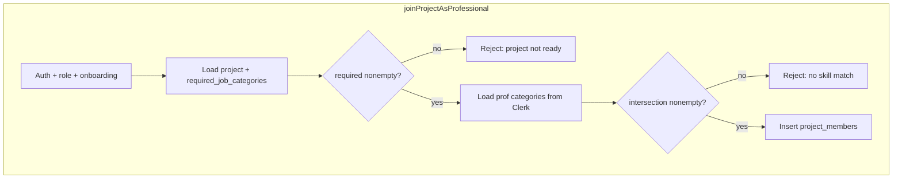

# Gate Join Team on project vs professional skills

## Current state

- Professionals store **job categories** in Clerk `publicMetadata` under [`PROFESSIONAL_JOB_CATEGORIES_KEY`](lib/professional-onboarding.ts) (same allowlist as [`PROFESSIONAL_JOB_CATEGORY_OPTIONS`](lib/professional-onboarding.ts)).
- Projects in Supabase are **title + description only** ([`001_projects.sql`](supabase/migrations/001_projects.sql)).
- [`joinProjectAsProfessional`](lib/project-members.ts) checks auth, role, onboarding, UUID, ownership, and duplicate membership — **no skill comparison**.

## Data model

- New migration (e.g. `004_projects_required_categories.sql`): add `required_job_categories text[] not null default '{}'` to `public.projects`.
- **Dev reset alignment:** update [`002_projects_dev_reset.sql`](supabase/migrations/002_projects_dev_reset.sql) `CREATE TABLE` to include the same column so a fresh reset matches production shape.

## Shared matching logic

- Add a small helper (e.g. in [`lib/professional-onboarding.ts`](lib/professional-onboarding.ts) or a dedicated `lib/skills-match.ts`) that:
  - Normalizes DB arrays with the same rules as [`normalizeProfessionalJobCategories`](lib/professional-onboarding.ts) (allowlist + dedupe + max 5).
  - `professionalCanJoinProject(profCategories, requiredCategories): boolean` → **true iff** `requiredCategories.length > 0` and **at least one** required value appears in `profCategories` (your chosen rule).

## Inventor flows (so projects are never “empty” for join)

- **Create project** — [`app/dashboard/projects/actions.ts`](app/dashboard/projects/actions.ts) `createProject`: read multi-value `categories` from `FormData`, normalize, **reject if length === 0** with a clear error; persist `required_job_categories` on insert.
- **UI / catalog (updated)** — See [`.cursor/plans/project_image_and_skills.plan.md`](project_image_and_skills.plan.md): **large shared preset list** (grouped checkboxes), **higher cap for inventors** than for professionals (e.g. inventors 8–12, professionals still ≤5), and optional **custom skills** (`project_custom_skills`) for display only — **join matching still uses `required_job_categories` presets only** (≥1 preset required).
- **Edit existing projects** (needed for rows created before this change): minimal path on the dashboard — e.g. per-project “Team skills” section with the same multi-select + a server action `updateProjectRequiredCategories(projectId, …)` gated to `venRole === "inventor"` and **owner** (`clerk_user_id` match). Revalidate `/dashboard` and `/idea-arena`.

## Server enforcement (source of truth)

- In [`joinProjectAsProfessional`](lib/project-members.ts):
  1. `select` project including `required_job_categories`.
  2. Normalize required array; if **empty** → return `{ ok: false, error: … }` (e.g. project not ready for professionals / inventor must add skills).
  3. Load current user via `currentUser()`, read and normalize `professionalJobCategories` from metadata.
  4. If **no overlap** → return a clear error (e.g. suggest updating profile or picking another project).

## Idea Arena UX

- Extend [`ArenaProject`](lib/projects-arena.ts) and queries in [`listProjectsForArena`](lib/projects-arena.ts) / [`getProjectByIdForArena`](lib/projects-arena.ts) to include `required_job_categories`.
- [`app/idea-arena/[projectId]/page.tsx`](app/idea-arena/[projectId]/page.tsx): for `venRole === "professional"`, compute `canJoinBySkills` (and optionally a short reason) using the same helper as the server action, and pass into [`ProjectDetailView`](components/idea-arena/project-detail-view.tsx).
- **Detail UI:** If professional, not already joined, and **not** `canJoinBySkills`, show explanatory copy instead of [`JoinTeamForm`](components/idea-arena/join-team-form.tsx) (empty required vs no overlap — two different messages). Optionally show “Team needs: …” chips using project data (replaces or supplements placeholder icons in “Team Still Needed”).

## Testing / docs

- Manually: inventor creates project **with** categories; professional **with** overlap joins; professional **without** overlap sees message and server rejects; project with empty required (legacy) blocks join until inventor edits.
- Update internal manuals only if you want them in scope ([`manual/how-to-join-a-project-team.md`](manual/how-to-join-a-project-team.md), [`manual/how-to-add-a-project.md`](manual/how-to-add-a-project.md)) — optional follow-up.
