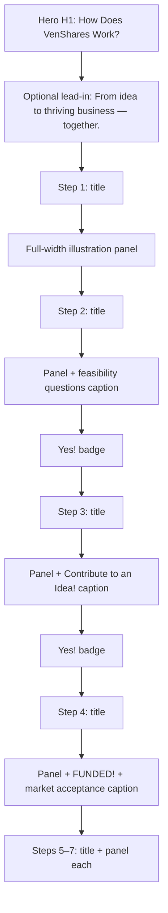

# Landing page hero and How It Works refresh

## Reference source

**Primary spec:** [`reference_docs/LandingPage.pdf`](reference_docs/LandingPage.pdf) (gitignored; on disk at `ven-shares/reference_docs/LandingPage.pdf`).

Supersedes the earlier `VenShares Website Design 5-24-2026 Page 1 Landing page v2.pdf` reference. The two files share the same How It Works flow and lower-page sections; `LandingPage.pdf` is the cleaner export (no duplicate hero marketing block in the PDF text layer).

Current implementation: [`app/page.tsx`](app/page.tsx) with styles in [`app/globals.css`](app/globals.css).

## Key differences vs. previous plan

| Topic | Previous plan (v2 PDF) | Revised plan (`LandingPage.pdf`) |
|-------|------------------------|----------------------------------|
| Reference file | `…Landing page v2.pdf` | `LandingPage.pdf` |
| Post-hero layout | Alternating text-left / image-right rows | **Stacked:** step title → full-width illustration panel |
| Step 2–4 body copy | Separate text column beside image | **Caption inside/below the panel** (questions, “Contribute to an Idea!”, crowdfunding copy) |
| Hero H1 | “From idea to thriving business…” | **“How Does VenShares Work?”** (matches `LandingPage.pdf`) |
| Hero subtitle | From v2 PDF | Connection line (not in PDF text layer; user-confirmed) |
| Steps 5–7 art | Generic placeholders only | **Try extracting** 800×800 embedded icons from PDF; placeholder fallback |
| Lower sections | Out of scope | **In scope** for copy alignment (Inventors, Professionals, earnings, footer) |

## What changes

### 1. Hero section

Replace the Churchill quote with copy aligned to `LandingPage.pdf`:

| Element | Content |
|---------|---------|
| **H1** | How Does VenShares Work? |
| **Subtitle** | VenShares connects skilled professionals with inventors to build businesses together. |
| **CTAs** | Unchanged (Inventor + Professional signup links) |
| **Background** | Keep existing underwater `hero-bg` in [`app/globals.css`](app/globals.css) (matches PDF hero image treatment) |

**Section header:** Do not repeat “How Does VenShares Work?” as an `<h2>` in `#how-it-works` (hero already carries it). Optionally keep “From idea to thriving business — together.” as a short lead-in line above step 1.

### 2. How It Works — first content after hero (`#how-it-works`)

Rebuild to match `LandingPage.pdf` vertical walkthrough. **Do not** use the current side-by-side `flex-row` alternating layout.

**Layout pattern (per step):**

**Copy (from `LandingPage.pdf`):**

| Step | Title (above panel) | Caption (on/in panel) |
|------|---------------------|------------------------|
| 1 | An Inventor Submits an Idea | — |
| 2 | Skilled Professionals check IP and viability of the idea. | Is it feasible? Can it be protected? does it already exist? etc… |
| 3 | Skilled Professionals Join Project Team | Contribute to an Idea! |
| 4 | Submit it to crowd funding section of VenShares | This will test for market acceptance (+ FUNDED! graphic) |
| 5 | Product is Built and launched | — |
| 6 | The Idea Becomes a Thriving Business | — |
| 7 | Earn Shares / dividends based on your contributions | — |

**“Yes!” badges** centered between steps 2→3 and 3→4 (green pill, as in PDF).

**Visual treatment:**
- Full-width panels with light periwinkle background (`~#E6E9F8`, from your screenshots)
- `next/image`, `object-contain`, responsive max-height so panels don’t overflow mobile
- Titles centered or left-aligned above each panel (match PDF: bold, stacked lines for multi-line titles)
- Captions centered below the illustration inside the panel (steps 2–4)

### 3. Assets

**Steps 1–4 — user-provided (rename for clean URLs):**

| Step | Source | Target |
|------|--------|--------|
| 1 | `public/assets/Screenshot 2026-05-25 at 4.35.39 PM.png` | `public/assets/landing-how-step-01.png` |
| 2 | `public/assets/Screenshot 2026-05-25 at 4.35.46 PM.png` | `public/assets/landing-how-step-02.png` |
| 3 | `public/assets/Screenshot 2026-05-25 at 4.35.53 PM.png` | `public/assets/landing-how-step-03.png` |
| 4 | `public/assets/Screenshot 2026-05-25 at 4.36.05 PM.png` | `public/assets/landing-how-step-04.png` |

**Steps 5–7 — extract from `LandingPage.pdf`:**
- PDF embeds multiple 800×800 step icons (launch, thriving business, earn shares / growth chart)
- During implementation: export best-matching embedded images to `public/assets/landing-how-step-05..07.png`
- If extraction quality is poor, use styled placeholder panels (same periwinkle bg + short label)

**Earnings chart section:**
- PDF includes a wide bar-chart graphic (3030×690 embedded image)
- Replace the current CSS-only bar placeholder with extracted chart image, or keep CSS bars as fallback

### 4. Lower sections — copy alignment to `LandingPage.pdf`

Update [`app/page.tsx`](app/page.tsx) text where it diverges:

| Section | PDF copy | Current drift |
|---------|----------|---------------|
| **Inventors** | “Join VenShares!” CTA | “Join as Inventor” — align button label |
| **Skilled Professionals** | “$65,000 **annually** over the next 5 years” | says “over $65,000 in the next 5 years” (missing “annually”) |
| **Earnings teaser** | “Using half of the free time…” + bar chart | copy mostly matches; swap in chart image |
| **Footer** | “Copyright VenShares 2020 - 2026” + “Contact Us” | already matches |

Illustration placeholders in Inventors / Professionals sections (emoji text) remain out of scope unless quick wins from PDF extraction.

### 5. Implementation approach

**Primary file:** [`app/page.tsx`](app/page.tsx)

- Update hero H1 + subtitle
- Replace `#how-it-works` with a `HOW_IT_WORKS_STEPS` config array: `{ title, caption?, image, yesAfter? }`
- Render each step as: `<h3>` title block → `.how-step-panel` with `<Image>` + optional caption → optional `.how-step-yes`
- Import `Image` from `next/image`

**Styles:** [`app/globals.css`](app/globals.css)

- Replace/extend `.step-box` with:
  - `.how-step-panel` — periwinkle bg, rounded-3xl, padding, full width
  - `.how-step-caption` — centered bold caption below image
  - `.how-step-yes` — centered green “Yes!” pill

**Out of scope (this pass):**
- Nav restructure to PDF’s INVENT / EARN / INVEST labels (current descriptive nav is fine)
- Inventors / Professionals section illustrations (emoji → real art)
- Favicon / OG metadata

## Verification

After implementation, spot-check in browser:

- Hero H1 reads “How Does VenShares Work?” with connection-line subtitle; CTAs work
- `#how-it-works` nav anchor scrolls correctly
- Steps use **stacked** layout (not side-by-side columns)
- Steps 1–4 show your four images; captions on 2–4 match PDF
- “Yes!” badges between steps 2–3 and 3–4
- Steps 5–7 have extracted or placeholder panels (no emoji text)
- Professionals section says “$65,000 annually over the next 5 years”
- `#how-it-works` does not repeat the hero H1; optional tagline appears at most once above steps
