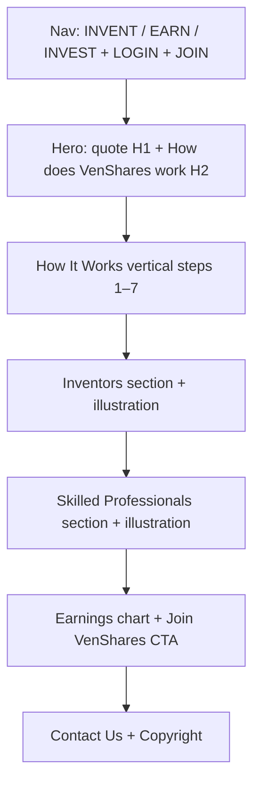

# Landing page v4 alignment

**Reference:** [`reference_docs/VenShares LandingPage v4.pdf`](reference_docs/VenShares LandingPage%20v4.pdf)

**Primary files:** [`app/page.tsx`](app/page.tsx), [`app/globals.css`](app/globals.css)

## Current state

Much of the v4 How It Works flow is already built: stacked periwinkle panels, step 1–4 screenshots, Yes! badges, and PDF-accurate step copy. Remaining gaps are hero copy/structure, header nav, step 5–7 assets, lower-section illustrations/chart, and a few CTA labels.

---

## 1. Hero section (user-specified)

Replace the current hero content in [`app/page.tsx`](app/page.tsx):

| Element | Content |
|---------|---------|
| **H1** | If you find a job you love, you'll never work again. |
| **H2** | How does VenShares work |
| **Background** | Extract the underwater sun-rays image from v4 PDF (embedded image ~1850×834) → save as `public/assets/landing-hero-bg.png` and point `.hero-bg` at it instead of the picsum placeholder in [`app/globals.css`](app/globals.css) |
| **Subtitle** | Remove the current connection-line paragraph ("VenShares connects skilled professionals…") |
| **Hero CTAs** | Remove the two signup buttons from the hero; signup remains in nav JOIN button and lower sections |

**Typography (match PDF feel):**
- H1: large, centered, white or dark text depending on contrast over the rays image (PDF uses dark text on bright center — tune with a light scrim if needed for readability)
- H2: smaller, centered, directly below H1
- Keep full-viewport hero height (`h-screen`) with centered stack

**Important:** Do **not** repeat "How does VenShares work" again as a section heading inside `#how-it-works` — the hero H2 already carries it; step 1 begins immediately with "An Inventor Submits an Idea".

---

## 2. Header nav (match v4 + arena pattern)

Update landing nav in [`app/page.tsx`](app/page.tsx) to mirror [`components/idea-arena/arena-header.tsx`](components/idea-arena/arena-header.tsx):

| Link | Anchor |
|------|--------|
| INVENT | `#inventors` |
| EARN | `#professionals` |
| INVEST | `#how-it-works` |

**Right side:**
- **LOGIN** — existing Clerk `SignInButton` (signed-out) / dashboard links (signed-in)
- **JOIN** — new green pill linking to `/auth/signup` (signed-out only)

Remove descriptive labels ("How it Works", "For Inventors", "For Professionals"). Update mobile menu to match.

Logo stays as [`components/venshares-logo.tsx`](components/venshares-logo.tsx) (tagline already in PNG).

---

## 3. How It Works — finish assets (steps 5–7)

Steps 1–4 are good (`landing-how-step-01..04.png`). Steps 5–6 currently use wrong extracted icons (gear, growth chart); step 7 is an emoji placeholder.

**Action:** Re-extract from v4 PDF the three 800×800 step illustrations and save as:
- `public/assets/landing-how-step-05.png` — Product is Built and launched
- `public/assets/landing-how-step-06.png` — The Idea Becomes a Thriving Business
- `public/assets/landing-how-step-07.png` — Earn Shares / dividends

Wire them in the existing `HOW_IT_WORKS_STEPS` config; remove the step 7 placeholder block.

---

## 4. Lower sections (match v4 copy + visuals)

### Inventors (`#inventors`)
- Copy already matches PDF
- **CTA label:** change from "Join VenShares!" to **"Join"** (PDF uses short label) → still links to `/auth/signup/inventor`
- **Illustration:** replace emoji placeholder with inventor icon extracted from v4 PDF (person + lightbulb sticker style)

### Skilled Professionals (`#professionals`)
- Copy already matches (including "$65,000 annually over the next 5 years")
- **CTA:** keep **"Join VenShares!"** → `/auth/signup/professional`
- **Illustration:** replace emoji with team-collaboration graphic from v4 PDF

### Earnings section
- Add **"Skilled Professionals:"** as section heading (PDF has this label above the chart block)
- Keep existing social-media copy
- Replace CSS-only bar placeholder with the v4 bar-chart image (embedded ~3030×690) → `public/assets/landing-earnings-chart.png`
- Add **"Join VenShares!"** CTA below chart → `/auth/signup/professional`

### Footer
- Already matches: "Contact Us" + "Copyright VenShares 2020 - 2026"
- Optionally link "Contact Us" to a mailto or existing contact route if one exists (currently plain text, same as PDF)

---

## 5. Styles

In [`app/globals.css`](app/globals.css):

- Point `.hero-bg` to `/assets/landing-hero-bg.png` (drop picsum URL)
- Add hero typography classes if needed (e.g. `.hero-quote`, `.hero-subheading`) for H1/H2 sizing and contrast
- Existing `.how-step-*` styles stay; no layout change needed for the flow section

---

## 6. Asset extraction approach

During implementation, use the PDF reader MCP on v4 to export:
1. Hero background (index 0, ~1850×834)
2. Steps 5–7 icons (800×800 set)
3. Inventor + Professionals section illustrations
4. Earnings bar chart (index 46, ~3030×690)

Save clean filenames under `public/assets/` and reference via `next/image`.

---

## Verification checklist

- Hero H1 reads the Churchill quote; H2 reads "How does VenShares work"; no duplicate H2 in `#how-it-works`
- Hero uses real underwater rays background, not picsum
- Nav shows INVENT / EARN / INVEST + LOGIN + JOIN
- Steps 1–7 all show real panel images (no emoji placeholders)
- Inventors CTA says "Join"; Professionals + earnings CTAs say "Join VenShares!"
- Earnings section has "Skilled Professionals:" header and chart image
- Mobile nav and anchor scroll still work (`scroll-mt-20` on sections)
