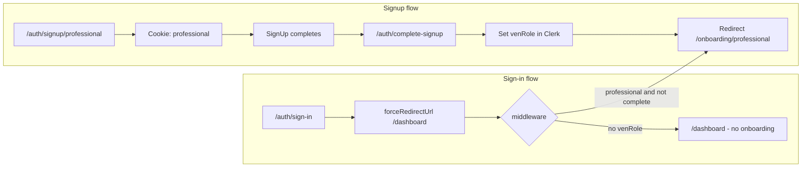

# Login, skills onboarding, and LOGOUT header

## What you are seeing

### 1. LOGOUT instead of “manage skills”

[Idea Arena](app/idea-arena/page.tsx), [project detail](app/idea-arena/[projectId]/page.tsx), and [workspace](app/idea-arena/[projectId]/workspace/page.tsx) all render [`ArenaHeader`](components/idea-arena/arena-header.tsx), which **only** exposes `useClerk().signOut` as a **LOGOUT** button. It does **not** use [`VenUserButton`](components/ven-user-button.tsx).

`VenUserButton` (used on [home](app/page.tsx), [dashboard](app/dashboard/page.tsx), [profile](app/dashboard/profile/page.tsx)) wraps Clerk’s **`UserButton`** and adds, for **professionals**:

- **“Complete your profile”** → `/onboarding/professional` while onboarding is incomplete  
- **“Profile & skills”** → `/dashboard/profile` after onboardingSo on Arena routes you never get that avatar menu or the skills link—only a raw sign-out control.

```33:38:components/idea-arena/arena-header.tsx
        <button
          type="button"
          className="ven-cta text-sm px-6 py-2 shrink-0"
          onClick={() => void signOut({ redirectUrl: "/" })}
        >
          LOGOUT
```

### 2. No onboarding to specify skills

Skills onboarding is **only for the “professional” account type**, enforced in [middleware](middleware.ts): redirect to `/onboarding/professional` only when `getVenRoleFromPublicMetadata(meta) === "professional"` **and** `isProfessionalOnboardingComplete(meta)` is false (see [`lib/professional-onboarding.ts`](lib/professional-onboarding.ts) — completion is strictly `professionalOnboardingComplete === true`).

**Role assignment** normally happens in [`app/auth/complete-signup/route.ts`](app/auth/complete-signup/route.ts): it reads the httpOnly **signup role cookie** set when visiting `/auth/signup/professional` or `/auth/signup/inventor` (see [middleware cookie logic](middleware.ts)), then writes `publicMetadata.venRole`.

**Sign-in** ([`app/auth/sign-in/[[...sign-in]]/page.tsx`](app/auth/sign-in/[[...sign-in]]/page.tsx)) uses `forceRedirectUrl="/dashboard"` and **never hits** `/auth/complete-signup`. So:

- If `venRole` was never set (e.g. account created outside the role-specific signup flow, or cookie missing/expired at the wrong time), middleware **will not** send you to professional onboarding, and `VenUserButton` **will not** show professional menu items (it gates on `isProfessionalVenRole`).

The [dashboard](app/dashboard/page.tsx) already surfaces this as **“Not set (complete sign-up or sign in again)”** when `venRole` is missing.

**Inventor accounts** intentionally have no professional skills onboarding in this app; only professionals get categories/hours flows.

---

## Recommended direction (when you implement)

1. **Arena header** — Replace the standalone LOGOUT button with `VenUserButton` (and remove or relocate raw `signOut` so account management stays in Clerk’s menu), *or* add an explicit nav link to `/dashboard/profile` for professionals while keeping a smaller sign-out affordance if you want parity with marketing styling.
2. **Login / role gaps** — After sign-in, if `venRole` is unset, redirect to a small **“choose / confirm account type”** flow or to `/auth/signup` hub instead of `/dashboard`, so professionals always get `venRole` + onboarding. Alternatively, run logic equivalent to `complete-signup` on first login when metadata is incomplete (careful with security: only set role when you have a trusted signal).
3. **Verification** — In Clerk Dashboard, inspect `publicMetadata.venRole` and `professionalOnboardingComplete` for the affected user; that confirms whether the issue is “not professional”, “onboarding already true”, or “Arena header only”.


