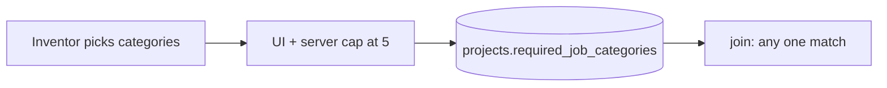
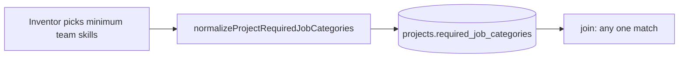

# Minimum team skills (inventor dashboard)

## Goal

Replace the inventor **selection cap** with a **minimum requirement** model:

- Inventors must pick **at least one** preset job category when creating or editing a project.
- They may select **as many** preset categories as apply (no disabled checkboxes at 5).
- **Join rule unchanged:** [`professionalCanJoinProject`](lib/skills-match.ts) stays OR — professional needs **any one** overlap with `required_job_categories`.

Professional onboarding/profile stays capped at 5 categories ([`components/onboarding/professional-onboarding-form.tsx`](components/onboarding/professional-onboarding-form.tsx) unchanged).

## Current behavior (problem)



- UI: [`AddProjectForm`](components/dashboard/add-project-form.tsx) and [`EditProjectForm`](components/dashboard/edit-project-form.tsx) use `MAX_CATEGORIES = 5`, disable unchecked boxes at cap, show `N / 5 selected`.
- Server: [`createProject`](app/dashboard/projects/actions.ts) / [`updateProjectWithMediaAndSkills`](app/dashboard/projects/actions.ts) call [`normalizeProfessionalJobCategories`](lib/professional-onboarding.ts), which **stops at 5** even if more checkboxes were submitted.
- DB reads: [`normalizeRequiredJobCategoriesFromDb`](lib/skills-match.ts) also uses the professional normalizer, so stored arrays with more than five entries would be **truncated** on read.

## Target behavior



- Copy: **"Minimum team skills"** (required) — helper text: professionals need **at least one** matching category to join; no "up to five" language or counter.
- Server: separate normalizer for **projects** (allowlist + dedupe, **no max** beyond the catalog size — currently 10 options in [`PROFESSIONAL_JOB_CATEGORY_OPTIONS`](lib/professional-onboarding.ts)).
- Validation error (create/update): e.g. `"Choose at least one minimum team skill."`

## Implementation

### 1. Project-specific normalization — [`lib/professional-onboarding.ts`](lib/professional-onboarding.ts)

Add:

```ts
export function normalizeProjectRequiredJobCategories(
  selected: string[],
): ProfessionalJobCategory[] {
  // same allowlist + dedupe as normalizeProfessionalJobCategories
  // do NOT break at 5
}
```

Keep `normalizeProfessionalJobCategories` as-is for professionals (max 5).

### 2. Read path for projects — [`lib/skills-match.ts`](lib/skills-match.ts)

Change `normalizeRequiredJobCategoriesFromDb` to use `normalizeProjectRequiredJobCategories` instead of `normalizeProfessionalJobCategories`, so Arena, join, workspace progress, and filters see the full stored array.

### 3. Write path — [`app/dashboard/projects/actions.ts`](app/dashboard/projects/actions.ts)

In `createProject` and `updateProjectWithMediaAndSkills`:

- Replace `normalizeProfessionalJobCategories` with `normalizeProjectRequiredJobCategories`.
- Update validation message from `"Choose at least one team skill needed (up to five)."` to the new minimum-skills copy.

No migration: `required_job_categories` is already `text[]` with no DB-level max.

### 4. Dashboard UI — [`components/dashboard/add-project-form.tsx`](components/dashboard/add-project-form.tsx), [`components/dashboard/edit-project-form.tsx`](components/dashboard/edit-project-form.tsx)

For both forms:

- Remove `MAX_CATEGORIES` and all `atCap` / `disabled` cap logic in `toggleCategory`.
- Rename fieldset/section: **Minimum team skills** (required).
- Helper text: explain **≥1 required for save** and **≥1 category match to join** (not every box must match).
- Remove `{selected.length} / {MAX_CATEGORIES} selected` counter (optional: show `{selected.length} selected` only if useful).

Workspace settings tab uses the same `EditProjectForm` — it picks up copy/behavior automatically.

### 5. Docs (light touch)

Update [`manual/how-to-add-a-project.md`](manual/how-to-add-a-project.md) step 6 to describe minimum team skills without the five-category cap.

## Out of scope

- AND join gate (must match all selected categories).
- Expanding the preset catalog ([`project_image_and_skills.plan.md`](.cursor/plans/project_image_and_skills.plan.md) grouped list / 25–40 options).
- Custom `project_required_skills` rows ([`inventor_custom_skills_ux_780198dc.plan.md`](.cursor/plans/inventor_custom_skills_ux_780198dc.plan.md)) — unchanged; still display-only for join.

## Verification

- **Create:** Select 6+ categories (if testing before catalog expansion, use all 10); save; dashboard and Idea Arena show all chips; DB array length matches selection.
- **Join:** Professional with one overlapping category can still join; professional with zero overlap cannot.
- **Edit/workspace:** Same uncapped behavior from dashboard and workspace Settings tab.
- **Professional profile:** Still limited to 5 categories on onboarding — unrelated to inventor project form.
