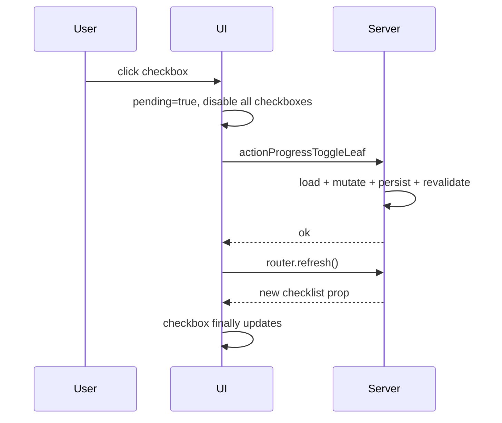
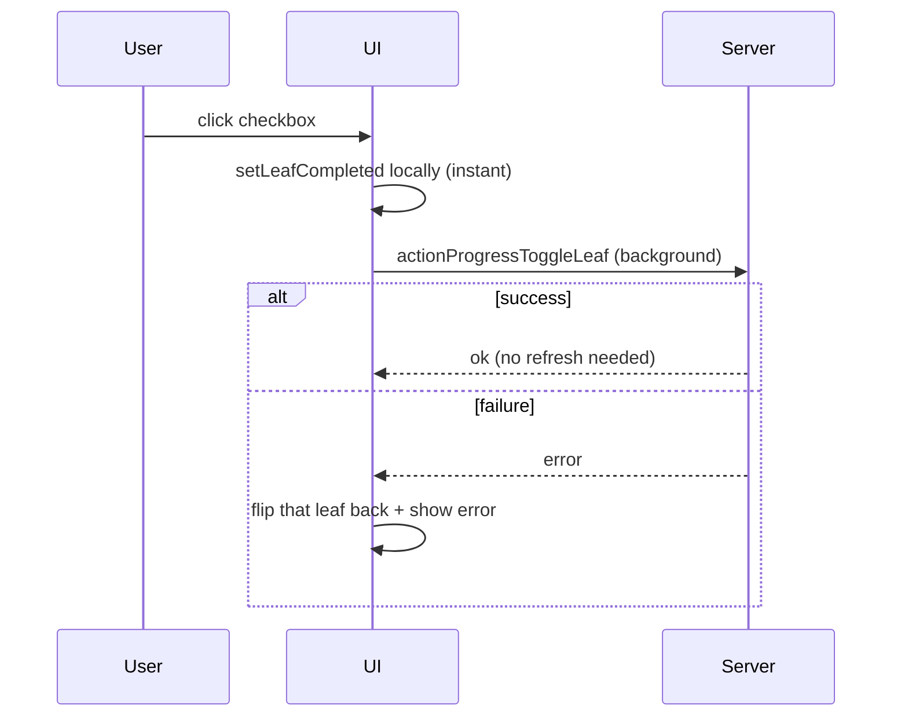

# Optimistic Progress Checkboxes

## Problem

Checkbox toggles currently wait for a full server round-trip before updating:



The checkbox is bound to server props via [`checklist`](components/workspace/workspace-progress-panel.tsx), and [`run()`](components/workspace/workspace-progress-panel.tsx) only calls `router.refresh()` after the action completes. Meanwhile [`disabled={pending}`](components/workspace/progress-task-row.tsx) freezes all checkboxes during any in-flight mutation.

## Solution

Apply the same pure function the server already uses — [`setLeafCompleted`](lib/workspace-progress-checklist.ts) — on the client immediately, then persist asynchronously.



No server action changes required — [`actionProgressToggleLeaf`](app/idea-arena/[projectId]/workspace/actions.ts) already uses `setLeafCompleted` internally.

## Files to change

### 1. [`components/workspace/workspace-progress-panel.tsx`](components/workspace/workspace-progress-panel.tsx)

**Add local checklist state** in `WorkspaceOrganizerPanel`:

- `const [localChecklist, setLocalChecklist] = useState(checklist)`
- Sync from server when props change: `useEffect(() => setLocalChecklist(checklist), [checklist])`

**Add optimistic toggle handler** at the panel level (lifted out of `SkillProgressBody`):

```ts
const toggleLeaf = useCallback(
  async (category: ProfessionalJobCategory, leafId: string, completed: boolean) => {
    setError(null);
    setLocalChecklist((prev) => {
      const next = setLeafCompleted(prev, category, leafId, completed);
      return next ?? prev;
    });

    const result = await actionProgressToggleLeaf(projectId, category, leafId, completed);
    if (!result.ok) {
      setLocalChecklist((prev) => {
        const reverted = setLeafCompleted(prev, category, leafId, !completed);
        return reverted ?? prev;
      });
      setError(result.error ?? "Something went wrong.");
    }
  },
  [projectId],
);
```

- Do **not** call `router.refresh()` on success — local state is already correct.
- On failure, revert only that leaf (flip back) rather than restoring a full snapshot, so concurrent toggles on different leaves stay intact.

**Render from `localChecklist` instead of `checklist`:**

- `leafCounts` memo → use `localChecklist[slot.category]`
- `block`, `taskLists`, `allDone` in the skill list → from `localChecklist`

**Derive skill badge optimistically** so "3 / 5 subtasks done" and status pill update with the checkbox:

```ts
function deriveSlotStatus(
  block: WorkspaceProgressCategoryBlock | undefined,
  teamCoversCategory: boolean,
): ArenaCategorySlotStatus {
  if (categoryAllLeavesComplete(block)) return "complete";
  if (categoryHasAnyLeafCompleted(block) || teamCoversCategory) return "in_progress";
  return "needed";
}
```

Use `deriveSlotStatus(localBlock, slot.teamCoversCategory)` for `slotBadge(...)` and `showRecommend` instead of `slot.status`.

**Wire toggle into `SkillProgressBody`:**

- Remove `handleToggleLeaf` + its `onRun(...)` wrapper inside `SkillProgressBody`
- Add prop `onToggleLeaf: (leafId, completed) => void` passed from panel as `(leafId, completed) => toggleLeaf(category, leafId, completed)`
- Checkbox toggles bypass `run()` entirely

**Leave other mutations unchanged** (add task, delete, drag, check-all) — they still use `run()` + refresh for now.

### 2. [`components/workspace/progress-task-row.tsx`](components/workspace/progress-task-row.tsx)

Remove `disabled={pending}` from checkbox `<input>` elements only (task leaf checkbox ~line 280, subtask checkbox ~line 178).

Keep `disabled={pending}` on drag handles, delete buttons, and remove confirms — those operations should still block during unrelated saves.

## Out of scope (follow-up)

- **Check all / Clear all** — same pattern with [`setAllLeavesInCategory`](lib/workspace-progress-checklist.ts); easy add-on once single-toggle works.
- **Add task / save status** — separate optimistic passes.
- **Returning checklist from server actions** — not needed for checkboxes since client and server share the same pure functions.

## Manual test plan

1. Open workspace Progress tab, expand a skill, toggle a subtask checkbox — should flip instantly with no freeze.
2. Confirm "X / Y subtasks done" count updates immediately.
3. Confirm status badge moves between Needed / In progress / Complete as appropriate.
4. Toggle several checkboxes quickly across different tasks — all should stay responsive.
5. Simulate failure (e.g. disconnect network, toggle) — checkbox reverts, red error banner appears.
6. Refresh page — persisted state matches what was checked.
