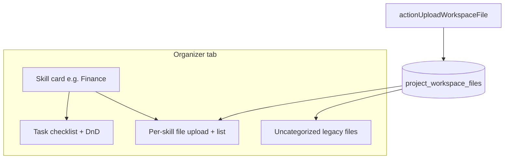

# Organizer tab with per-skill files

## Goal

Consolidate workspace file management into the skill-organizer experience:

- Tab label **Organizer** (URL `?tab=organizer`), replacing **Progress**
- Remove the standalone **Files** tab
- Upload and list files **inside each skill category card** (same cards that hold the task checklist)
- Persist **`job_category`** + optional **`description`** on each file record
- Legacy files (no category) → **Uncategorized** section at the bottom (download/remove only)



---

## 1. Database migration

Add [`supabase/migrations/012_workspace_file_skill_metadata.sql`](supabase/migrations/012_workspace_file_skill_metadata.sql):

```sql
alter table public.project_workspace_files
  add column if not exists job_category text,
  add column if not exists description text;

create index if not exists project_workspace_files_project_category_idx
  on public.project_workspace_files (project_id, job_category, created_at desc)
  where deleted_at is null;
```

- `job_category` stores the exact `ProfessionalJobCategory` string (matches checklist keys)
- `description` is user-facing optional text; category is the internal skill flag
- No FK to projects.required_job_categories — validate in server actions (same pattern as progress mutations)

Existing rows keep `job_category = null` → Uncategorized UI.

---

## 2. Server layer

### Types and helpers — [`lib/workspace.ts`](lib/workspace.ts)

Extend `WorkspaceFileRow` / insert path:

```ts
job_category: string | null;
description: string | null;
```

Update `uploadWorkspaceFileRecord(...)` to accept `jobCategory: string | null` and `description: string | null`.

Add optional helper `listWorkspaceFilesForCategory(projectId, category)` or keep single `listWorkspaceFiles` and group client-side (project file counts are small; grouping in the panel is fine for v1).

Activity payload for `file_uploaded` / `file_deleted`: include `job_category` and `description` when present.

### Upload action — [`app/idea-arena/[projectId]/workspace/actions.ts`](app/idea-arena/[projectId]/workspace/actions.ts)

Extend `actionUploadWorkspaceFile(projectId, formData)`:

| Form field | Rule |
|------------|------|
| `file` | required (unchanged) |
| `job_category` | required; must pass `resolveProfessionalJobCategory()` and be in the project's `required_job_categories` |
| `description` | optional; trim; max ~500 chars |

Reject uploads with missing/invalid category. Storage path stays `{projectId}/{fileId}-{filename}` (no bucket restructure needed).

Delete/download actions unchanged — category is metadata only.

---

## 3. Tab rename and Files tab removal

### [`components/workspace/workspace-shell.tsx`](components/workspace/workspace-shell.tsx)

- **TABS**: remove `{ id: "files" }`; change `{ id: "progress", label: "Progress" }` → `{ id: "organizer", label: "Organizer", icon: LayoutList }` (or similar)
- **`resolveTabId`**: map legacy `progress` and `files` → `organizer` so old bookmarks still work
- **Remove** the entire `tab === "files"` block (~220 lines: upload form, active list, removed files, file-specific state)
- **Remove** file-only state from shell (`uploadError`, `workspaceUploadFileName`, `pendingDeleteId`, etc.) once moved to organizer component
- **Keep** shared concerns in shell only if still needed elsewhere (likely none after move)
- Update `activityDescription` for `file_uploaded` to mention skill when `payload.job_category` is set (e.g. "Uploaded budget.xlsx for Finance")

### [`app/idea-arena/[projectId]/workspace/page.tsx`](app/idea-arena/[projectId]/workspace/page.tsx)

Map new DTO fields:

```ts
job_category: f.job_category ?? null,
description: f.description ?? null,
```

Pass `files`, `nameMap`, `currentUserId`, `isProjectOwner` into the organizer panel.

---

## 4. Organizer panel UI

### Rename panel — [`components/workspace/workspace-progress-panel.tsx`](components/workspace/workspace-progress-panel.tsx)

- Rename export to **`WorkspaceOrganizerPanel`** (update import in shell; file rename optional in same PR)
- Accept new props: `files: WorkspaceFileDTO[]`, `nameMap`, `currentUserId`, `isProjectOwner`

### New component — [`components/workspace/organizer-skill-files.tsx`](components/workspace/organizer-skill-files.tsx)

Extract the file UX from today's Files tab into a reusable per-skill block:

**Upload form** (inside expanded skill card, below task checklist):
- File picker + optional description textarea
- Hidden/submit field `job_category={slot.category}`
- Calls `actionUploadWorkspaceFile`; `router.refresh()` on success

**Active file list** for `files.filter(f => f.job_category === category && !f.deleted_at)`:
- Show filename, description (if any), uploader, size, date
- Preview (reuse [`lib/workspace-preview.ts`](lib/workspace-preview.ts)), download, remove+confirm (uploader or owner — same `canRemoveFile` logic)

**Removed files** (per skill): collapsible subsection when that category has soft-deleted rows

**Preview modal**: move from shell into this component (or a tiny shared [`components/workspace/workspace-file-preview-dialog.tsx`](components/workspace/workspace-file-preview-dialog.tsx)) so shell stays lean

### Wire into skill cards

In the expanded skill body ([`workspace-progress-panel.tsx`](components/workspace/workspace-progress-panel.tsx) ~637–673), render:

```
SkillProgressBody (existing tasks)
OrganizerSkillFiles (new — category={slot.category})
```

Place files **below** tasks, separated by a light border.

### Uncategorized section

At the bottom of `WorkspaceOrganizerPanel`, after all skill cards:

- Only render if `files.some(f => !f.job_category && !f.deleted_at)` (or include removed in collapsible)
- Heading: **Uncategorized files** with note: "Uploaded before skill folders were added"
- Download + remove only (no upload here in v1)

---

## 5. DTO type update

Extend [`WorkspaceFileDTO`](components/workspace/workspace-shell.tsx) in shell (or move to a small shared types file if preferred):

```ts
export type WorkspaceFileDTO = {
  // ...existing fields...
  job_category: string | null;
  description: string | null;
};
```

---

## Files to touch

| File | Change |
|------|--------|
| `supabase/migrations/012_workspace_file_skill_metadata.sql` | New columns + index |
| `lib/workspace.ts` | Types, upload record, activity payload |
| `app/idea-arena/.../workspace/actions.ts` | Category + description on upload |
| `app/idea-arena/.../workspace/page.tsx` | DTO mapping; pass props to organizer |
| `components/workspace/workspace-shell.tsx` | Tab rename, remove Files tab, slim down |
| `components/workspace/workspace-progress-panel.tsx` | Rename to organizer panel; wire files + uncategorized |
| `components/workspace/organizer-skill-files.tsx` | New per-skill file UI + preview |

---

## Manual test plan

1. **Tab UX** — Sidebar shows "Organizer"; `?tab=organizer` works; `?tab=progress` and `?tab=files` redirect to Organizer
2. **Per-skill upload** — Upload in Finance with description; file appears only under Finance, not other skills
3. **Validation** — Upload without category (tampered form) rejected server-side
4. **Description** — Shows in file row; omitted when empty
5. **Preview / download / remove** — Same behavior as old Files tab, scoped per skill
6. **Removed files** — Soft-deleted file moves to per-skill "Removed" collapsible; download still works
7. **Uncategorized** — Pre-migration files (null category) appear in bottom section only
8. **Activity feed** — Upload/remove events show filename (+ skill when categorized)
9. **Progress tasks** — Checklist, DnD, completion sync unchanged

## Out of scope (v1)

- Re-assigning legacy files to a skill
- Editing description after upload
- Project-wide "all files" view (Files tab is removed)
- Linking files to specific tasks/subtasks
