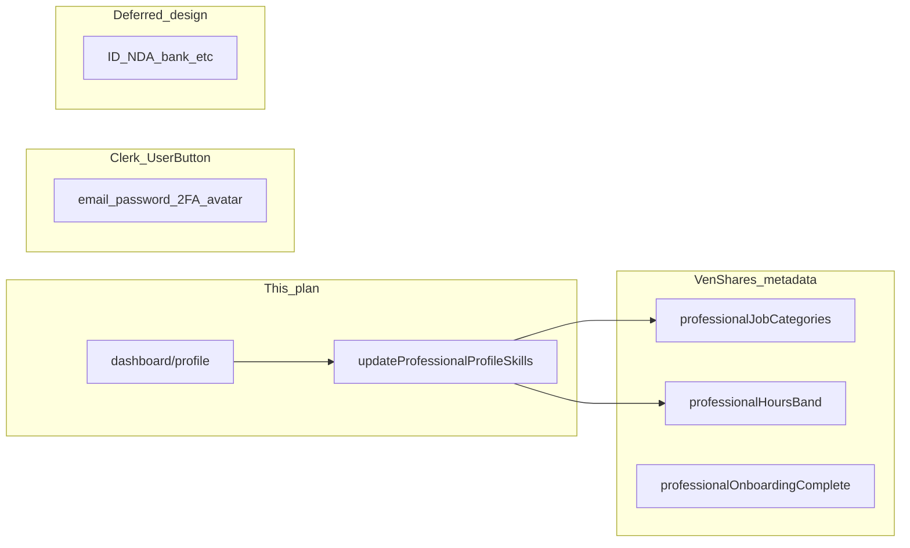

# Professional “Edit profile skills” and related settings

## What exists today for professionals (VenShares-owned)

Stored in Clerk **`publicMetadata`** ([`lib/professional-onboarding.ts`](lib/professional-onboarding.ts)):

- **`professionalJobCategories`** — up to 5 preset categories (join-team / Idea Arena matching).
- **`professionalHoursBand`** — availability band.
- **`professionalOnboardingComplete`** — set once at onboarding; should stay `true` on edits.

There is **no** in-app profile page yet; [`app/dashboard/page.tsx`](app/dashboard/page.tsx) only shows account type for professionals.

---

## Implementation: “Edit profile skills”

**1. Refactor the form for reuse**

[`components/onboarding/professional-onboarding-form.tsx`](components/onboarding/professional-onboarding-form.tsx) currently initializes categories to `[]` and hours to empty `defaultValue`. Extend it with props, for example:

- `initialCategories: ProfessionalJobCategory[]` (default `[]` for onboarding).
- `initialHours: ProfessionalHoursBandValue | ""` (default `""`).
- `action` — server action reference (onboarding vs update).
- `submitLabel` — e.g. “Continue to dashboard” vs “Save profile”.
- Optionally `showOnboardingCopy` boolean to tweak helper text (“personalize” vs “update”).

Use `key={`${initialHours}-${initialCategories.join(",")}`}` on the form or controlled patterns if needed so remount picks up fresh server data after save.

**2. Dedicated server action**

Add something like **`updateProfessionalProfileSkills`** next to onboarding or under a small profile module (e.g. [`app/dashboard/profile/actions.ts`](app/dashboard/profile/actions.ts)):

- Same auth + **`venRole === "professional"`** check as [`completeProfessionalOnboarding`](app/onboarding/professional/actions.ts).
- Same validation: `isValidProfessionalHoursBand`, `normalizeProfessionalJobCategories`, at least one category.
- `clerkClient().users.updateUser` with spread `...user.publicMetadata`, update only **`PROFESSIONAL_JOB_CATEGORIES_KEY`** and **`PROFESSIONAL_HOURS_BAND_KEY`** — do **not** clear **`PROFESSIONAL_ONBOARDING_COMPLETE_KEY`**.
- `redirect("/dashboard")` or back to the profile page with a success path; `revalidatePath` as needed for the app’s Next.js caching pattern.

Keep **`completeProfessionalOnboarding`** behavior unchanged (still sets onboarding complete + redirect).

**3. Route and entry point**

- New page e.g. **`/dashboard/profile`** (or `/settings/professional`): server component loads current user via Clerk, reads categories/hours from `publicMetadata` (mirror how [`lib/skills-match.ts`](lib/skills-match.ts) reads categories), passes into the client form.
- No middleware change required: only incomplete onboarding is forced to [`/onboarding/professional`](middleware.ts); completed professionals can hit the new route freely.
- On [`app/dashboard/page.tsx`](app/dashboard/page.tsx), for **`venRole === "professional"`**, add a clear link: “Edit profile skills” → new route.

**4. Onboarding page**

Swap to `<ProfessionalOnboardingForm />` with no initial values (or explicit defaults) and existing `completeProfessionalOnboarding` — behavior parity with today.

---

## Other settings professionals may want (product lens)

| Area | In this codebase today | Notes |
|------|------------------------|--------|
| **Job categories + hours** | Yes (metadata) | Covered by this plan. |
| **Account basics** (email, password, 2FA, avatar) | Clerk **`UserButton`** | Already on dashboard header; optional short copy: “Account & security” opens Clerk. |
| **Verification & payouts** | Listed as **deferred** only | [`lib/onboarding-deferred.ts`](lib/onboarding-deferred.ts): ID, citizenship, NDAs, bank — future “Verification” or “Payout setup” flow, not part of this small edit-skills scope. |
| **Bio / portfolio / LinkedIn** | Not stored | Useful for trust and matching later; would need schema (metadata or DB) + UI. |
| **Notifications** | Not present | Email/in-app preferences if you add messaging or join alerts. |
| **Privacy** | Not present | e.g. visibility of name on public project pages. |

**Bottom line:** besides the two fields you already have, the next **VenShares-specific** settings professionals will likely need are the **deferred compliance/financial** items when you build them; everything else is either **Clerk** (account) or **greenfield** (bio, notifications).

