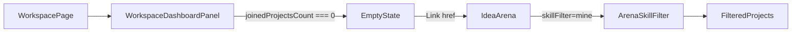

# Professional no-team empty state

## Target UI

When a professional has **completed onboarding** but **`joinedProjectsCount === 0`**, the workspace professional tab currently shows a small `text-base` paragraph telling them to use Idea Arena in the header:

```67:71:components/workspace/workspace-dashboard-panel.tsx
            ) : joinedProjectsCount === 0 ? (
              <p className="text-slate-600 text-base mb-10">
                You haven&apos;t joined a team yet. Use Idea Arena in the header
                to find projects that match your skills.
              </p>
```

**Goal:** Make this message prominent (large font) and embed a link to Idea Arena with `skillFilter=mine` so they land on **Matches my skills** (per your preference).

## Filter link (already supported)

Idea Arena reads `skillFilter` from the URL via [`lib/arena-skill-filter.ts`](lib/arena-skill-filter.ts). Existing helper:

```88:101:lib/arena-skill-filter.ts
export function buildIdeaArenaSearchParams(opts: {
  selected?: string;
  skillFilter?: ArenaSkillFilterMode;
  needCategories?: ProfessionalJobCategory[];
}): URLSearchParams {
  // ...
}
```

Link target: `/idea-arena?skillFilter=mine` (built with `buildIdeaArenaQueryString({ skillFilter: "mine" })`).

**Edge case:** If the professional has no job categories in metadata, `mine` shows the arena’s existing “add your job categories” empty state ([`app/idea-arena/page.tsx`](app/idea-arena/page.tsx) `emptyMineNoProfile`). That is acceptable because onboarding-complete users should normally have categories; no extra branching required unless you want a plain `/idea-arena` fallback.

## Implementation

### 1. Add a small href helper (optional but keeps URL logic in one place)

In [`lib/arena-skill-filter.ts`](lib/arena-skill-filter.ts), add:

```ts
export function ideaArenaHrefMatchingMySkills(): string {
  const q = buildIdeaArenaQueryString({ skillFilter: "mine" });
  return q ? `/idea-arena?${q}` : "/idea-arena";
}
```

Reuses existing serialization; no new query params.

### 2. Update the empty state in [`components/workspace/workspace-dashboard-panel.tsx`](components/workspace/workspace-dashboard-panel.tsx)

Replace the plain `<p>` with a prominent block:

- **Typography:** `text-xl` (or `text-lg md:text-xl`) with `text-slate-700` and relaxed leading — noticeably larger than the header subtitle (`text-base`) and section title (`text-2xl` stays on “Your teams”).
- **Copy:** Keep the core message; weave in an inline **Idea Arena** link (green accent consistent with arena links: `text-[#22c55e] font-semibold hover:underline`).
- **Example structure:**

```tsx
<p className="text-xl text-slate-700 leading-relaxed mb-10 max-w-2xl">
  You haven&apos;t joined a team yet.{" "}
  <Link href={ideaArenaHrefMatchingMySkills()} className="...">
    Browse Idea Arena
  </Link>{" "}
  to find projects that match your skills.
</p>
```

Import `Link` (already used in this file) and the new helper.

No new props needed — the href is static for all professionals.

### 3. No server/page changes required

[`app/workspace/page.tsx`](app/workspace/page.tsx) already gates on `proOnboardingComplete` and `joinedProjectsCount`; the empty state only renders in that branch. Shell props stay unchanged.

## Data flow



## Verification

1. Sign in as a **professional** with completed onboarding and **no team memberships**.
2. Open `/workspace` (or `/workspace?tab=professional` if dual-role).
3. Confirm the no-team message uses **large font** and includes a clickable **Browse Idea Arena** (or similar) link.
4. Click the link → lands on `/idea-arena?skillFilter=mine` with **Matches my skills** active and projects filtered to joinable overlap.
5. Dual-role user on inventor tab: message unchanged.
6. Professional with joined teams: progress stack still shows (no empty state).
