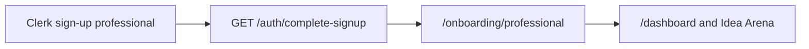

# Simple professional onboarding

## Documentation you already have

- **[`sign-up-procedures.md`](sign-up-procedures.md)** / **[`manual/sign-up-procedures.md`](manual/sign-up-procedures.md)** — verify Clerk paths and `publicMetadata.venRole`.
- **[`lib/onboarding-deferred.ts`](lib/onboarding-deferred.ts)** — full deferred list for professionals (ID, bank, NDAs, categories, hours). **v1 “simple”** implements only **job categories (≤5)** and **hours band**, matching the PDF summary in [`.cursor/plans/inventor_vs_professional_signup_0b351a28.plan.md`](.cursor/plans/inventor_vs_professional_signup_0b351a28.plan.md) (“Personalize Your Projects List” before “select project”).
- Inventors stay unchanged: still land on [`app/dashboard/page.tsx`](app/dashboard/page.tsx) after [`app/auth/complete-signup/route.ts`](app/auth/complete-signup/route.ts).

## Target behavior

1. **New professional sign-ups** — After [`complete-signup`](app/auth/complete-signup/route.ts) sets `venRole`, redirect to **`/onboarding/professional`** instead of `/dashboard` when the effective role is `professional` (use the role just written or already present on the user).
2. **Onboarding page** — Server component wrapper + client form (or server action): copy aligned with PDF (short intro about IP / readiness optional one-liner, no file uploads in v1).
   - **Job categories:** multi-select from a fixed list (checkboxes or a small multi-select), enforce **max 5**.
   - **Hours per week:** single select with bands from the plan: e.g. `1-5`, `5-10`, `15-20`, `25-30`, `35-40`, plus an **“I’m all in”** (or similar) option.
3. **Persistence (v1)** — Store on Clerk **`publicMetadata`** (e.g. `professionalJobCategories: string[]`, `professionalHoursBand: string`, `professionalOnboardingComplete: true`). Add small helpers next to existing role helpers in [`lib/ven-role.ts`](lib/ven-role.ts) or a dedicated `lib/professional-onboarding.ts` for key names and type guards. **No Supabase migration** unless you explicitly want profiles in DB now ([`001_projects.sql`](supabase/migrations/001_projects.sql) has no `profiles` table).
4. **Require completion** — **`clerkMiddleware`** (extend [`middleware.ts`](middleware.ts)): if the user is signed in, `venRole === "professional"`, and `professionalOnboardingComplete` is not true, redirect to `/onboarding/professional`. **Allowlist** that path, auth routes (`/auth/*`), static assets, and API routes so users are not stuck in a loop. Inventors and users without `venRole` are unaffected.
5. **Existing professionals** — Next sign-in, middleware sends them to onboarding until they submit the form (same as “legacy” accounts with `venRole` but no onboarding flag).

## Files to add or touch (concise)

| Area | Action |
|------|--------|
| [`app/auth/complete-signup/route.ts`](app/auth/complete-signup/route.ts) | After metadata update, branch redirect: `professional` → `/onboarding/professional`, else `/dashboard`. |
| `app/onboarding/professional/page.tsx` (+ maybe `actions.ts`) | UI + server action calling `clerkClient().users.updateUser` with categories, hours band, and completion flag. |
| [`middleware.ts`](middleware.ts) | Gate professionals with incomplete onboarding (needs `auth().userId` + `clerkClient().users.getUser` or lean on session claims if you prefer; simplest is async middleware with Clerk’s supported pattern). |
| [`lib/ven-role.server.ts`](lib/ven-role.server.ts) (or new lib) | Helper: `isProfessionalOnboardingComplete(metadata)` for reuse in middleware and page. |

**Note:** If Clerk’s middleware typing makes a full user fetch heavy, alternative is a lightweight check using `sessionClaims.publicMetadata` in middleware (verify against current `@clerk/nextjs` patterns in `node_modules/next/dist/docs/` per [AGENTS.md](AGENTS.md)).

## Out of scope for this “simple” slice

- Document uploads (license, citizenship, NDAs), bank linking — remain listed under [`DEFERRED_PROFESSIONAL_ONBOARDING`](lib/onboarding-deferred.ts).
- Inventor onboarding.
- Changing [`manual/sign-up-procedures.md`](manual/sign-up-procedures.md) unless you ask for doc updates.
