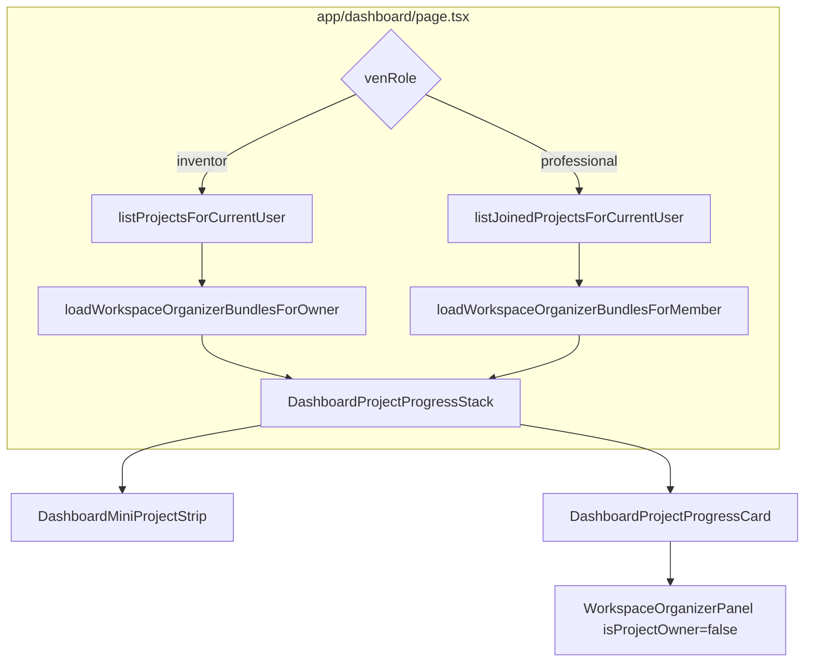

# Professional progress dashboard

## Goal

When a professional clicks **Dashboard** from the landing page (or header), they should see a hub comparable to the inventor experience:

- Collapsible **Overview** mini-strip (status chips per project)
- **Full progress cards** with embedded [`WorkspaceOrganizerPanel`](components/workspace/workspace-progress-panel.tsx)
- **Open workspace** links per project
- **No** “Add new project” or **Arena Card Details** (owner-only)

Scope: only projects where the user has a row in `project_members` (team membership), not all Idea Arena projects.



---

## Current gaps

| Area | Today |
|------|--------|
| [`app/dashboard/page.tsx`](app/dashboard/page.tsx) | Professional branch is a static stub (“Account type: Skilled professional”) |
| [`loadWorkspaceOrganizerBundlesForOwner`](lib/workspace-organizer-bundle.server.ts) | Uses `ownerOnly: true`; no member path |
| [`listProjectsForCurrentUser`](app/dashboard/projects/actions.ts) | Inventor-only |
| [`DashboardProjectProgressCard`](components/dashboard/dashboard-project-progress-card.tsx) | Hardcodes `isProjectOwner={true}` and always shows Arena Card Details |
| [`joinProjectTeam`](app/idea-arena/actions.ts) | Revalidates Idea Arena but **not** `/dashboard` |

Workspace access for members already works ([`getWorkspaceAccessFlags`](lib/workspace-access.ts), [`assertWorkspaceAccess`](lib/workspace-access.ts)); organizer actions already allow any workspace member via `canAccessWorkspace`.

---

## 1. List joined projects (server)

Add to [`lib/project-members.ts`](lib/project-members.ts):

```ts
export type JoinedProjectRow = {
  id: string;
  title: string;
  joinedAt: string;
};

export async function listJoinedProjectsForCurrentUser(): Promise<JoinedProjectRow[]>
```

- Query `project_members` where `clerk_user_id = userId`, join `projects` for `title`
- Order by `project_members.created_at desc` (most recently joined first)
- Return `[]` if not signed in or not professional (guard with `getVenRoleForCurrentUser`)

No new migration; uses existing [`project_members`](supabase/migrations/003_project_members.sql) table and index on `clerk_user_id`.

---

## 2. Load organizer bundles for members (server)

Extend [`lib/workspace-organizer-bundle.server.ts`](lib/workspace-organizer-bundle.server.ts):

**Access guard in `loadWorkspaceOrganizerBundle`:** when `ownerOnly` is false, require workspace access before returning data:

```ts
import { canAccessWorkspace } from "@/lib/workspace-access";

// after meta load, before progress sync:
if (options.ownerOnly) {
  if (meta.clerk_user_id !== userId) return null;
} else if (options.requireAccess) {
  if (!(await canAccessWorkspace(projectId, userId))) return null;
}
```

Add batch helper:

```ts
export async function loadWorkspaceOrganizerBundlesForMember(
  projectIds: string[],
  userId: string,
): Promise<WorkspaceOrganizerBundle[]>
```

- Map each id through `loadWorkspaceOrganizerBundle(id, userId, { requireAccess: true })`
- Filter nulls (same pattern as owner helper)

Keep `loadWorkspaceOrganizerBundlesForOwner` unchanged (still `ownerOnly: true`).

---

## 3. Professional dashboard page branch

Refactor [`app/dashboard/page.tsx`](app/dashboard/page.tsx) professional section:

**Replace** the stub block with:

- New header component (see below)
- If `joinedProjects.length === 0`: empty state with link to [`/idea-arena`](app/idea-arena/page.tsx) (“Browse Idea Arena to join a team”)
- Else: `<DashboardProjectProgressStack bundles={bundles} currentUserId={userId} isProjectOwner={false} />`

Data load:

```ts
const joinedProjects =
  venRole === "professional"
    ? await listJoinedProjectsForCurrentUser()
    : [];

const professionalBundles =
  joinedProjects.length > 0
    ? await loadWorkspaceOrganizerBundlesForMember(
        joinedProjects.map((p) => p.id),
        userId,
      )
    : [];
```

Remove redundant “Adding projects is available to inventor accounts” copy; keep a single line pointing to **Manage account → Skills & availability** (aligned with [`profile_skills_in_account` plan](.cursor/plans/profile_skills_in_account_89e02f2c.plan.md)).

---

## 4. Role-aware dashboard components

### New [`components/dashboard/dashboard-professional-header.tsx`](components/dashboard/dashboard-professional-header.tsx)

Mirror inventor header layout without the add-project button:

- **H1:** “Your teams” (or “Projects you’re on”)
- **Subtitle:** Track checklist progress on teams you’ve joined
- Optional secondary link: **Browse Idea Arena** → `/idea-arena`

### Update [`components/dashboard/dashboard-project-progress-stack.tsx`](components/dashboard/dashboard-project-progress-stack.tsx)

- Add optional prop `isProjectOwner?: boolean` (default `true`)
- Pass through to each `DashboardProjectProgressCard`

### Update [`components/dashboard/dashboard-project-progress-card.tsx`](components/dashboard/dashboard-project-progress-card.tsx)

- Add `isProjectOwner?: boolean` (default `true`)
- Pass to `WorkspaceOrganizerPanel`
- **Hide** “Arena Card Details” link when `!isProjectOwner` (settings tab is owner-only in [`workspace-shell.tsx`](components/workspace/workspace-shell.tsx))

Mini strip and card headers otherwise unchanged; `viewerCoveredCategories` is already computed per viewer in the bundle loader.

---

## 5. Cache revalidation

In [`app/idea-arena/actions.ts`](app/idea-arena/actions.ts) `joinProjectTeam`, add:

```ts
revalidatePath("/dashboard");
```

So the dashboard updates immediately after joining a team (workspace actions already revalidate `/dashboard` for progress edits).

---

## 6. UX reference (professional with 1+ joined projects)

```
+------------------------------------------------------------------+
|  [VenShares logo]                    Idea Arena    [User avatar]   |
+------------------------------------------------------------------+
|  Your teams                              [Browse Idea Arena]     |
|  Track checklist progress on teams you've joined.                  |
|                                                                  |
|  Overview                                    [Hide overview ^]   |
|  [ tile: Project A ] [ tile: Project B ]  → horizontal scroll    |
|                                                                  |
|  +-- Card: Project title -------------------------------------+  |
|  |  0 / 12 tasks complete                                     |  |
|  |  Open workspace                                            |  |
|  |  [ full Organizer panel — same as inventor, member perms ] |  |
|  +------------------------------------------------------------+  |
|                                                                  |
|  Back to home                                                    |
+------------------------------------------------------------------+
```

Empty state (0 joined projects): header + short message + prominent **Browse Idea Arena** link.

---

## Files to touch

| File | Change |
|------|--------|
| [`lib/project-members.ts`](lib/project-members.ts) | `listJoinedProjectsForCurrentUser` |
| [`lib/workspace-organizer-bundle.server.ts`](lib/workspace-organizer-bundle.server.ts) | `requireAccess` option + `loadWorkspaceOrganizerBundlesForMember` |
| [`app/dashboard/page.tsx`](app/dashboard/page.tsx) | Professional branch → progress stack |
| [`components/dashboard/dashboard-professional-header.tsx`](components/dashboard/dashboard-professional-header.tsx) | New |
| [`components/dashboard/dashboard-project-progress-stack.tsx`](components/dashboard/dashboard-project-progress-stack.tsx) | `isProjectOwner` prop |
| [`components/dashboard/dashboard-project-progress-card.tsx`](components/dashboard/dashboard-project-progress-card.tsx) | `isProjectOwner` prop; hide settings link |
| [`app/idea-arena/actions.ts`](app/idea-arena/actions.ts) | `revalidatePath("/dashboard")` on join |

No schema changes. Reuse existing mini-strip, progress stats, and organizer panel.

---

## Verification

1. Sign in as **@professional1** with **no** team memberships → empty state + Idea Arena CTA (not the old stub).
2. Join a project from Idea Arena → refresh dashboard → project appears in Overview strip + full card.
3. **Open workspace** from card → `/idea-arena/{id}/workspace?tab=organizer` works.
4. Confirm **Arena Card Details** is absent on professional cards but still present for inventor cards.
5. Sign in as **@rebdev** (inventor) → existing dashboard unchanged.
