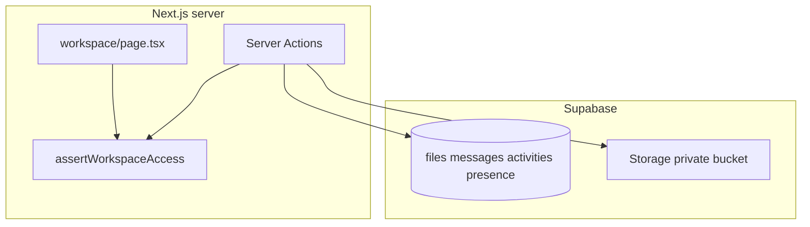

# Professional workspace (collab hub)

## Context

- Today, collaboration stops at Idea Arena: [`components/idea-arena/project-detail-view.tsx`](components/idea-arena/project-detail-view.tsx) shows **“You’re on this team.”** with no next step. Data exists for **projects** ([`supabase/migrations/001_projects.sql`](supabase/migrations/001_projects.sql)), **members** ([`supabase/migrations/003_project_members.sql`](supabase/migrations/003_project_members.sql)), and **cover images** in public bucket `project-images` ([`supabase/migrations/005_project_image_and_required_skills.sql`](supabase/migrations/005_project_image_and_required_skills.sql))—nothing yet for team workspace files, chat, or presence.
- Supabase is used **only on the server** via [`lib/supabase-server.ts`](lib/supabase-server.ts) (service role). Keep that pattern for v1: **all authorization in Next.js**, tables with RLS enabled and **no policies** (same as `projects` / `project_members`), matching existing security posture.

## Access control (single helper)

Introduce something like [`lib/workspace-access.ts`](lib/workspace-access.ts):

- **`canAccessWorkspace(projectId, userId)`**: `true` if the user is the **project owner** (`projects.clerk_user_id`) **or** has a row in `project_members` for that `project_id` (reuse query patterns from [`lib/project-members.ts`](lib/project-members.ts)).
- **`assertWorkspaceAccess`**: used by the workspace page, server actions, and download helpers; otherwise `notFound()` or a clear error.

You confirmed: **inventor and joined professionals share one workspace.**

## Data model (new migration)

One new migration file under [`supabase/migrations/`](supabase/migrations/) (next number after `005`):

1. **`project_workspace_files`**  
   - `id` (uuid), `project_id` → `projects`, `uploaded_by_clerk_user_id` (text), `storage_path` (text, path inside bucket), `filename` (original name), `content_type`, `byte_size`, `created_at`.  
   - Index on `(project_id, created_at desc)`.

2. **`project_workspace_messages`**  
   - `id`, `project_id`, `author_clerk_user_id`, `body` (text, app-enforced max length), `created_at`, optional `reply_to_id` → self-FK for threading / “refer to” quotes later.  
   - Index on `(project_id, created_at desc)`.

3. **`project_workspace_activities`** (append-only **status / audit feed**)  
   - `id`, `project_id`, `actor_clerk_user_id`, `kind` (text: e.g. `message_posted`, `file_uploaded`, `status_updated`, `member_joined`), `payload` (jsonb, optional: `{ "message_id": "...", "file_id": "..." }`), `created_at`.  
   - Powers an **Activity** sidebar/tab and satisfies “track … refer to them later” at the event level alongside raw messages.

4. **`project_workspace_presence`** (optional but aligns with “what others are doing”)  
   - Unique `(project_id, clerk_user_id)`, `status_text` (short, user-editable), `updated_at`.  
   - Heartbeat from the workspace UI (server action or small route) every few minutes while the tab is open; show “last updated” in the roster.

**Storage:** new **private** bucket (e.g. `project-workspace-files`). **No** public SELECT policy—downloads via **signed URLs** generated in a server action after `assertWorkspaceAccess`. Uploads via service role (same pattern as [`uploadRepresentativeImage`](app/dashboard/projects/actions.ts) but private bucket).

## Server layer

- **Queries/actions** (new module e.g. [`lib/workspace.ts`](lib/workspace.ts) or split `workspace-files.ts` / `workspace-messages.ts`): list/post messages, list/upload files, list activities, upsert presence, create signed download URL.
- **Server Actions** (e.g. [`app/idea-arena/[projectId]/workspace/actions.ts`](app/idea-arena/[projectId]/workspace/actions.ts)): thin wrappers with `revalidatePath` for the workspace route after mutations.
- **Clerk display names**: message list and activity feed need **safe resolution** of `clerk_user_id` → display name (batch `clerkClient().users.getUser` or small cache); avoid N+1 where possible.

## UI / routing

- **Route:** [`app/idea-arena/[projectId]/workspace/page.tsx`](app/idea-arena/[projectId]/workspace/page.tsx) (keeps project context next to Arena). If `!canAccessWorkspace`, `notFound()`.
- **Shell:** layout inspired by your mock—**header** (project title), **left nav** with **Activity**, **Messages**, **Files**; optional placeholders for **Progress** / **Meeting** as non-functional stubs or “Coming soon” so the IA matches the vision without scoping video yet.
- **Messages:** thread list + composer; support **permalink** to a message (e.g. hash or query `?m=uuid`) for “refer back later.”
- **Files:** table or card list with uploader (multipart → server action), metadata from DB, download button (signed URL).
- **Status:** roster of project owner + members (from `projects` + `project_members`) merged with `project_workspace_presence` rows; simple “Set my status” control.

## Entry points

- **Professional** already on team: from [`ProjectDetailView`](components/idea-arena/project-detail-view.tsx), replace or augment “You’re on this team.” with a primary **Open workspace** link.
- **Inventor:** link from the dashboard project row/card (where projects are listed—e.g. [`app/dashboard/page.tsx`](app/dashboard/page.tsx) or project list component) **Open workspace** when `clerk_user_id` matches.

## Realtime (explicitly out of MVP)

Because clients do not talk to Supabase with user-scoped keys today, **live** updates in v1 should use **Server Actions + `revalidatePath` / `router.refresh()`** (and optional slow polling for presence). A later iteration can add **Supabase Realtime**, **SSE**, or a third-party channel once you decide how to authenticate the browser to realtime.

## Testing / manual checks

- Owner and joined professional both see workspace; non-member and unrelated user get 404.
- Upload lists correctly; download works only for authorized users; file row in DB matches storage object.
- Message appears in thread and generates an `message_posted` activity row.
- Status updates appear in roster and activity feed.
