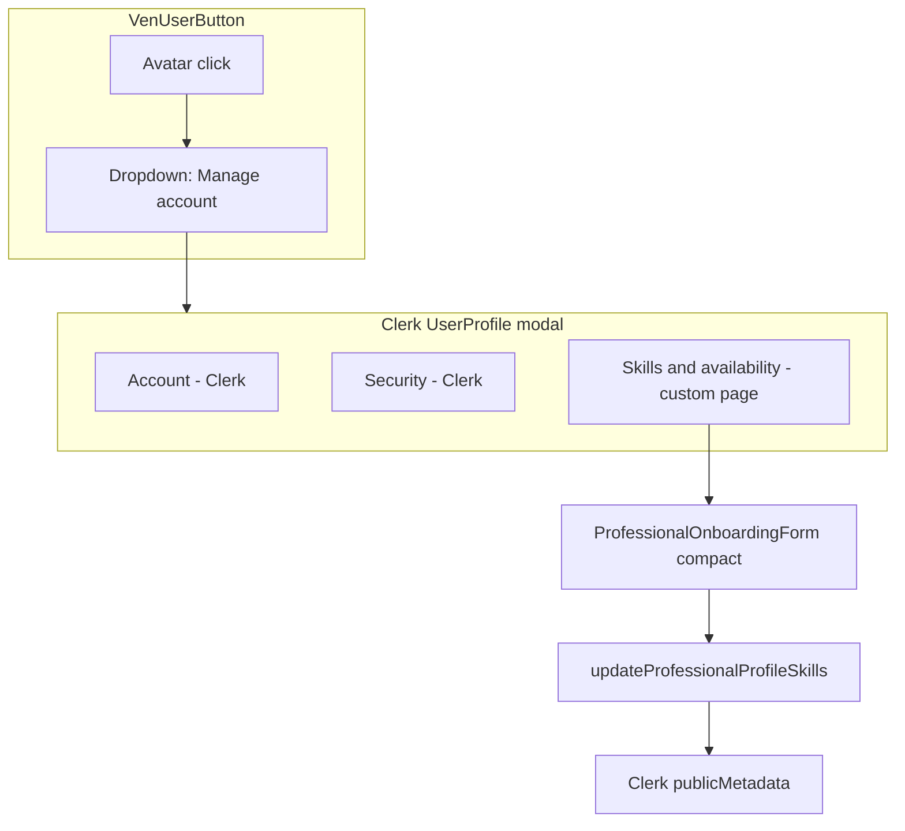

# Move professional skills editing into Manage account

## Opinion

**Your instinct is right.** Job categories and hours are “who I am on VenShares,” not a separate product area. Today they are split across three places:

| Entry point | Location |
|-------------|----------|
| Avatar menu link | [`components/ven-user-button.tsx`](components/ven-user-button.tsx) — “Profile & skills” → `/dashboard/profile` |
| Dashboard CTA | [`app/dashboard/page.tsx`](app/dashboard/page.tsx) — “Edit profile skills” |
| Idea Arena CTA | [`app/idea-arena/page.tsx`](app/idea-arena/page.tsx) — when categories are empty |

Clerk already owns email, password, security, and **profile image** under **Manage account → Account**. VenShares metadata (`professionalJobCategories`, `professionalHoursBand`) belongs in that same mental bucket — not as a stray dashboard link.

The existing copy on [`app/dashboard/profile/page.tsx`](app/dashboard/profile/page.tsx) already acknowledges this split (“Account email, password, and security are managed from your profile menu”). Moving skills **into** Manage account makes that sentence true in practice.

---

## Will a full form inside the Clerk modal work?

**Yes, technically** — with two important clarifications.

### 1. You cannot inject into Clerk’s built-in “Account” tab

Clerk only lets you add **sibling** pages in the Manage account sidenav via [`UserButton.UserProfilePage`](https://clerk.com/docs/nextjs/guides/customizing-clerk/adding-items/user-profile) (modal) or [`UserProfile.Page`](https://clerk.com/docs/nextjs/guides/customizing-clerk/adding-items/user-profile) (dedicated route). Plan for a nav item such as **“Skills & availability”** next to Account / Security, not fields inside Account itself.

### 2. The current form fits the modal if you trim duplication

[`ProfessionalOnboardingForm`](components/onboarding/professional-onboarding-form.tsx) is already a **client** component using `useActionState` + your existing [`updateProfessionalProfileSkills`](app/dashboard/profile/actions.ts) server action — that pattern works inside `UserButton.UserProfilePage` children.

Content size today:

- 11 category checkboxes (2-column grid on `sm+`)
- Hours `<select>`
- Optional profile photo block (~70px preview + file input)
- Submit button

The Clerk modal content area is **scrollable**; this is workable on desktop. On narrow viewports it will feel long — acceptable if you:

- Add a prop like `variant="compact" | "full"` (tighter spacing, single-column categories in modal)
- **Hide profile photo in the modal variant** — Clerk’s default **Account** page already edits the avatar; duplicating upload in “Skills” inside the same modal is confusing

**Save behavior:** `updateProfessionalProfileSkills` ends with `redirect("/dashboard")`, which closes the modal and lands on the dashboard. That is fine; optionally change redirect to `redirect("/dashboard/profile")` or use `revalidatePath` only + stay in modal (more work, lower priority).



---

## Recommended approach (hybrid)

**Primary:** Embed a **compact** skills form in Manage account via `UserButton.UserProfilePage` in [`components/ven-user-button.tsx`](components/ven-user-button.tsx).

**Fallback (optional):** Keep [`/dashboard/profile`](app/dashboard/profile/page.tsx) as the full-page editor (same form, `variant="full"`) and add `UserButton.UserProfileLink` only if modal testing feels too cramped — you do not need both embed **and** a separate menu link.

**Keep:** Idea Arena empty-state link — contextual, task-driven CTA is still valuable.

**Remove or demote:**

- `UserButton.MenuItems` link “Profile & skills” (redundant once sidenav has Skills)
- Dashboard body link “Edit profile skills” (optional; can replace with one line: “Update skills from your account menu (top right)”)

**Do not change:** [`/onboarding/professional`](app/onboarding/professional/page.tsx) — first-time onboarding stays a full page (middleware + richer copy).

---

## Implementation sketch

### 1. Client wrapper for modal content

New file e.g. [`components/profile/professional-skills-profile-panel.tsx`](components/profile/professional-skills-profile-panel.tsx):

- `"use client"`
- `useUser()` for `publicMetadata` + `imageUrl`
- Guard: only render form when `venRole === "professional"` and onboarding complete; otherwise short message or link to `/onboarding/professional`
- Render `ProfessionalOnboardingForm` with `formAction={updateProfessionalProfileSkills}`, `showOnboardingCopy={false}`, `variant="compact"`, `showProfilePhoto={false}`

### 2. Extend the form for modal layout

In [`components/onboarding/professional-onboarding-form.tsx`](components/onboarding/professional-onboarding-form.tsx):

- `showProfilePhoto?: boolean` (default `true`)
- `variant?: "full" | "compact"` — compact: single-column categories, smaller padding, no `space-y-8` hero spacing

### 3. Wire into VenUserButton

In [`components/ven-user-button.tsx`](components/ven-user-button.tsx), for professionals with onboarding complete:

```tsx
<UserButton.UserProfilePage
  label="Skills & availability"
  url="skills"
  labelIcon={...}
>
  <ProfessionalSkillsProfilePanel />
</UserButton.UserProfilePage>
```

Place **before** default Account/Security if you want skills prominent (Clerk supports reordering with `<UserButton.UserProfilePage label="account" />`).

Remove the post-onboarding `UserButton.Link` to `/dashboard/profile` from `MenuItems`.

### 4. `/dashboard/profile` page

Either:

- **A)** Keep as deep-link target using `variant="full"` + photo (for bookmarks and Idea Arena), or
- **B)** Redirect to opening Manage account (harder without `openUserProfile()` UX) — **prefer A**.

### 5. Server action tweak (small)

[`app/dashboard/profile/actions.ts`](app/dashboard/profile/actions.ts): consider `revalidatePath` + `redirect` back to current page or dashboard only; photo upload can remain on full page variant only if hidden in modal.

---

## Verification

1. Professional, onboarding complete: Avatar → Manage account → sidenav shows **Skills & availability** → edit categories/hours → Save → metadata updates, Idea Arena matching reflects changes.
2. Modal scroll on mobile Safari / Chrome; no clipped submit button.
3. Account tab still handles avatar; Skills tab does not duplicate photo (modal variant).
4. Incomplete professional: no Skills tab (or link to onboarding); middleware still forces `/onboarding/professional`.
5. Inventor: no custom UserProfile page.
6. Idea Arena empty-categories CTA still reaches editable skills (modal or `/dashboard/profile`).

---

## Summary answer to your question

| Question | Answer |
|----------|--------|
| Should skills live under Manage account? | **Yes** — matches user mental model and your existing profile-page copy. |
| Full form in Clerk modal? | **Yes, with compact layout and no duplicate photo block**; otherwise use sidenav link to full `/dashboard/profile`. |
| Inside Clerk “Profile details” tab itself? | **No** — use a custom sidenav page beside Account / Security. |
