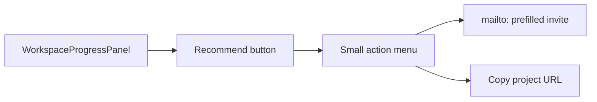

# Progress area: Recommend button for unassigned skills

## Context

The workspace **Progress** tab renders skill categories in [`components/workspace/workspace-progress-panel.tsx`](components/workspace/workspace-progress-panel.tsx). Each row is an `ArenaCategorySlot` from [`lib/projects-arena.ts`](lib/projects-arena.ts), which already exposes:

- `teamCoversCategory` — true when at least one `project_members` row lists that category in `covered_job_categories`
- `status` — `needed` | `in_progress` | `complete`

**Unassigned skill** (for this feature): a category that still needs a person on the team:

```ts
!slot.teamCoversCategory && slot.status !== "complete"
```

This includes skills marked **Needed** and skills marked **In progress** only because the checklist was started without team coverage (the inconsistent state called out in the detail-page plan).

There is **no** existing recommend/invite UI, **no** transactional email provider, and **no** DM channel. You confirmed v1 actions are **email invite** + **copy link**; **in-app message is later**.



## UI changes

### 1. Restructure skill card header

Today the entire header is one `<button>` that toggles expand/collapse (lines 222–249). Split it so:

- **Left (flex-1)**: existing chevron + category name + status badge + subtask counts — still toggles expand
- **Upper right**: **Recommend** — only when unassigned (condition above)

Use `stopPropagation` on Recommend interactions so opening the menu does not collapse the skill.

### 2. New client component: `SkillRecommendMenu`

Add [`components/workspace/skill-recommend-menu.tsx`](components/workspace/skill-recommend-menu.tsx):

- Props: `projectTitle`, `projectId`, `skillCategory` (`ProfessionalJobCategory`)
- **Recommend** button (text-xs, green outline or link style to match existing Progress actions)
- Click opens a small anchored panel (absolute positioning; no shadcn — [`components/ui/`](components/ui/) is empty)
- Two actions:
  1. **Email invite** — opens `mailto:?subject=…&body=…` (encode with `encodeURIComponent`)
  2. **Copy invite link** — copies URL to clipboard; brief “Copied!” feedback on the row

Close menu on outside click / Escape.

### 3. Pass `projectTitle` into the panel

[`components/workspace/workspace-shell.tsx`](components/workspace/workspace-shell.tsx) already has `projectTitle`. Pass it to `WorkspaceProgressPanel`:

```tsx
<WorkspaceProgressPanel
  projectId={projectId}
  projectTitle={projectTitle}
  checklist={progressChecklist}
  categoryStatuses={progressCategoryStatuses}
/>
```

## Invite content (shared helper)

Add a tiny client-safe helper [`lib/skill-recommend-invite.ts`](lib/skill-recommend-invite.ts):

```ts
export function buildSkillRecommendInvite(opts: {
  origin: string;        // window.location.origin in browser
  projectId: string;
  projectTitle: string;
  skillCategory: string;
}): { inviteUrl: string; mailtoHref: string }
```

**Invite URL (v1):** `{origin}/idea-arena/{projectId}` — lands on the project detail page with Join Team CTA. No new query params required.

**Email template (plain text):**

- **Subject:** `VenShares — {skillCategory} needed on “{projectTitle}”`
- **Body:** 2–3 sentences explaining the project needs this skill, includes the invite URL, and notes they can join via VenShares if they’re a skilled professional.

Build `mailtoHref` as `mailto:?subject=…&body=…`.

Use `navigator.clipboard.writeText(inviteUrl)` for copy; fallback `prompt()` if clipboard API unavailable.

## What we are NOT building (v1)

- **In-app message / DM** — deferred; when added, likely prefilled Messages tab draft or username-targeted flow
- **Server-sent email** (Resend, etc.) — mailto only
- **Activity audit** (`skill_recommended` events) — optional follow-up; skip unless you want analytics
- **Recommend on assigned or complete skills** — hidden when `teamCoversCategory` or `status === "complete"`
- **Free-text `project_required_skills`** — not shown in Progress today; out of scope

## Files to touch

| File | Change |
|------|--------|
| [`components/workspace/workspace-progress-panel.tsx`](components/workspace/workspace-progress-panel.tsx) | Split header; render `SkillRecommendMenu` per unassigned slot |
| [`components/workspace/skill-recommend-menu.tsx`](components/workspace/skill-recommend-menu.tsx) | New Recommend button + menu |
| [`lib/skill-recommend-invite.ts`](lib/skill-recommend-invite.ts) | URL + mailto builder |
| [`components/workspace/workspace-shell.tsx`](components/workspace/workspace-shell.tsx) | Pass `projectTitle` to panel |

## Manual test plan

1. Open workspace Progress for a project with at least one category **not** covered by a team member.
2. Confirm **Recommend** appears upper-right on unassigned rows only (not on covered or complete skills).
3. Click **Email invite** — default mail client opens with subject/body containing project title, skill name, and URL.
4. Click **Copy invite link** — paste URL opens project detail page; button shows copied feedback.
5. Click **Recommend** does not collapse/expand the skill accordion.
6. Assigned skill (member with matching `covered_job_categories`) — no Recommend button.

## Follow-up (later)

- **In-app recommend:** Messages tab deep link with prefilled body, or DM/notifications to a `@username`
- **Skill-scoped deep link:** e.g. `?needCat=Design` on Idea Arena list if you want professionals to land in filtered browse
- **Optional activity feed entry** when someone copies or emails an invite
