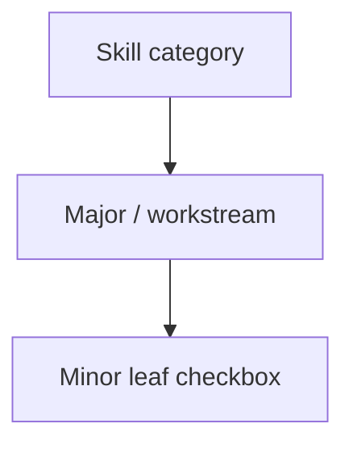
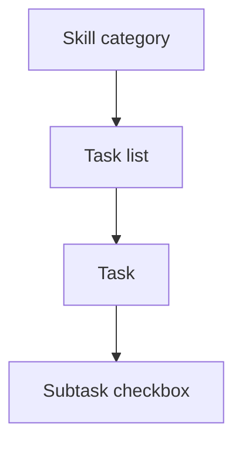

# Workspace progress: task list → task → subtask

## Current state

Progress lives in `projects.workspace_progress_checklist` (JSONB). Today’s shape is **2 levels** under each job skill:



Key files:
- Data + merge logic: [`lib/workspace-progress-checklist.ts`](lib/workspace-progress-checklist.ts)
- UI: [`components/workspace/workspace-progress-panel.tsx`](components/workspace/workspace-progress-panel.tsx) — button **“Add major”**, placeholder **“New major workstream…”**, nested checkboxes under expandable majors
- Mutations: [`app/idea-arena/[projectId]/workspace/actions.ts`](app/idea-arena/[projectId]/workspace/actions.ts)
- Arena status derivation (unchanged conceptually): [`lib/projects-arena.ts`](lib/projects-arena.ts) via `categoryHasAnyLeafCompleted` / `categoryAllLeavesComplete`

Completion is based on **leaf nodes** only (today’s `minors`). Arena “complete” still means all leaves in a skill are checked.

## Target model



| Level | Role | Checkable? |
|-------|------|------------|
| Task list | Grouping (e.g. “Discovery & strategy”) | No |
| Task | Named work item under a list | No |
| Subtask | Actionable checkbox | Yes (leaf) |

User-facing copy:
- **Add task list** (replaces “Add major”)
- **Add task** (new, under a task list)
- **Add subtask** (replaces “Add a task…” under majors)
- Placeholders: “New task list…”, “New task…”, “New subtask…”

Progress header counts **subtasks** (leaves): e.g. `3 / 9 subtasks done` (or keep shorter “tasks done” if you prefer — implementation will count subtasks either way).

## Persisted JSON shape

Replace `majors` / `minors` with explicit keys (no SQL migration — JSON only):

```ts
// lib/workspace-progress-checklist.ts (conceptual)
type WorkspaceProgressSubtask = { id; title; standard; completed };
type WorkspaceProgressTask = { id; title; standard; subtasks: WorkspaceProgressSubtask[] };
type WorkspaceProgressTaskList = { id; title; standard; tasks: WorkspaceProgressTask[] };
type WorkspaceProgressCategoryBlock = { taskLists: WorkspaceProgressTaskList[] };
```

**Stable IDs (critical for existing projects):**
- Task list ids: keep current `std:…:M{n}` and `cust:…` major ids
- **Subtask ids: preserve current minor ids** (`std:…:M0:m1`, `cust:…`) so checked state survives migration
- New task ids: `std:…:M0:T{n}` for template rows; `cust:…` for user-added tasks

## Legacy migration (read path)

In [`parseWorkspaceProgressChecklist`](lib/workspace-progress-checklist.ts):

1. If block has `taskLists` → parse as v3
2. If block has legacy `majors` → convert on read:
   - each major → task list (same id/title/standard)
   - each minor → **one task** wrapping **one subtask**
   - subtask keeps the **old minor id + completed**
   - new task id generated (`std:…:T{n}` or `cust:…`)

[`mergeChecklistWithTemplates`](lib/workspace-progress-checklist.ts) and [`ensureWorkspaceProgressChecklistSynced`](lib/workspace-progress-sync.ts) already persist when parsed ≠ merged, so the first workspace load after deploy will rewrite DB JSON to v3 without a manual migration script.

## Standard template update

Refactor [`WORKSPACE_PROGRESS_STANDARD_TEMPLATE`](lib/workspace-progress-checklist.ts) from `{ title, minors[] }` to `{ title, tasks: { title, subtasks: { title }[] }[] }`.

**Initial content strategy (minimal churn):** mechanically convert each existing minor into a task with a single subtask (same wording). This keeps today’s checklist items and completion behavior while enabling real multi-subtask tasks going forward. Optional follow-up: regroup subtasks under fewer, better-named tasks per category.

Update ID helpers:
- `stdTaskListId` (alias/rename of `stdMajorId`)
- `stdTaskId(category, listIndex, taskIndex)`
- `stdSubtaskId` — for migrated template rows, **emit the legacy `std:…:m{n}` id** on the subtask so existing toggles still match

## Library function changes

All in [`lib/workspace-progress-checklist.ts`](lib/workspace-progress-checklist.ts):

| Today | After |
|-------|-------|
| `collectLeavesForCategory` (minors) | Walk `taskLists → tasks → subtasks` |
| `setLeafCompleted` | Find subtask by id |
| `setAllLeavesInCategory` | Toggle all subtasks |
| `addCustomMajor` | `addCustomTaskList` |
| `addCustomMinor(…, majorId)` | `addCustomSubtask(…, taskId)` |
| — | **New** `addCustomTask(…, taskListId)` |

Rename types throughout consumers (`WorkspaceProgressMajor/Minor` → `TaskList/Task/Subtask`). Avoid leaving dual names in TS — update imports in panel, actions, and arena lib in one pass.

## Server actions

In [`app/idea-arena/[projectId]/workspace/actions.ts`](app/idea-arena/[projectId]/workspace/actions.ts):

- Rename `actionProgressAddCustomMajor` → `actionProgressAddCustomTaskList` (error: “Could not add task list.”)
- Rename `actionProgressAddCustomMinor` → `actionProgressAddCustomSubtask` (parent param: `taskId`)
- **Add** `actionProgressAddCustomTask(projectId, category, taskListId, title)`
- Keep `actionProgressToggleLeaf` and `actionProgressSetCategoryLeaves` (still operate on subtask ids)

## UI: [`workspace-progress-panel.tsx`](components/workspace/workspace-progress-panel.tsx)

Restructure the expanded skill panel to a **3-level accordion**:

```
Skill (Finance)
  ├─ Task list: Modeling & runway  [expand]
  │    ├─ Task: Build model        [expand]
  │    │    ☐ Subtask A
  │    │    ☐ Subtask B
  │    │    [input] Add subtask
  │    [input] Add task
  ├─ [input] New task list…  [Add task list]
```

State: expand sets for task lists and tasks (replace `expandedMajors`). Separate draft title maps for new task list / task / subtask inputs.

**Optional UX polish (recommended):** if a task has exactly one subtask and titles match, render a single checkbox row (no extra nested header) so migrated 1:1 data doesn’t look redundant.

Buttons/copy to update:
- `Add major` → **Add task list**
- `New major workstream…` → **New task list…**
- Per-task-list **Add task** row
- Per-task **Add subtask** row (replace current minor add row)

## Downstream consumers (no behavior change beyond new shape)

- [`lib/projects-arena.ts`](lib/projects-arena.ts) — still uses leaf helpers; update imports only
- [`app/dashboard/projects/actions.ts`](app/dashboard/projects/actions.ts) — trim/merge via updated parser
- [`lib/workspace-progress-sync.ts`](lib/workspace-progress-sync.ts) — unchanged flow; benefits from auto-migrate-on-sync

No changes needed to [`ProjectCard`](components/idea-arena/project-card.tsx) / arena badges if `completed_job_categories` sync remains leaf-driven.

## Manual test plan

1. Open workspace Progress on a project with existing checked items → verify checks survive after reload (subtask ids preserved)
2. Add task list, task, subtask on a custom row → persists and expands correctly
3. Check all subtasks in a skill → Idea Arena slot shows **Complete**; uncheck one → **In progress**
4. Edit required skills on dashboard → checklist trims/merges without breaking v3 JSON
5. New project with no checklist JSON → standard template loads as task list → task → subtask tree

## Out of scope (this pass)

- Delete/edit/reorder nodes
- AI task suggestions plan ([`.cursor/plans/ai_workspace_task_assistance_686b3ebb.plan.md`](.cursor/plans/ai_workspace_task_assistance_686b3ebb.plan.md)) — update separately when that feature ships
- Regrouping standard template content into richer task groupings (can follow once 3-level plumbing works)
