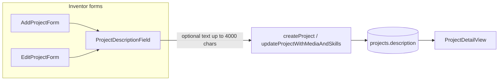

# Project description field UX

## Current behavior

- [`components/dashboard/add-project-form.tsx`](components/dashboard/add-project-form.tsx): description is **optional**, `rows={3}`, placeholder **"Short summary"** — this signals brevity.
- [`components/dashboard/edit-project-form.tsx`](components/dashboard/edit-project-form.tsx): same 3-row field and optional label (also used from workspace **Project settings** via `EditProjectForm`).
- Server actions in [`app/dashboard/projects/actions.ts`](app/dashboard/projects/actions.ts) accept any length (including empty); DB column is unbounded `text`; UI `maxLength={4000}` already allows long copy. **No validation changes needed.**

Your example paragraph is **330 characters** — the main gap is UI, not limits.

## Proposed changes

### 1. Shared description field (small DRY component)

Add [`components/dashboard/project-description-field.tsx`](components/dashboard/project-description-field.tsx) used by both forms:

| Prop | Add form | Edit form |
|------|----------|-----------|
| `defaultValue` | — | existing description |
| `id` | `project-description` | optional or same |

**Field specs:**
- **Label:** `Description` with `(optional)` kept — still not required.
- **Helper text** (below label, `text-xs text-slate-500`):
  > Describe the problem, your solution, and who it helps. A few detailed sentences work best — professionals use this to decide whether to join.
- **Textarea:**
  - `rows={8}` (fits ~330+ chars without scrolling on desktop)
  - `min-h-[10rem]` for consistent height
  - `maxLength={4000}` unchanged
  - **Placeholder:** use your wheelchair example as inspiration, trimmed for readability (~120 chars), e.g.  
    `e.g. Most wheelchairs only use pushing muscles… A push-and-pull system lets operators use lats too, get a full workout, and climb hills without rolling back.`
- No `required`, no `minLength`, no server-side minimum.

### 2. Wire into both forms

- [`add-project-form.tsx`](components/dashboard/add-project-form.tsx): replace inline description block with `<ProjectDescriptionField />`.
- [`edit-project-form.tsx`](components/dashboard/edit-project-form.tsx): same, passing `defaultValue={project.description ?? ""}`.

Both dashboard **Add a project** and workspace **Project settings** pick up the change automatically.

### 3. Docs (light touch)

Update [`manual/how-to-add-a-project.md`](manual/how-to-add-a-project.md) step 5 from “Optionally enter a **Description**” to note that a **detailed** optional description (several sentences) helps professionals evaluate the project in Idea Arena.

## Out of scope

- No DB migration.
- No minimum-length validation on create or edit.
- No changes to Idea Arena display ([`project-card.tsx`](components/idea-arena/project-card.tsx) already shows up to 1000 chars; detail view shows full text).

## Verification

1. Open `/dashboard` → **Add a project**: description area is visibly taller; helper + example placeholder visible; short or empty description still saves.
2. Edit an existing project (dashboard or workspace settings): same larger field; existing long text loads correctly.
3. Save a ~330+ character description and confirm it appears on the Idea Arena project detail page.

